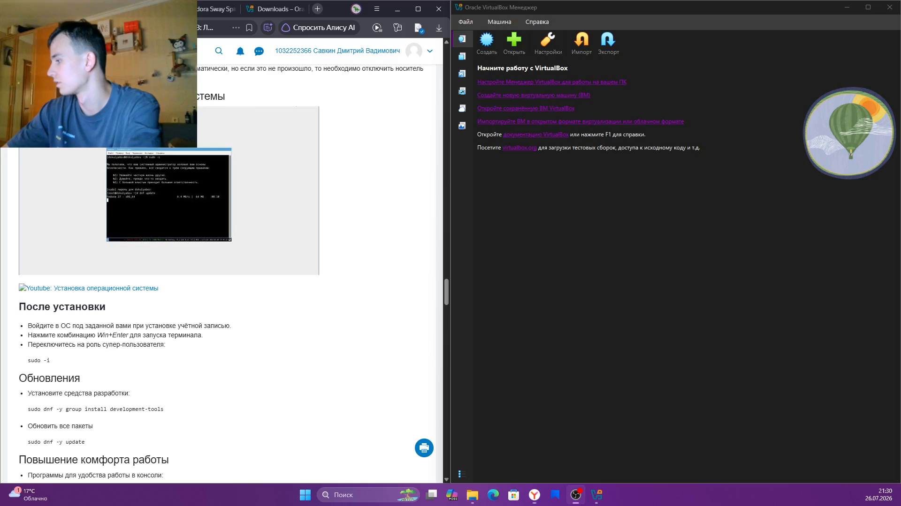
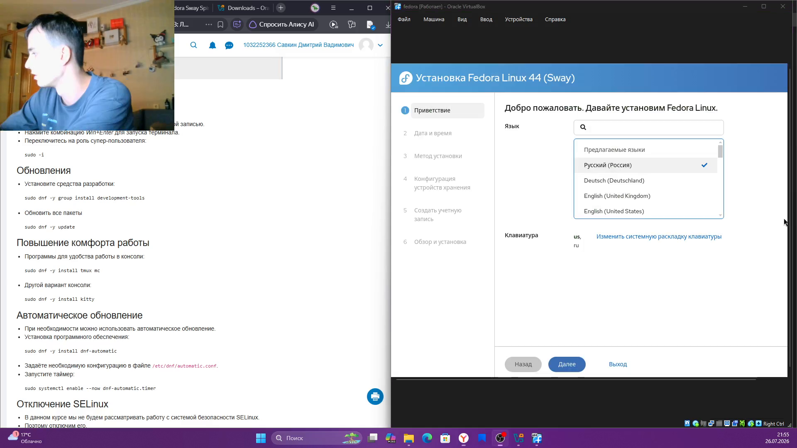
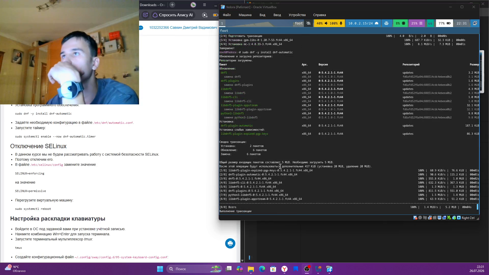
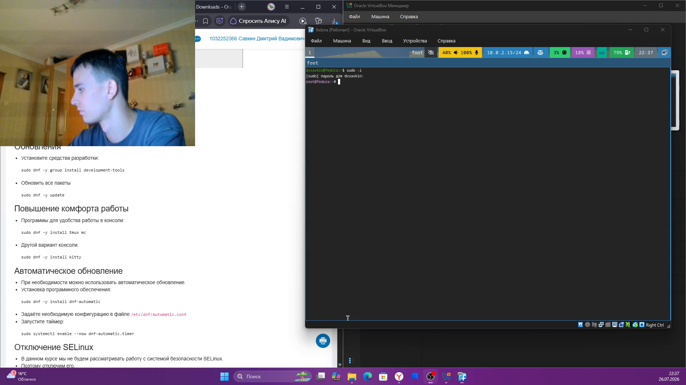
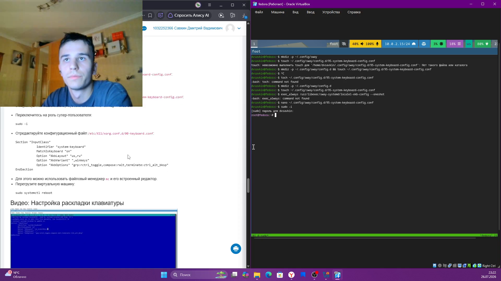
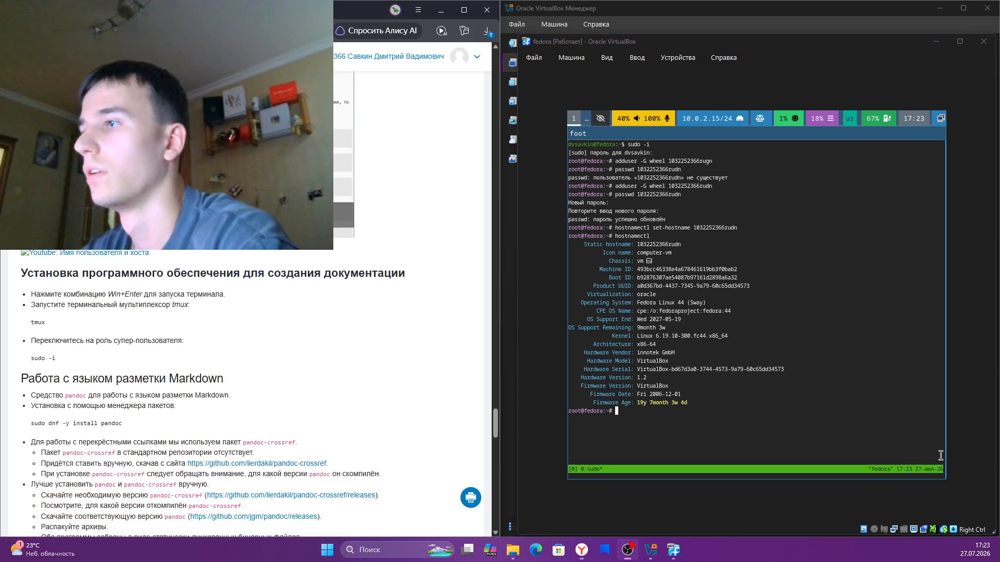
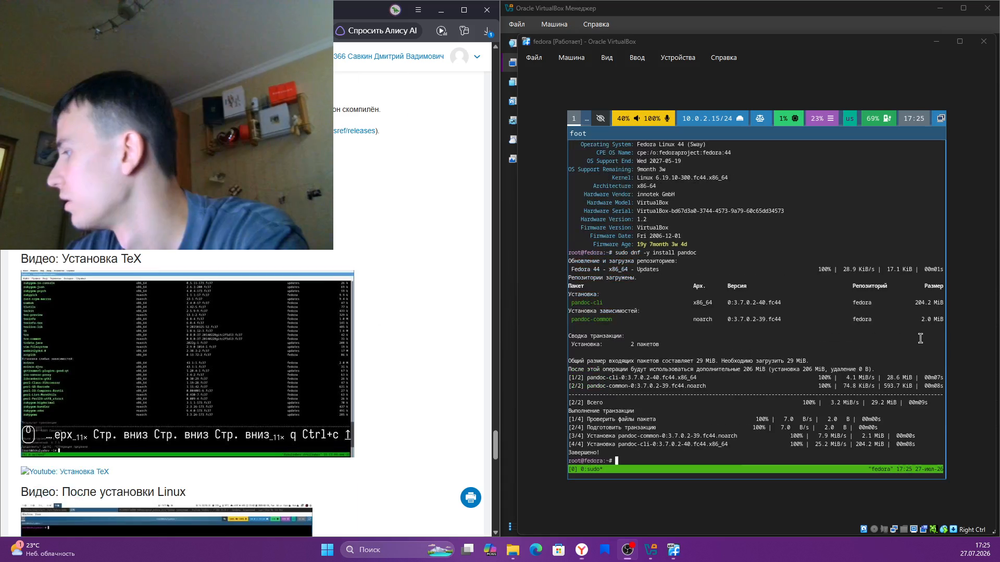
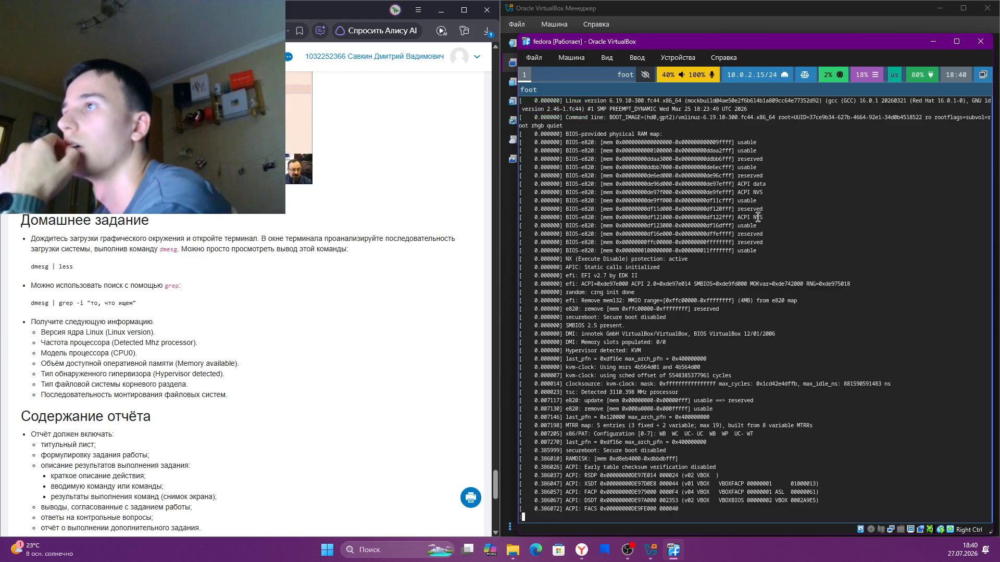

# Информация

## Докладчик

:::::::::::::: {.columns align=center}
::: {.column width="70%"}

- Савкин Дмитрий Вадимович
- РУДН, группа НПИбд-02-25
- Тема: установка и настройка ОС на виртуальную машину

:::
::: {.column width="30%"}

:::
::::::::::::::

# Цель работы

## Цель работы

- Установить ОС на виртуальную машину и настроить её после установки

# Задание

## Задание

- Установить Fedora Sway на VirtualBox
- Настроить SELinux
- Настроить раскладку клавиатуры
- Задать имя пользователя и хоста

# Выполнение работы
## Скачивание VirtualBox

Скачиваем VirtualBox с официального сайта.

{width=55%}

## Скачивание образа

Скачиваем образ Fedora Sway Spin.

{width=55%}

## VirtualBox готов

VirtualBox установлен, менеджер готов к работе.

{width=55%}

## Параметры ВМ

Настраиваем параметры виртуальной машины.

{width=55%}

## Память и CPU

Задаём объём памяти и число CPU при создании ВМ.

{width=55%}

## Язык установки

Выбираем язык установки в установщике Fedora.

{width=55%}

## Запуск установщика

Инструкция по запуску установщика на Live-рабочем столе.

{width=55%}

## Первый вход

Первый вход в систему после установки, сессия Sway.

{width=55%}

## Рабочий стол

Рабочий стол Fedora после входа.

{width=55%}

## Средства разработки

Устанавливаем `sudo dnf -y group install development-tools`.

{width=55%}

## Обновление системы

Обновляем систему: `sudo dnf -y update`.

{width=55%}

## dnf-automatic

Устанавливаем `dnf-automatic`.

{width=55%}

## tmux и mc

Устанавливаем `tmux` и `mc`.

{width=55%}

## sudo -i

Переключаемся на суперпользователя.

{width=55%}

## Таймер автообновления

Включаем `dnf-automatic.timer`.

{width=55%}

## SELinux config

Просматриваем `/etc/selinux/config`.

{width=55%}

## Permissive

Меняем `SELINUX=enforcing` на `permissive`.

{width=55%}

## Перезагрузка

Перезагружаем ВМ.

{width=55%}

## Раскладка — конфиг

Создаём конфиг раскладки клавиатуры для Sway.

{width=55%}

## Раскладка — правка

Редактируем конфиг sway, снова заходим под sudo.

{width=55%}

## xorg keyboard

Редактируем `/etc/X11/xorg.conf.d/00-keyboard.conf` (us,ru).

{width=55%}

## Имя пользователя и хоста

Меняем имя пользователя и хоста.

{width=55%}

## Установка pandoc

Устанавливаем `pandoc`.

{width=55%}

## TeX Live

Устанавливаем TeX Live для сборки отчётов.

{width=55%}

## dmesg

Смотрим вывод `dmesg` для домашнего задания.

{width=55%}

# Выводы

## Выводы

- Установлена и настроена Fedora Sway на ВМ
- Обновлена система, настроены автообновление, SELinux, раскладка
- Изменены имя пользователя и хоста, установлено ПО для отчётов
