---
## Author
author:
  name: Савкин Дмитрий Вадимович
  affiliation:
    - name: Российский университет дружбы народов
      country: Российская Федерация
      city: Москва

## Title
title: "Отчёт по лабораторной работе № 1"
subtitle: "Установка и конфигурация ОС на виртуальную машину"
license: "CC BY"
---

# Цель работы

Установить ОС на виртуальную машину и настроить её после установки.

# Задание

- Установить Fedora Sway на VirtualBox, настроить SELinux, раскладку клавиатуры, имя пользователя и хоста.

# Выполнение лабораторной работы

Скачиваем VirtualBox с официального сайта.

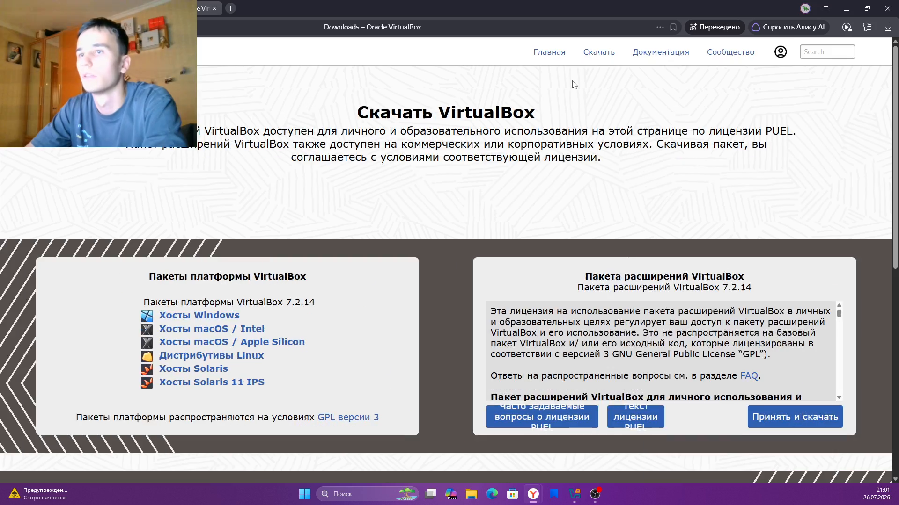{width=70%}

Скачиваем образ Fedora Sway Spin 44.

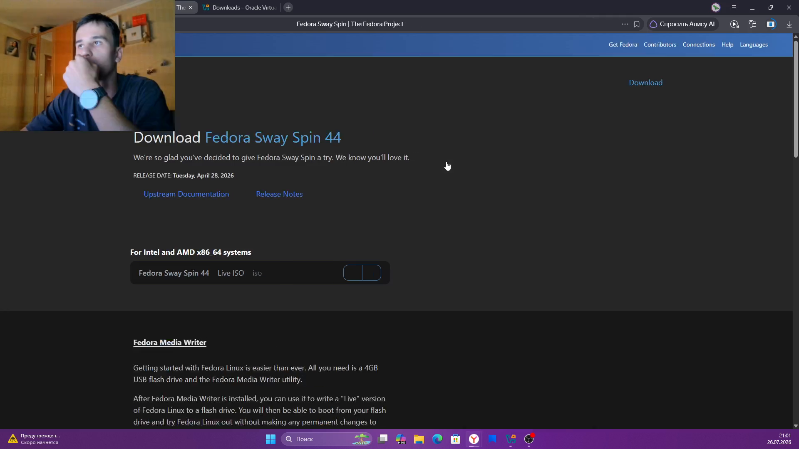{width=70%}

VirtualBox установлен, менеджер готов к работе.

{width=70%}

Настраиваем параметры виртуальной машины.

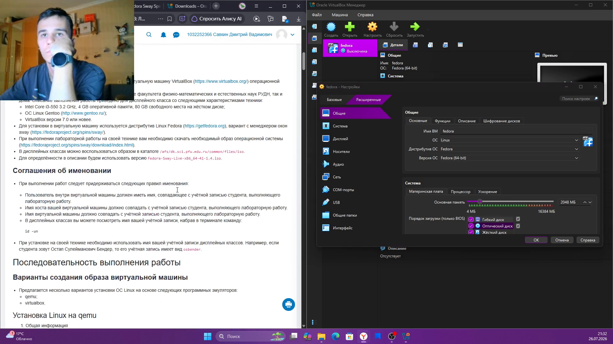{width=70%}

Задаём объём памяти и число CPU при создании ВМ.

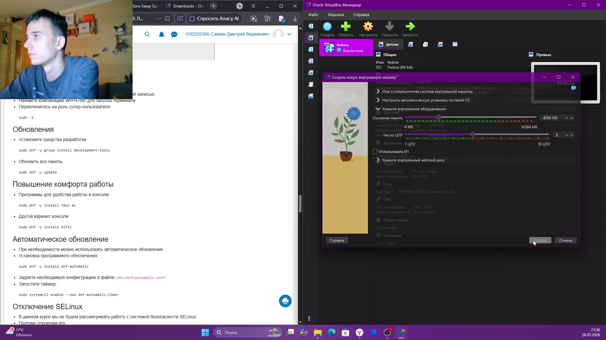{width=70%}

Выбираем язык установки в установщике Fedora.

{width=70%}

Инструкция по запуску установщика на Live-рабочем столе.

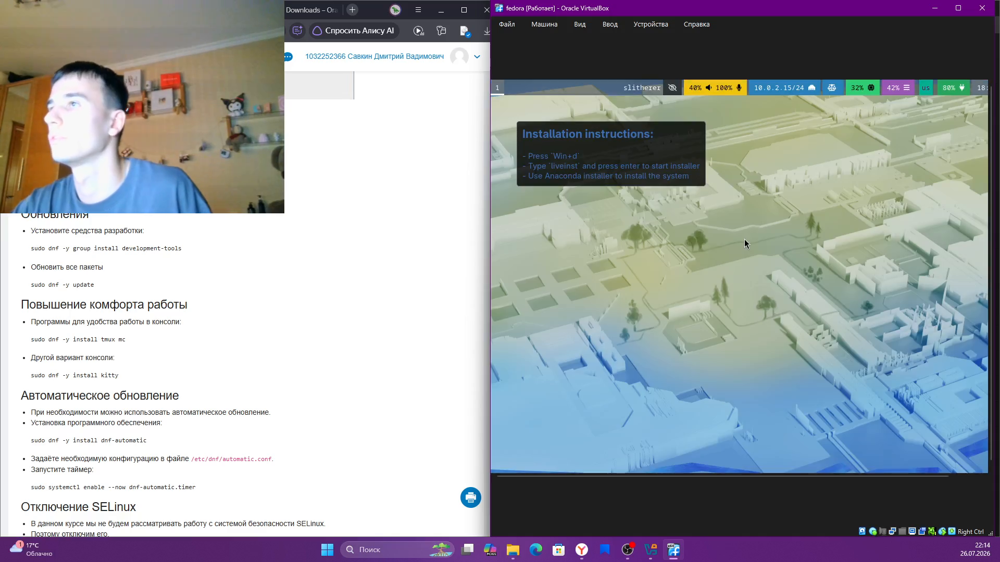{width=70%}

Первый вход в систему после установки, сессия Sway.

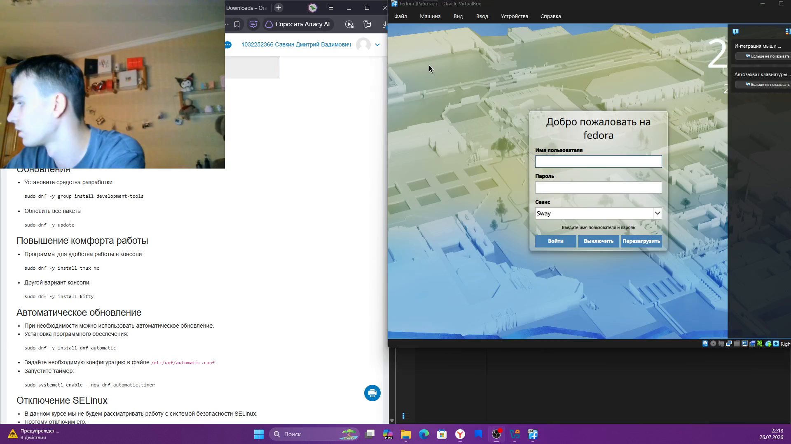{width=70%}

Рабочий стол Fedora после входа.

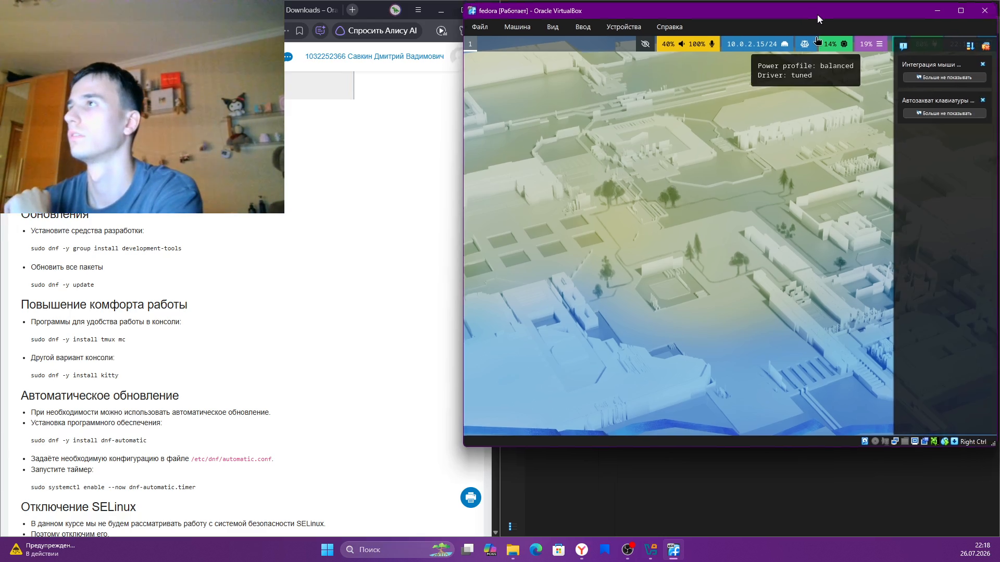{width=70%}

Устанавливаем средства разработки: `sudo dnf -y group install development-tools`.

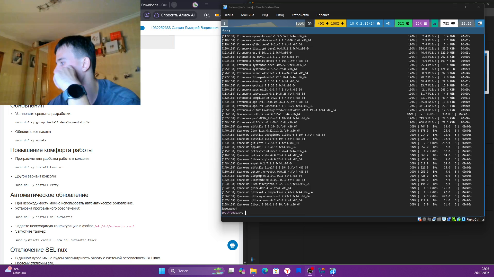{width=70%}

Обновляем систему: `sudo dnf -y update`.

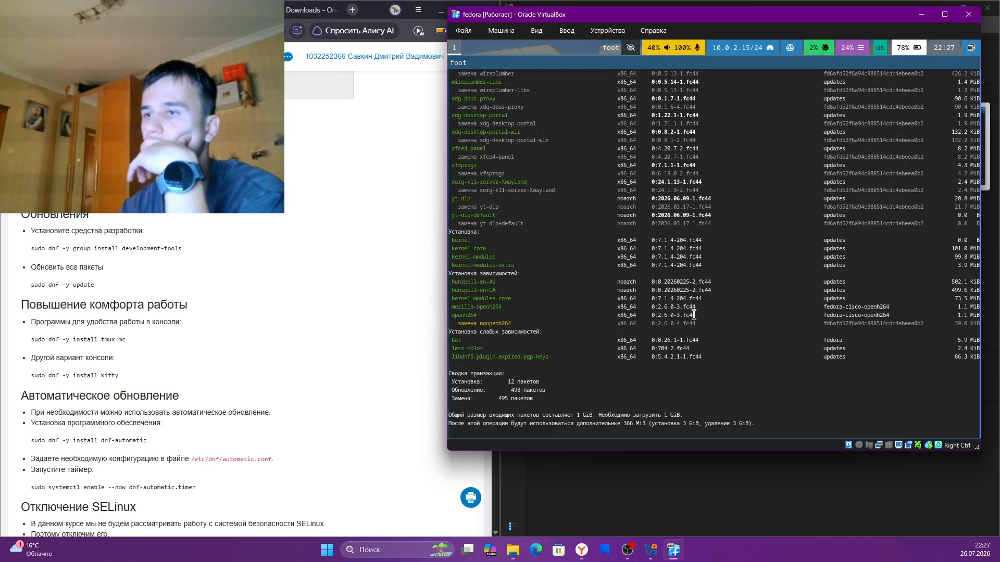{width=70%}

Устанавливаем dnf-automatic: `sudo dnf -y install dnf-automatic`.

{width=70%}

Устанавливаем tmux и mc: `sudo dnf -y install tmux mc`.

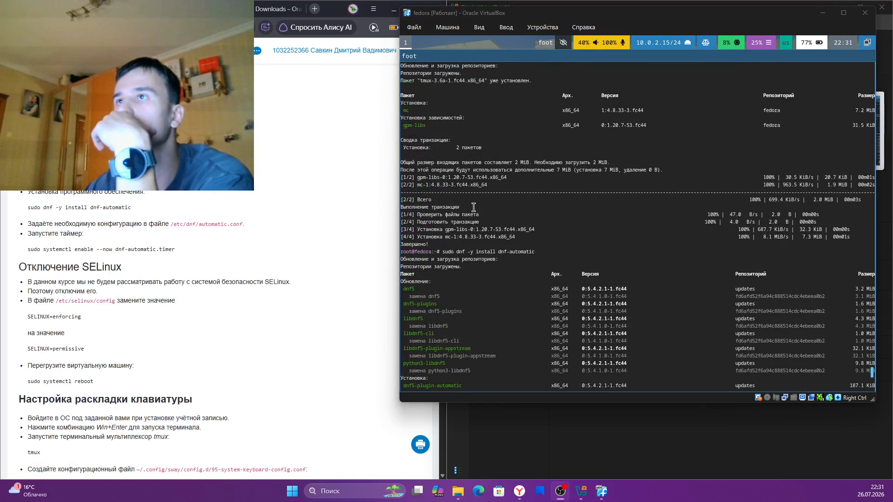{width=70%}

Переключаемся на суперпользователя: `sudo -i`.

{width=70%}

Включаем таймер автообновления: `sudo systemctl enable --now dnf-automatic.timer`.

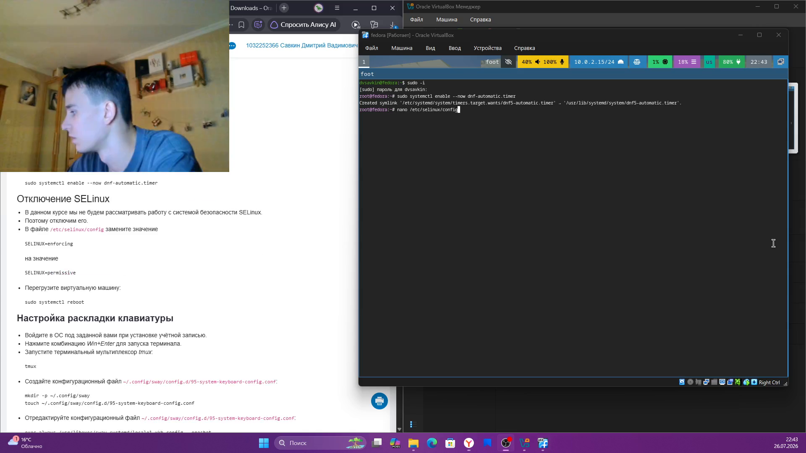{width=70%}

Просматриваем файл /etc/selinux/config.

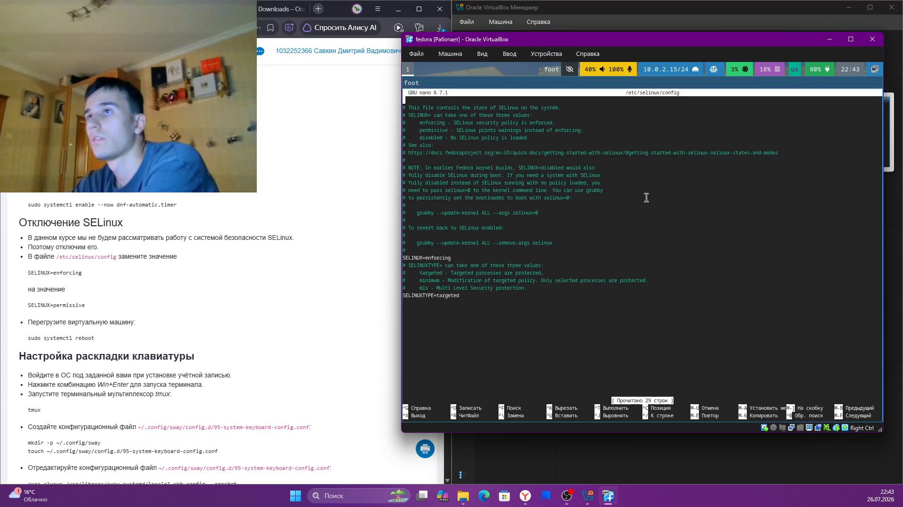{width=70%}

Меняем SELINUX=enforcing на SELINUX=permissive.

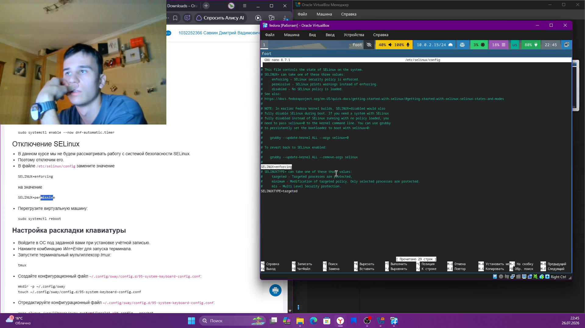{width=70%}

Перезагружаем ВМ: `sudo systemctl reboot`.

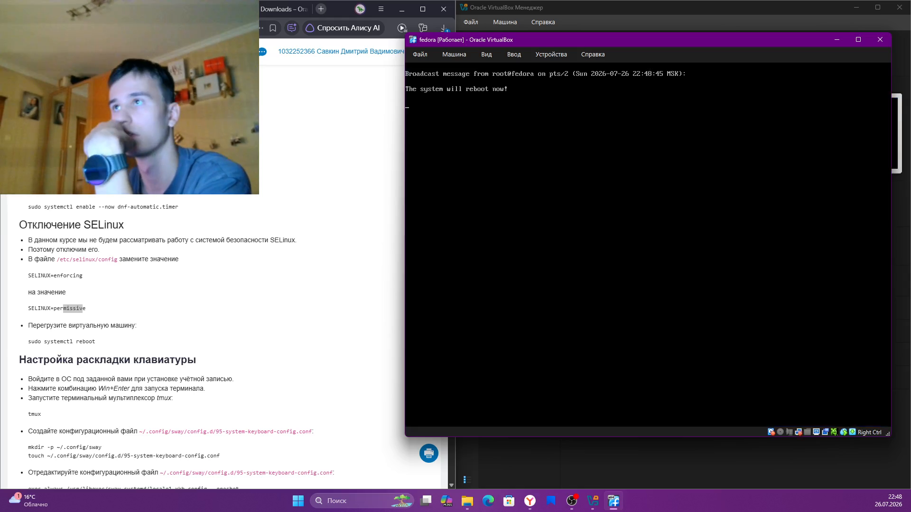{width=70%}

Создаём конфиг раскладки клавиатуры для Sway.

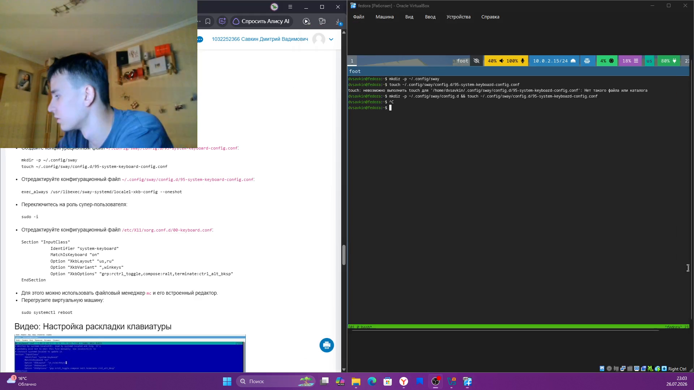{width=70%}

Редактируем конфиг sway и снова заходим под sudo -i.

{width=70%}

Редактируем /etc/X11/xorg.conf.d/00-keyboard.conf (раскладки us,ru).

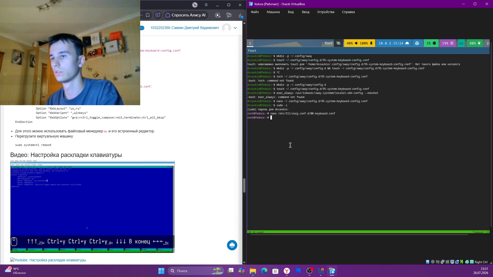{width=70%}

Меняем имя пользователя и хоста: adduser, passwd, hostnamectl.

{width=70%}

Устанавливаем pandoc: `sudo dnf -y install pandoc`.

{width=70%}

Устанавливаем TeX Live для сборки отчётов.

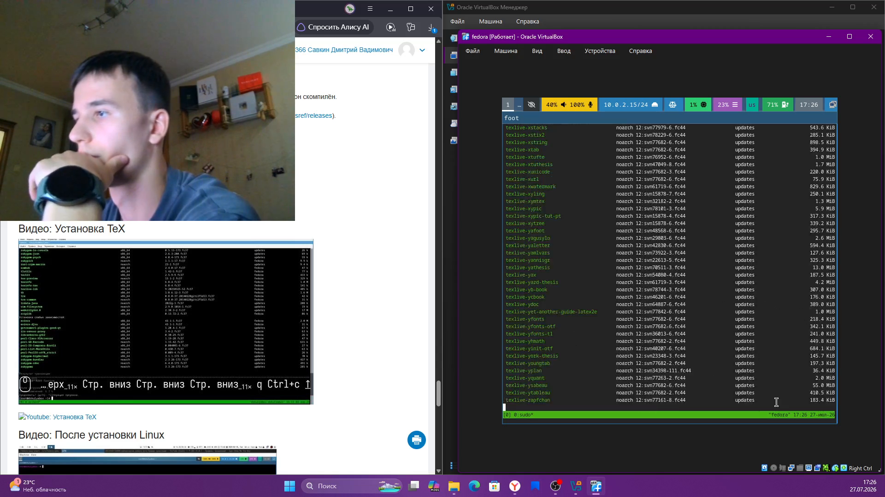{width=70%}

Смотрим вывод dmesg для домашнего задания: `dmesg | less`.

{width=70%}

# Выводы

Установлена и настроена Fedora Sway на виртуальной машине: обновлена система, настроены автообновление, SELinux, раскладка клавиатуры, имя пользователя и хоста, установлено ПО для подготовки отчётов.

# Ответы на контрольные вопросы{.unnumbered}

**1. Какую информацию содержит учётная запись пользователя?**
Имя, UID/GID, домашний каталог, shell, хеш пароля (`/etc/passwd`, `/etc/shadow`).

**2. Команды терминала с примерами:**
`man` — справка, `cd` — переход, `ls -la` — список файлов, `du -sh` — размер, `mkdir`/`rm -r` — каталог, `touch`/`rm` — файл, `chmod` — права, `history` — история команд.

**3. Что такое файловая система? Примеры.**
Способ хранения и организации файлов на носителе. Примеры: `ext4`, `xfs`, `btrfs`, `FAT32`, `NTFS`.

**4. Как посмотреть смонтированные файловые системы?**
`mount`, `df -h`, `cat /proc/mounts`.

**5. Как удалить зависший процесс?**
Найти PID — `ps aux | grep имя`; завершить — `kill PID`, принудительно — `kill -9 PID`.
