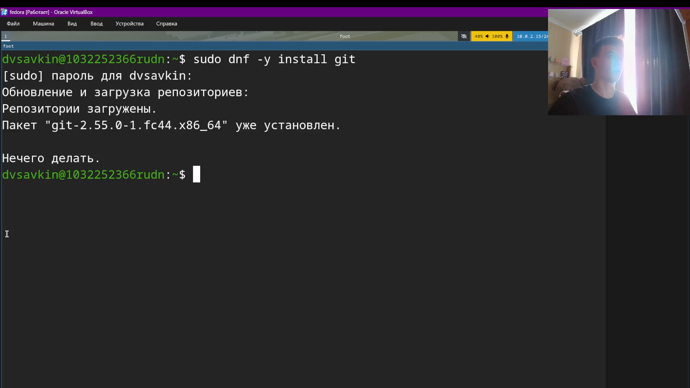
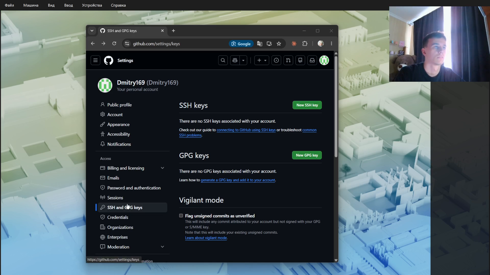
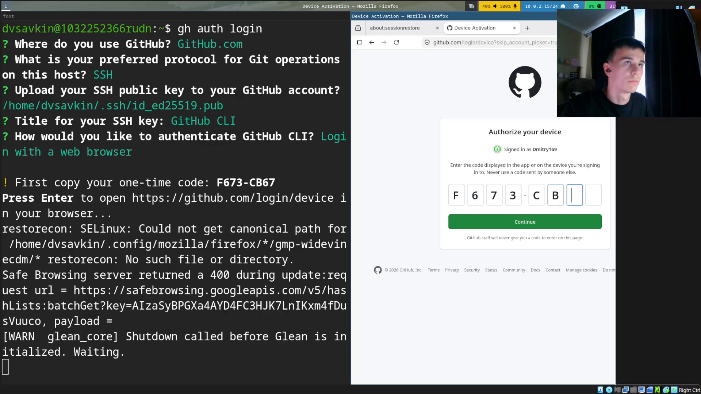
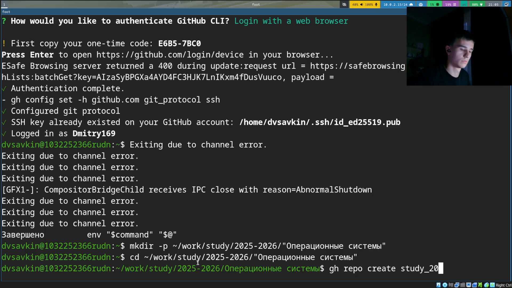
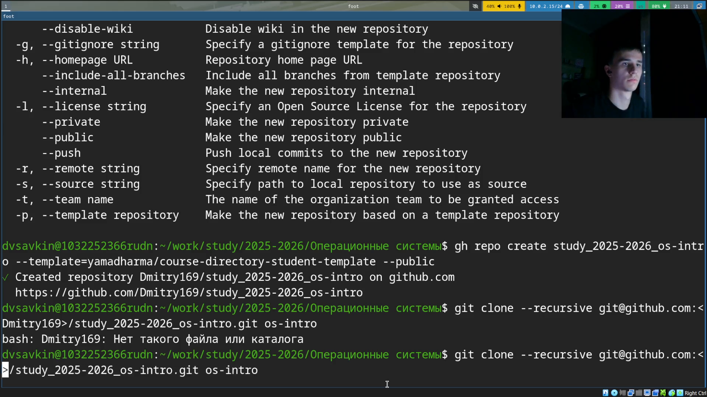
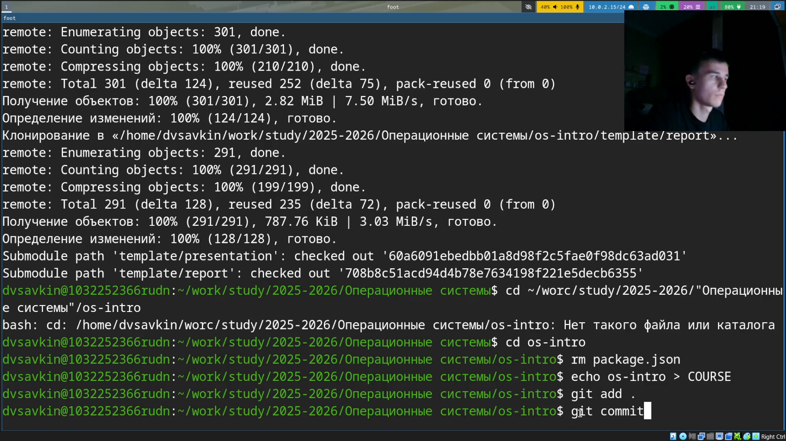
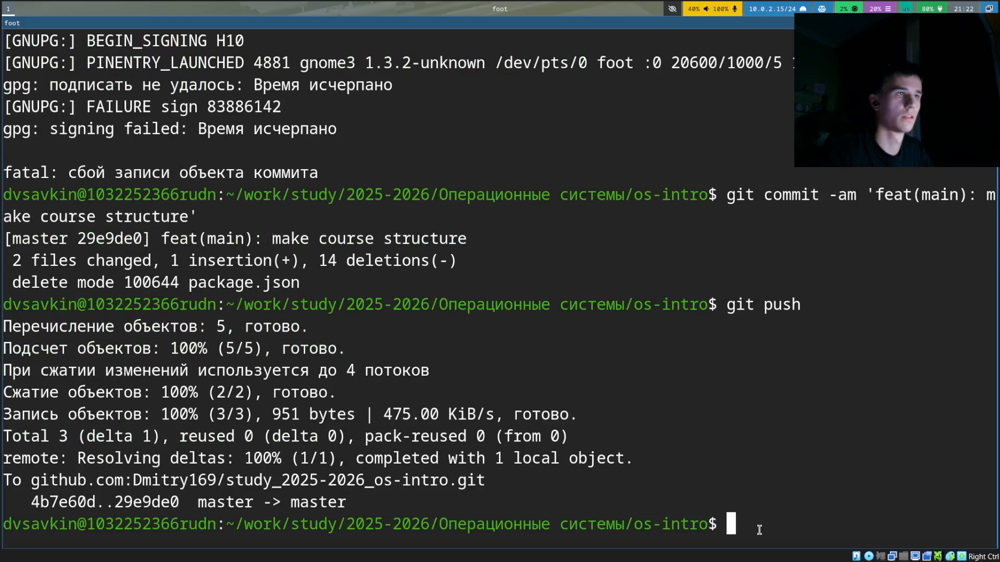

# Информация

## Докладчик

:::::::::::::: {.columns align=center}
::: {.column width="70%"}

- Савкин Дмитрий Вадимович
- РУДН, группа НПИбд-02-25
- Тема: первоначальная настройка git

:::
::: {.column width="30%"}

:::
::::::::::::::

# Цель работы

## Цель работы

- Изучить идеологию систем контроля версий, освоить работу с git

# Задание

## Задание

- Настроить git, ключи SSH и PGP, подписи коммитов
- Зарегистрироваться на GitHub, создать рабочий каталог курса

# Выполнение работы
## Установка git

Устанавливаем git: `sudo dnf install git`.

{width=55%}

## Установка GitHub CLI

Устанавливаем GitHub CLI: `sudo dnf install gh`.

{width=55%}

## Базовые параметры

Задаём имя, email, кодировку путей, ветку по умолчанию, переносы строк.

{width=55%}

## SSH-ключ

Генерируем SSH-ключ, копируем публичный ключ в буфер.

{width=55%}

## Добавление ключа на GitHub

Открываем GitHub Settings → SSH and GPG keys.

{width=55%}

## PGP-ключ

Генерируем PGP-ключ (RSA 4096 бит).

{width=55%}

## Подпись коммитов

Настраиваем автоматическую подпись коммитов и `gh auth login`.

{width=55%}

## Подтверждение в браузере

Подтверждаем активацию устройства по одноразовому коду.

{width=55%}

## Авторизация завершена

Вход выполнен под учётной записью Dmitry169.

{width=55%}

## Создание репозитория

Создаём репозиторий курса из шаблона и клонируем его.

{width=55%}

## Настройка каталога

Удаляем `package.json`, создаём файл `COURSE`, `git add .`.

{width=55%}

## Первый коммит

Коммитим и отправляем изменения: `git commit -am`, `git push`.

{width=55%}

# Выводы

## Выводы

- Изучены принципы git, настроены SSH/PGP-ключи и подпись коммитов
- Создан и настроен репозиторий курса, отправлен подписанный коммит
