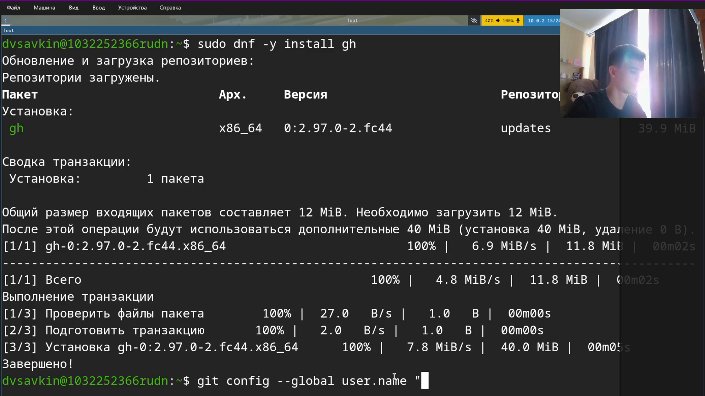
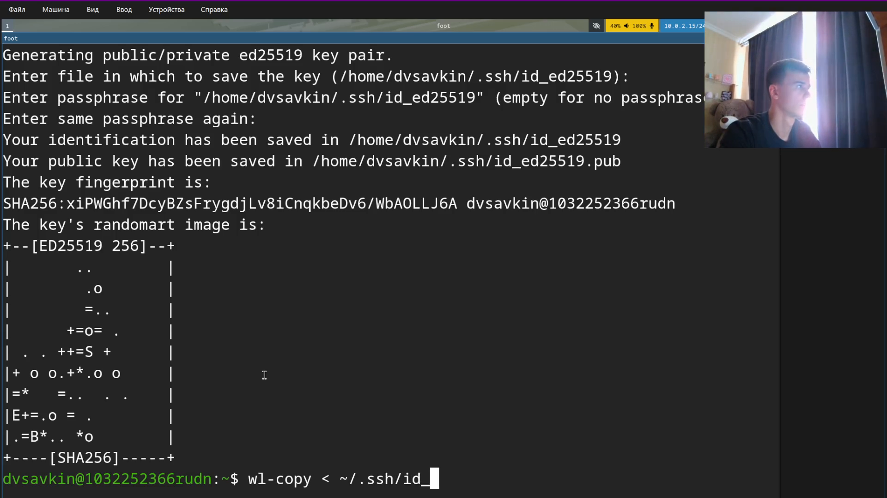
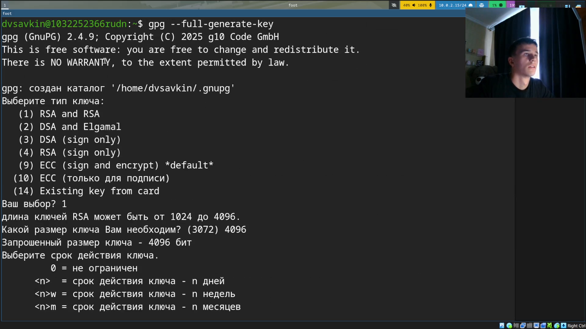
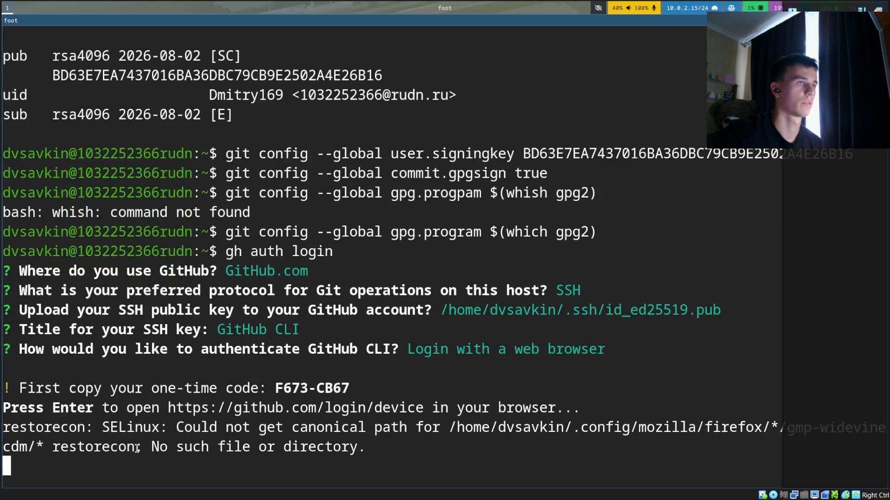

---
## Author
author:
  name: Савкин Дмитрий Вадимович
  affiliation:
    - name: Российский университет дружбы народов
      country: Российская Федерация
      city: Москва

## Title
title: "Отчёт по лабораторной работе № 2"
subtitle: "Первоначальная настройка git"
license: "CC BY"
---

# Цель работы

Изучить идеологию и применение средств контроля версий, освоить умения по работе с git.

# Задание

- Создать базовую конфигурацию для работы с git, создать ключи SSH и PGP, настроить подписи git, зарегистрироваться на GitHub, создать локальный каталог для выполнения заданий по предмету.

# Выполнение лабораторной работы

Устанавливаем git: `sudo dnf install git`.

{width=70%}

Устанавливаем GitHub CLI: `sudo dnf install gh`.

{width=70%}

Задаём базовые параметры git: имя, email, кодировку путей, имя ветки по умолчанию, обработку переносов строк.

{width=70%}

Генерируем SSH-ключ: `ssh-keygen -t ed25519`, копируем публичный ключ в буфер: `wl-copy < ~/.ssh/id_ed25519.pub`.

{width=70%}

Открываем раздел GitHub Settings → SSH and GPG keys для добавления ключей.

{width=70%}

Генерируем PGP-ключ: `gpg --full-generate-key` (RSA and RSA, 4096 бит, без ограничения срока действия).

{width=70%}

Настраиваем автоматическую подпись коммитов (`user.signingkey`, `commit.gpgsign`, `gpg.program`) и авторизуемся в GitHub CLI: `gh auth login`.

{width=70%}

Подтверждаем активацию устройства в браузере по одноразовому коду.

{width=70%}

Авторизация GitHub CLI завершена успешно, вход выполнен под учётной записью Dmitry169.

{width=70%}

Создаём репозиторий курса на основе шаблона: `gh repo create study_2025-2026_os-intro --template=yamadharma/course-directory-student-template --public` и клонируем его: `git clone --recursive`.

{width=70%}

Настраиваем каталог курса: удаляем `package.json`, создаём файл `COURSE`, добавляем изменения: `git add .`.

{width=70%}

Сохраняем и отправляем изменения: `git commit -am 'feat(main): make course structure'`, `git push`.

{width=70%}

# Выводы

Изучены принципы работы распределённой системы контроля версий git, получены практические навыки настройки git, генерации SSH- и PGP-ключей, подписи коммитов и работы с GitHub через терминал, в том числе через утилиту gh. Создан и настроен рабочий репозиторий курса на основе шаблона, в который отправлен подписанный коммит.

# Ответы на контрольные вопросы{.unnumbered}

**1. Что такое системы контроля версий (VCS) и для решения каких задач они предназначаются?**
Программные средства для фиксации изменений в файлах проекта при совместной работе нескольких человек: сохранение истории, слияние правок, откат к более ранним версиям.

**2. Объясните понятия VCS: хранилище, commit, история, рабочая копия.**
Хранилище — репозиторий со всеми версиями проекта; commit — зафиксированный набор изменений; история — последовательность коммитов; рабочая копия — локальная версия файлов пользователя.

**3. Централизованные и децентрализованные VCS?**
Централизованные (SVN) — один сервер. Децентрализованные (git) — полная копия у каждого.

**4. Работа с VCS в одиночку.**
`init`, правки, `status`/`diff`, `add`, `commit`.

**5. Работа с общим хранилищем.**
`pull`, ветка, правки, `add`, `commit`, `push`.

**6. Задачи git.**
Версионирование, совместная работа, слияние, ветки, бэкап.

**7. Основные команды git.**
`init`, `status`, `diff`, `add`, `rm`, `commit`, `pull`, `push`, `checkout`, `merge`, `branch`.

**8. Локально и с удалённым репозиторием.**
Локально: `init`, `add`, `commit`. Удалённо: `clone`, `pull`, `push`.

**9. Ветви (branches)?**
Параллельная линия разработки для экспериментов без риска для основной ветки.

**10. Игнорирование файлов?**
Через `.gitignore` — чтобы служебные файлы не попадали в отслеживание.
