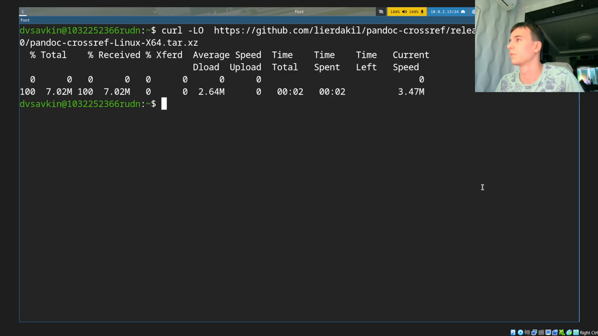
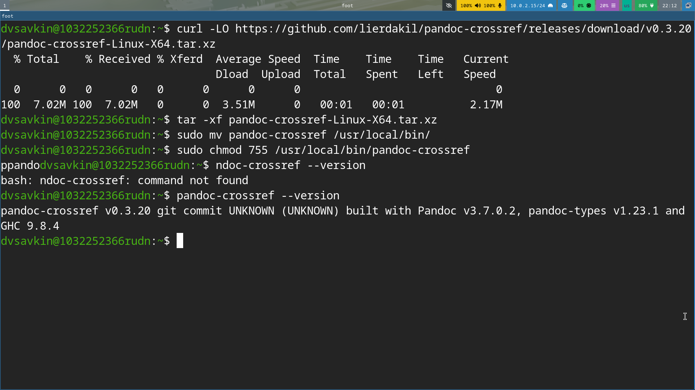
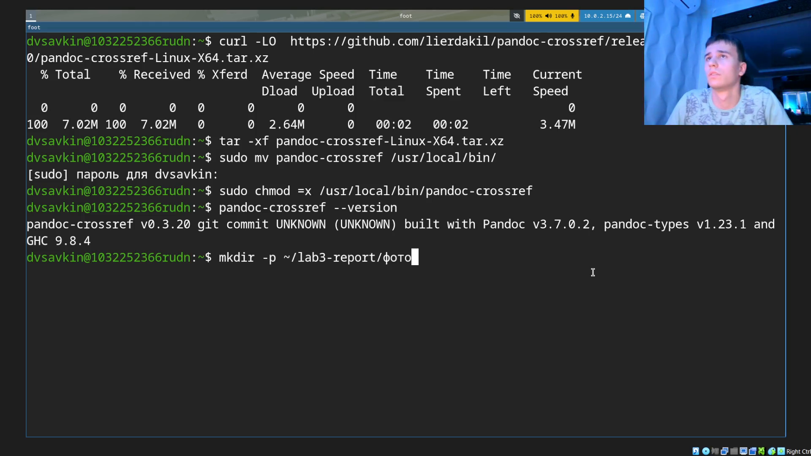
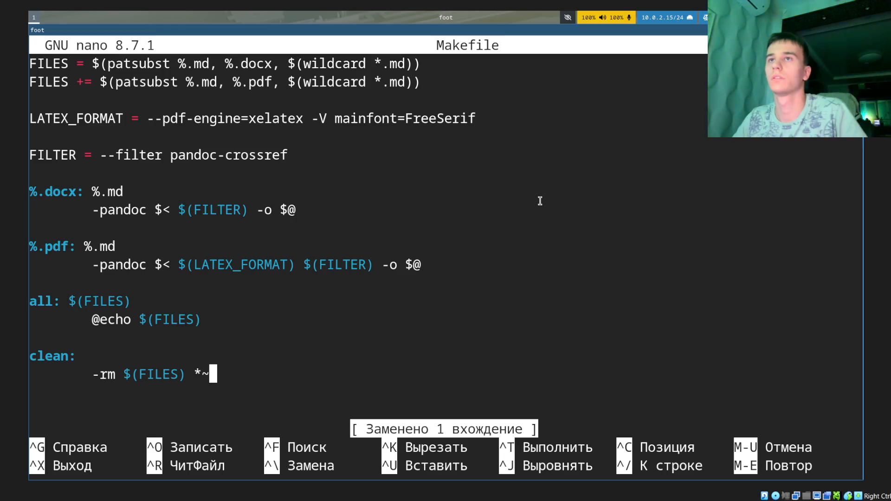
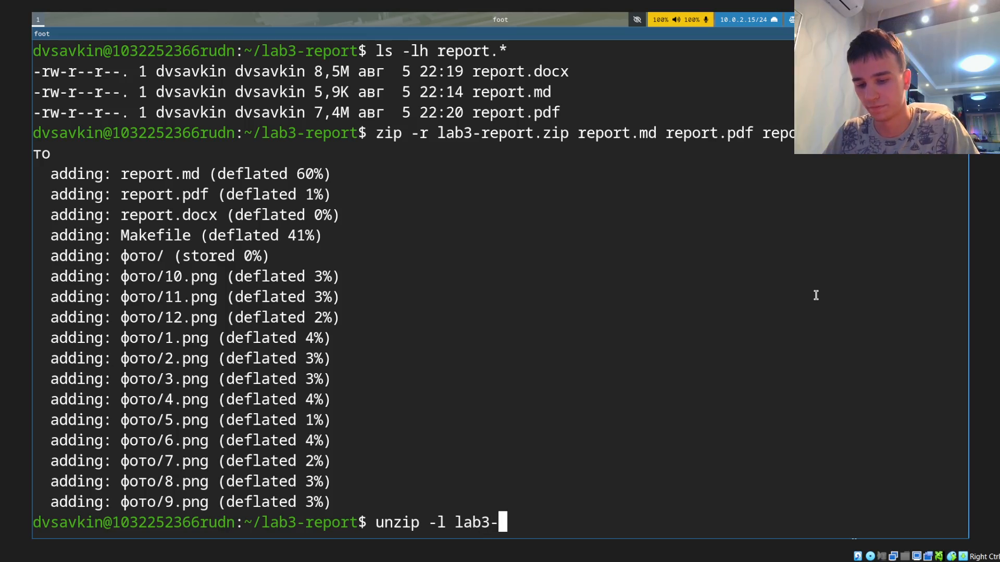

# Информация

## Докладчик

:::::::::::::: {.columns align=center}
::: {.column width="70%"}

- Савкин Дмитрий Вадимович
- РУДН, группа НПИбд-02-25
- Тема: оформление отчётов в Markdown

:::
::: {.column width="30%"}

:::
::::::::::::::

# Цель работы

## Цель работы

- Научиться оформлять отчёты с помощью Markdown

# Задание

## Задание

- Сделать отчёт по Лабораторной работе №2 в формате Markdown
- Предоставить отчёт в форматах pdf, docx и md

# Выполнение работы
## Скачивание pandoc-crossref

Скачиваем сборку `pandoc-crossref`, соответствующую версии pandoc.

{width=55%}

## Распаковка

Распаковываем архив: `tar -xf`.

{width=55%}

## Установка в систему

Переносим программу в `/usr/local/bin`, даём права, проверяем версию.

{width=55%}

## Рабочий каталог

Создаём рабочий каталог для отчёта с подпапкой для скриншотов.

{width=55%}

## Копирование текста

Копируем текст отчёта по Лабораторной работе №2.

{width=55%}

## Копирование скриншотов

Копируем скриншоты Лабораторной работы №2.

{width=55%}

## Makefile

Создаём Makefile: xelatex + FreeSerif + фильтр pandoc-crossref.

{width=55%}

## Сборка

Запускаем `make all` — собираются report.docx и report.pdf.

{width=55%}

## Архив

Упаковываем всё в архив и проверяем содержимое.

{width=55%}

# Выводы

## Выводы

- Изучены основы Markdown, освоена сборка отчётов через Pandoc
- Установлен pandoc-crossref, написан Makefile для сборки в 2 форматах
