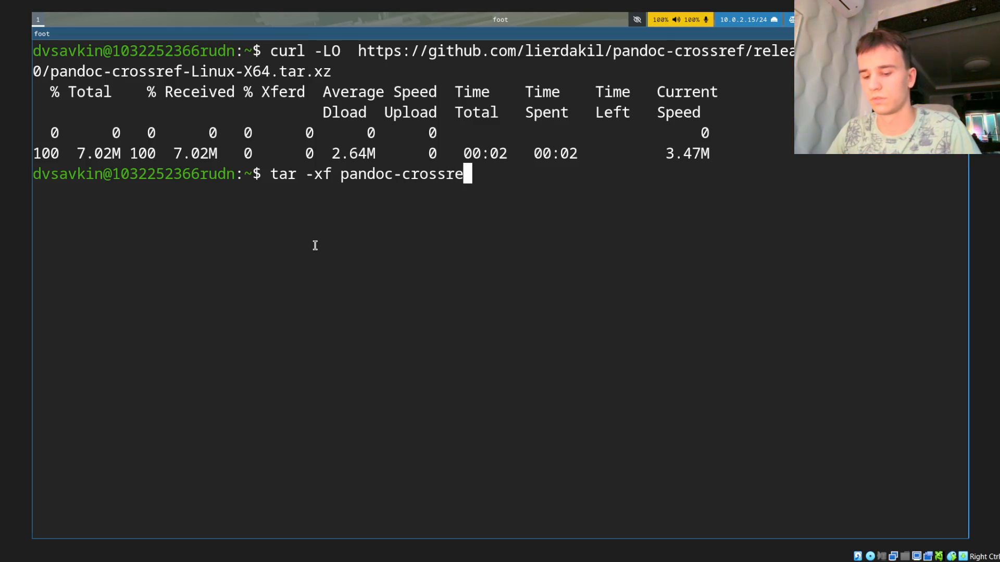
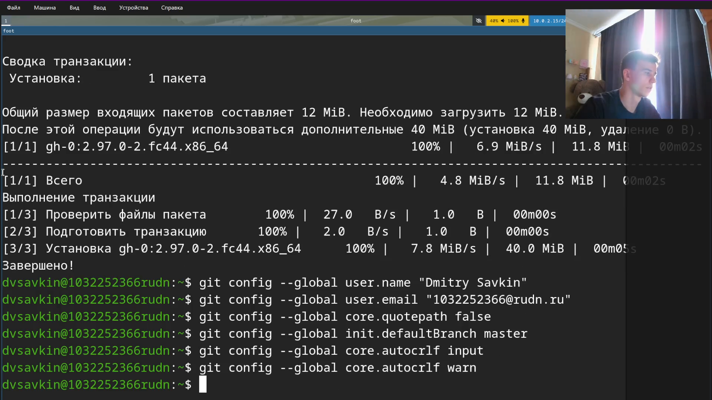
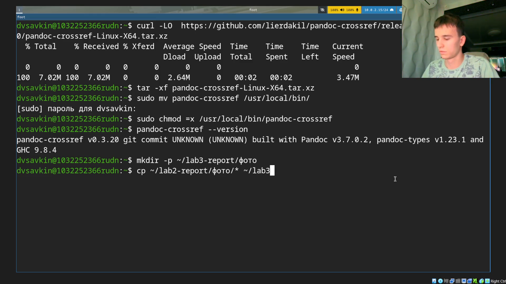
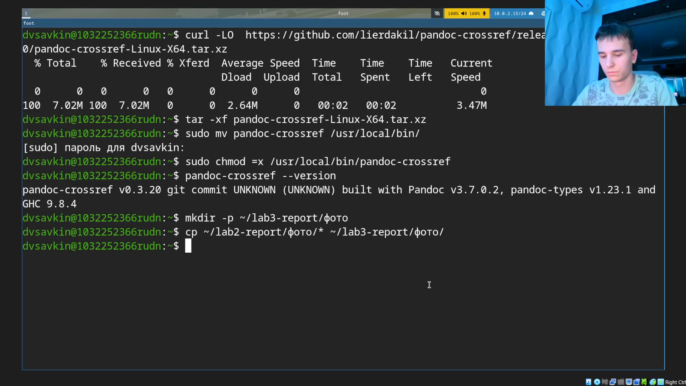
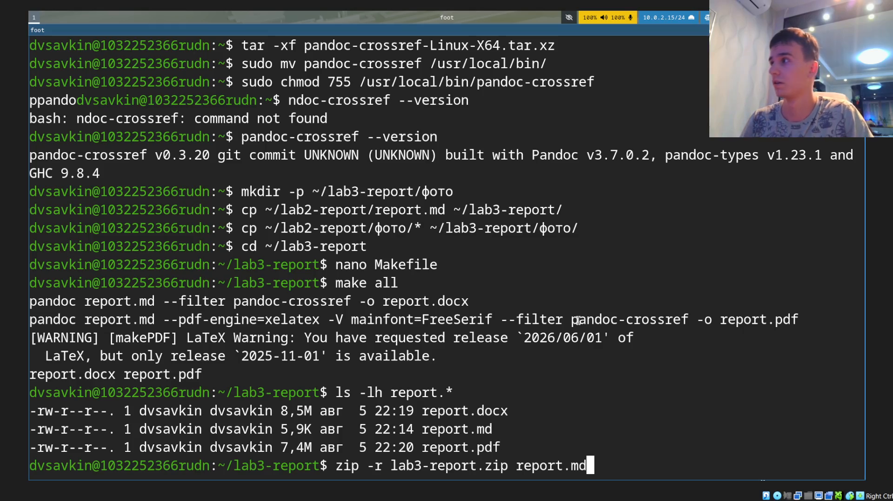

---
## Author
author:
  name: Савкин Дмитрий Вадимович
  affiliation:
    - name: Российский университет дружбы народов
      country: Российская Федерация
      city: Москва

## Title
title: "Отчёт по лабораторной работе № 3"
subtitle: "Markdown"
license: "CC BY"
---

# Цель работы

Научиться оформлять отчёты с помощью легковесного языка разметки Markdown.

# Задание

- Сделать отчёт по предыдущей лабораторной работе в формате Markdown.
- Предоставить отчёт в 3 форматах: pdf, docx и md (в архиве, поскольку он должен содержать скриншоты, Makefile и т. д.).

# Выполнение лабораторной работы

Скачиваем сборку `pandoc-crossref`, соответствующую установленной версии pandoc: `curl -LO https://github.com/lierdakil/pandoc-crossref/releases/download/v0.3.20/pandoc-crossref-Linux-X64.tar.xz`.

{width=70%}

Распаковываем архив: `tar -xf pandoc-crossref-Linux-X64.tar.xz`.

{width=70%}

Переносим программу в `/usr/local/bin`, даём права на запуск и проверяем версию: `sudo mv pandoc-crossref /usr/local/bin/`, `sudo chmod 755 /usr/local/bin/pandoc-crossref`, `pandoc-crossref --version`.

{width=70%}

Создаём рабочий каталог для отчёта с подпапкой для скриншотов: `mkdir -p ~/lab3-report/фото`.

{width=70%}

Копируем в него текст отчёта по лабораторной работе № 2: `cp ~/lab2-report/report.md ~/lab3-report/`.

{width=70%}

Копируем скриншоты лабораторной работы № 2: `cp ~/lab2-report/фото/* ~/lab3-report/фото/`.

{width=70%}

Создаём `Makefile` для автоматической сборки отчёта в форматы pdf и docx, указав движок `xelatex` со шрифтом `FreeSerif` для корректного отображения кириллицы и фильтр `pandoc-crossref`.

{width=70%}

Запускаем сборку: `make all`. Pandoc последовательно собирает `report.docx` и `report.pdf` из `report.md`.

{width=70%}

Упаковываем `report.md`, `report.pdf`, `report.docx`, `Makefile` и папку `фото` в архив и проверяем его содержимое: `zip -r lab3-report.zip report.md report.pdf report.docx Makefile фото`, `unzip -l lab3-report.zip`.

{width=70%}

# Выводы

Изучены основные элементы синтаксиса Markdown и освоена обработка Markdown-документов с помощью Pandoc. Установлен `pandoc-crossref` (вручную, поскольку в стандартном репозитории Fedora он отсутствует), написан `Makefile` для автоматической сборки отчёта сразу в двух форматах. На основе отчёта по лабораторной работе № 2 собраны `report.pdf` и `report.docx`, все материалы упакованы в единый архив вместе со скриншотами и Makefile.
