# Информация

## Докладчик

:::::::::::::: {.columns align=center}
::: {.column width="70%"}

- Савкин Дмитрий Вадимович
- РУДН, группа НПИбд-02-25
- Тема: продвинутое использование git (git-flow)

:::
::: {.column width="30%"}

:::
::::::::::::::

# Цель работы

## Цель работы

- Получение навыков правильной работы с репозиториями git

# Задание

## Задание

- Освоить git-flow на тестовом репозитории
- Преобразовать рабочий репозиторий на git-flow и conventional commits

# Выполнение работы
## Установка gitflow

Включаем COPR-репозиторий, устанавливаем `gitflow`.

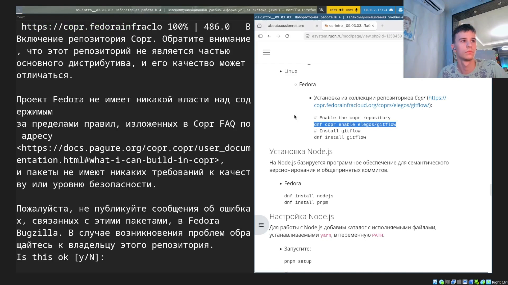{width=55%}

## Node.js и commitizen

Устанавливаем Node.js, pnpm, глобально `commitizen`.

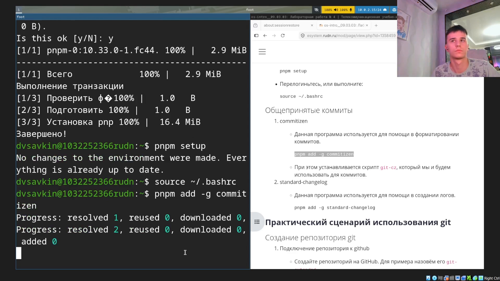{width=55%}

## standard-changelog

Устанавливаем `standard-changelog`, создаём тестовый репозиторий.

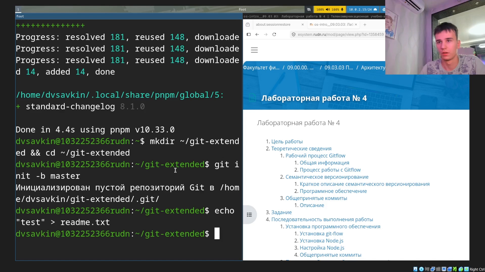{width=55%}

## Индекс и адаптер

Добавляем файл в индекс, ставим адаптер `cz-conventional-changelog`.

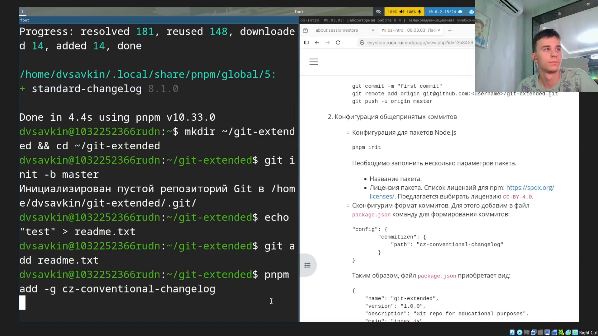{width=55%}

## package.json

Инициализируем `package.json`.

{width=55%}

## Настройка commitizen

Добавляем блок `config.commitizen` в `package.json`.

{width=55%}

## Первый коммит через cz

`git add .`, `git cz` — выбираем тип `feat`.

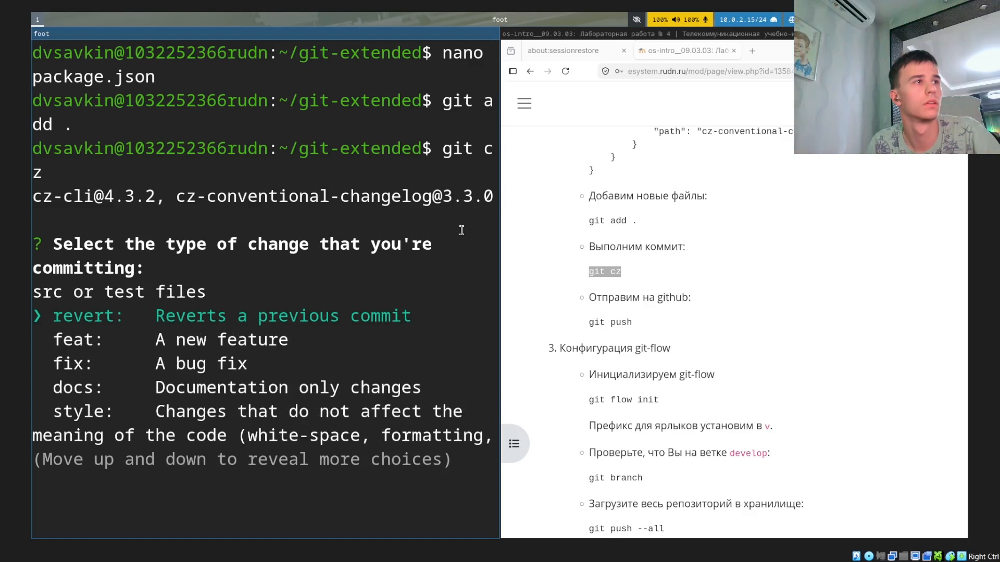{width=55%}

## Диалог commitizen

Проходим диалог: область, описание, breaking changes.

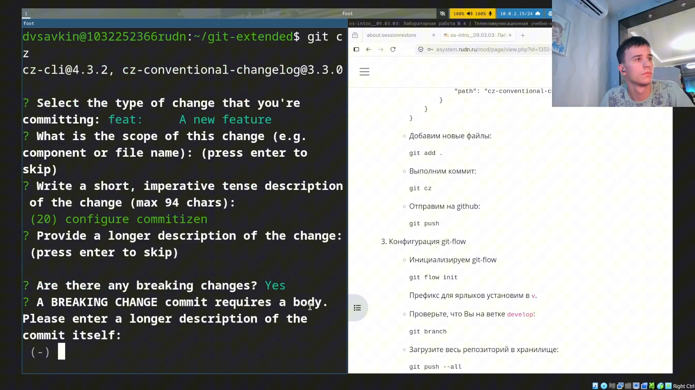{width=55%}

## git flow init

Отправляем коммит, инициализируем git-flow.

{width=55%}

## Начало релиза

`git push --all`, начинаем релиз 1.0.0, генерируем CHANGELOG.

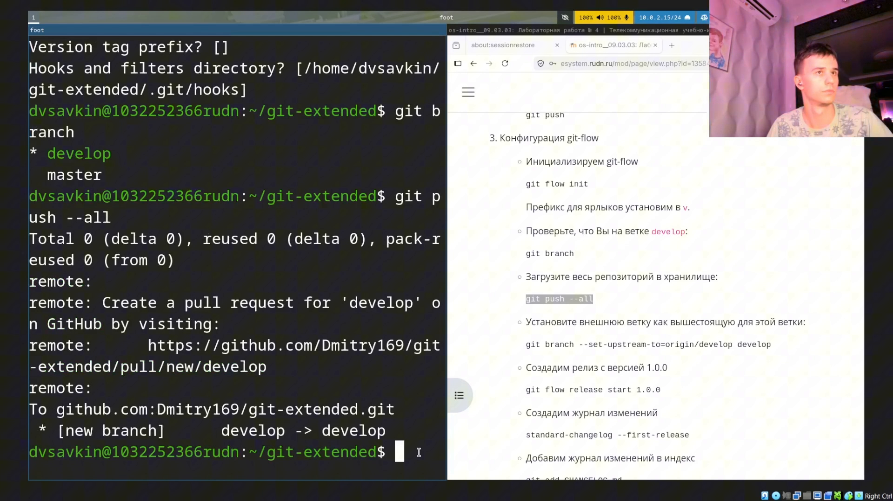{width=55%}

## Завершение релиза

`git flow release finish 1.0.0`, сообщение для тега.

{width=55%}

## Push веток и тегов

`git push --all`, `git push --tags`.

{width=55%}

## GitHub release

Создаём релиз на GitHub через `gh release create`.

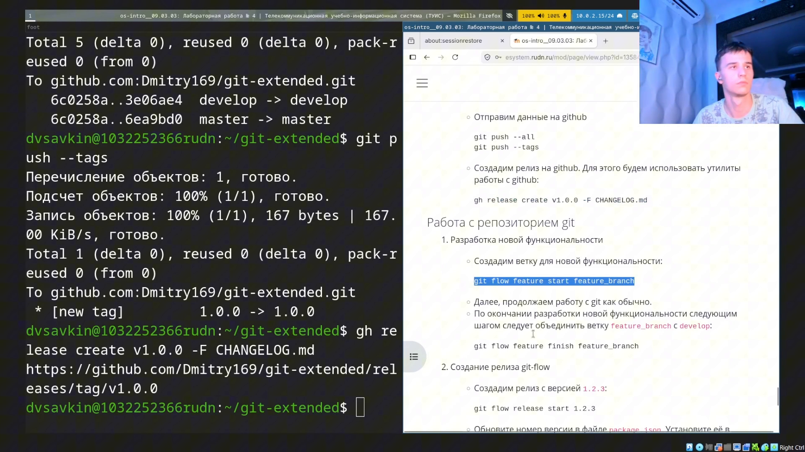{width=55%}

## Feature-ветка

Создаём ветку для новой функциональности.

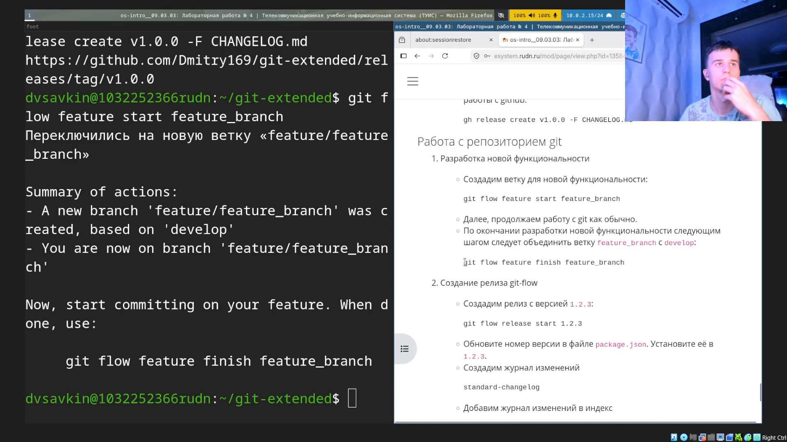{width=55%}

## Завершение feature и релиз 1.2.3

Завершаем feature, начинаем релиз 1.2.3.

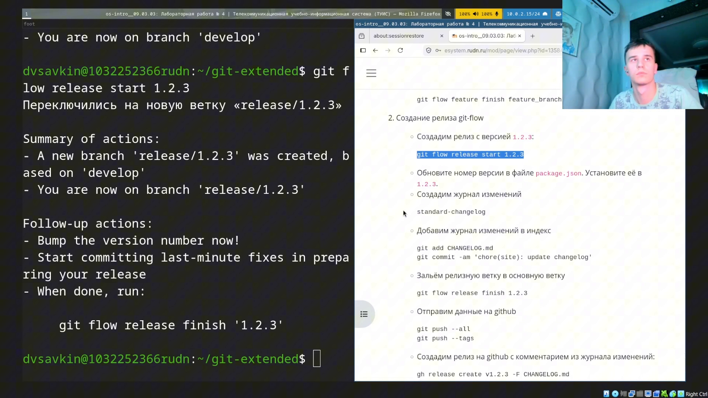{width=55%}

## Завершение второго релиза

`git flow release finish 1.2.3`.

{width=55%}

## Push второго релиза

Отправляем ветки и теги второго релиза.

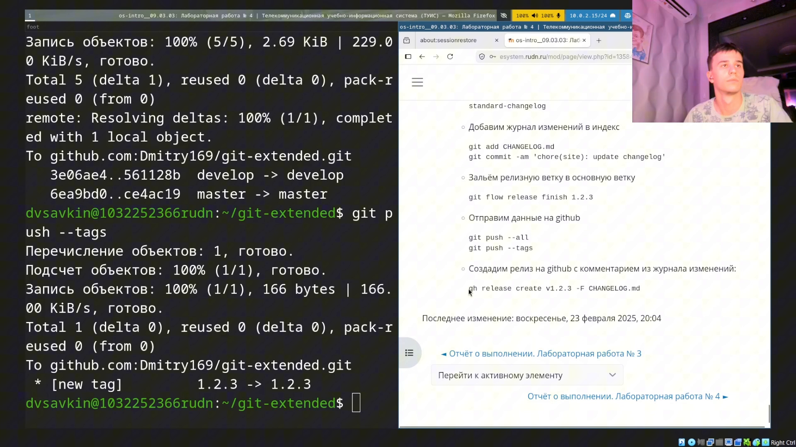{width=55%}

## Второй GitHub release

Создаём второй релиз на GitHub.

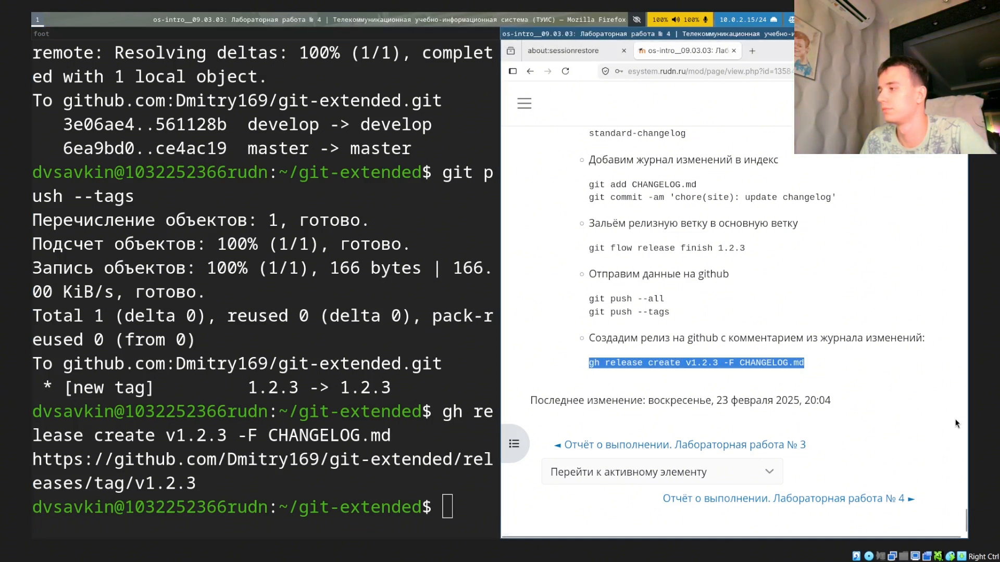{width=55%}

# Выводы

## Выводы

- Изучена модель ветвления Gitflow и Conventional Commits
- Проведён полный цикл разработки: feature-ветка и два релиза с автогенерацией changelog
