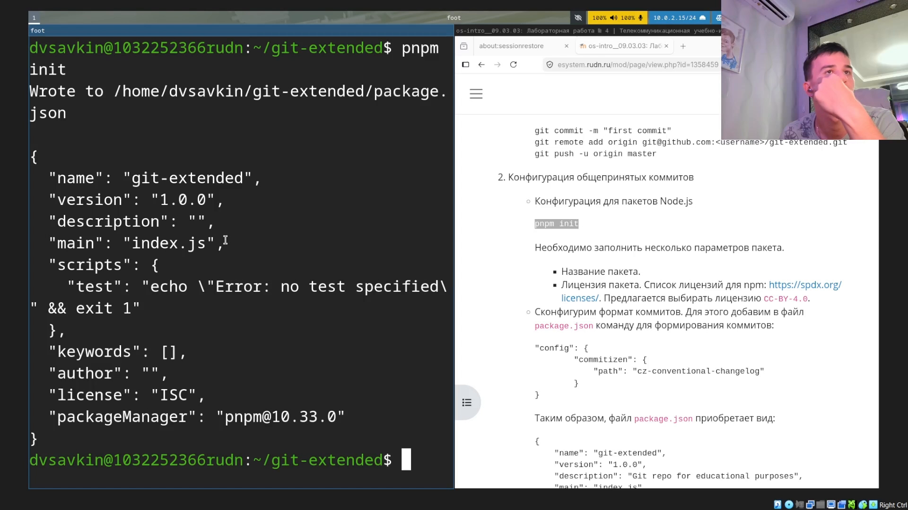
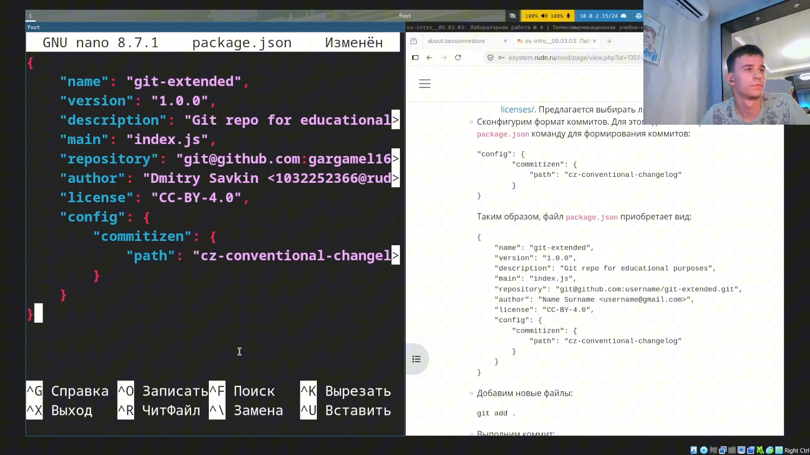
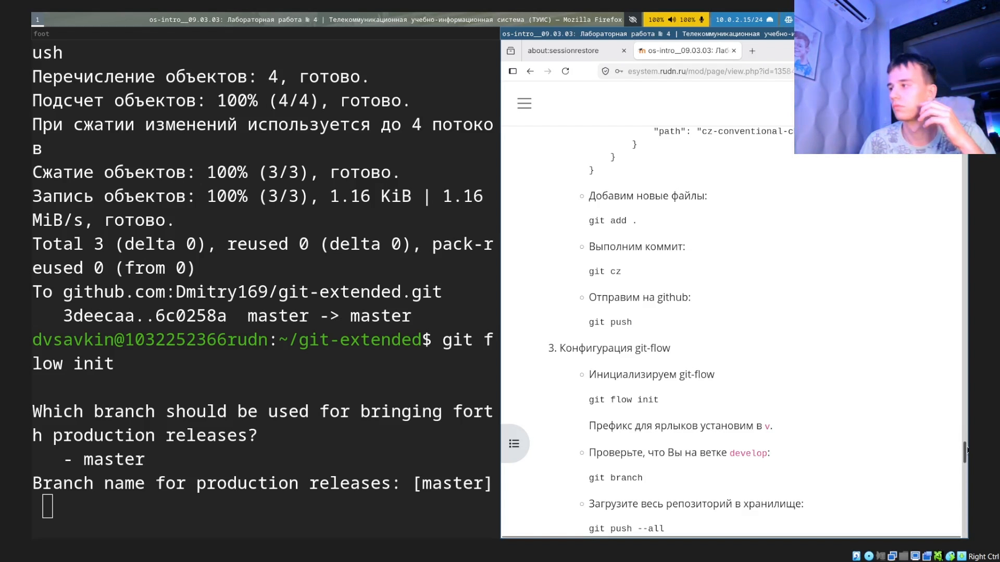
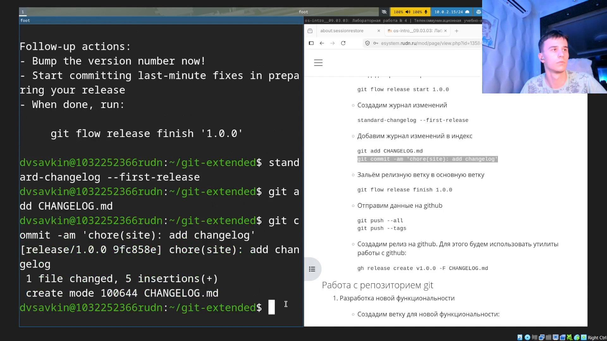
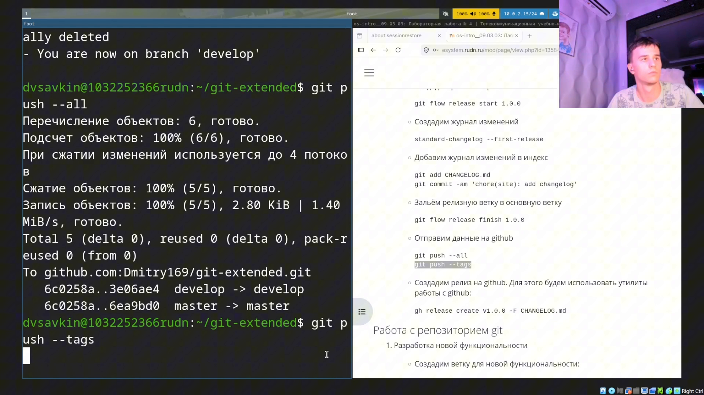
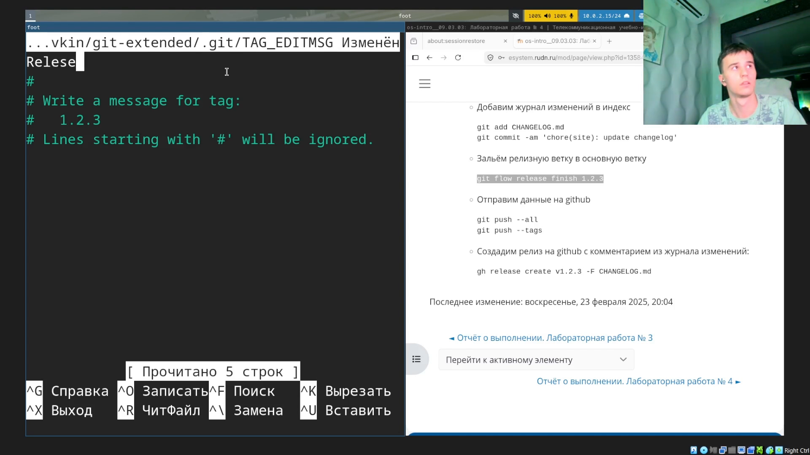

---
## Author
author:
  name: Савкин Дмитрий Вадимович
  affiliation:
    - name: Российский университет дружбы народов
      country: Российская Федерация
      city: Москва

## Title
title: "Отчёт по лабораторной работе № 4"
subtitle: "Продвинутое использование git"
license: "CC BY"
---

# Цель работы

Получение навыков правильной работы с репозиториями git.

# Задание

- Выполнить работу для тестового репозитория.
- Преобразовать рабочий репозиторий в репозиторий с git-flow и conventional commits.

# Выполнение лабораторной работы

Включаем COPR-репозиторий и устанавливаем `gitflow`: `dnf copr enable elegos/gitflow`, `dnf install gitflow`.

{width=70%}

Устанавливаем Node.js и pnpm, настраиваем окружение и глобально ставим `commitizen`: `dnf install nodejs`, `dnf install pnpm`, `pnpm setup`, `source ~/.bashrc`, `pnpm add -g commitizen`.

{width=70%}

Устанавливаем `standard-changelog` и создаём тестовый репозиторий: `pnpm add -g standard-changelog`, `mkdir ~/git-extended && cd ~/git-extended`, `git init -b master`, `echo "test" > readme.txt`.

{width=70%}

Добавляем файл в индекс и устанавливаем адаптер commitizen для формата коммитов: `git add readme.txt`, `pnpm add -g cz-conventional-changelog`.

{width=70%}

Инициализируем `package.json`: `pnpm init`.

{width=70%}

Редактируем `package.json`, добавляя блок `config.commitizen` с путём к адаптеру `cz-conventional-changelog`, а также поля `repository` и `author`.

{width=70%}

Добавляем все файлы и создаём первый коммит через commitizen вместо обычного `git commit`: `git add .`, `git cz` — выбираем тип изменения `feat`.

{width=70%}

Проходим весь диалог commitizen: область изменения, краткое и подробное описание коммита, отметка о breaking changes.

{width=70%}

Отправляем коммит на GitHub и инициализируем git-flow: `git push`, `git flow init` (префикс тегов `v`).

{width=70%}

Проверяем текущую ветку, отправляем весь репозиторий в хранилище и начинаем релиз версии 1.0.0: `git branch`, `git push --all`, `git flow release start 1.0.0`, генерируем журнал изменений `standard-changelog --first-release`, добавляем и коммитим `CHANGELOG.md`.

{width=70%}

Завершаем релиз: `git flow release finish 1.0.0`, вводим сообщение для тега `Release 1.0.0`.

{width=70%}

Отправляем ветки и теги на GitHub: `git push --all`, `git push --tags`.

{width=70%}

Создаём релиз на GitHub с описанием из журнала изменений: `gh release create v1.0.0 -F CHANGELOG.md`.

{width=70%}

Создаём ветку для новой функциональности: `git flow feature start feature_branch`.

{width=70%}

Завершаем работу над функциональностью и начинаем второй релиз версии 1.2.3: `git flow feature finish feature_branch`, `git flow release start 1.2.3`.

{width=70%}

Завершаем второй релиз, вводим сообщение для тега `Release 1.2.3`: `git flow release finish 1.2.3`.

{width=70%}

Отправляем ветки и теги второго релиза на GitHub: `git push --all`, `git push --tags`.

{width=70%}

Создаём второй релиз на GitHub: `gh release create v1.2.3 -F CHANGELOG.md`.

{width=70%}

# Выводы

Изучена и опробована на практике модель ветвления Gitflow и принцип общепринятых коммитов (Conventional Commits). Настроены git-flow и commitizen в тестовом репозитории, проведён полный цикл разработки новой функциональности через feature-ветку и два цикла выпуска релизов (1.0.0 и 1.2.3) с автоматической генерацией журнала изменений и публикацией релизов на GitHub.
