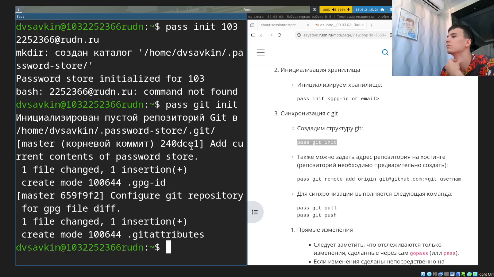
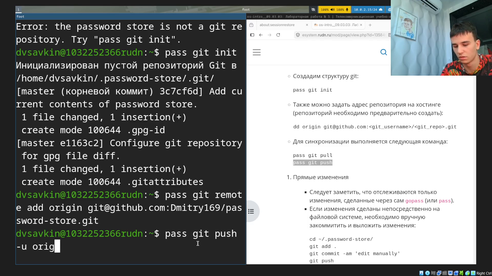
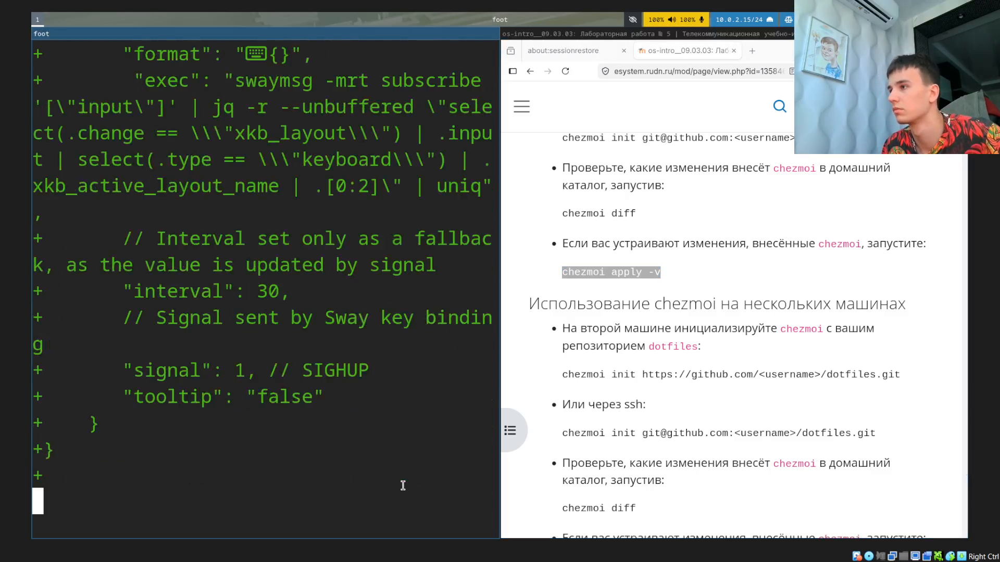

# Информация

## Докладчик

:::::::::::::: {.columns align=center}
::: {.column width="70%"}

- Савкин Дмитрий Вадимович
- РУДН, группа НПИбд-02-25
- Тема: настройка рабочей среды (pass, chezmoi)

:::
::: {.column width="30%"}

:::
::::::::::::::

# Цель работы

## Цель работы

- Получение навыков настройки менеджера паролей pass и менеджера dotfiles chezmoi

# Задание

## Задание

- Настроить pass и синхронизировать хранилище с удалённым репозиторием
- Настроить chezmoi на основе шаблона и применить конфигурацию

# Выполнение работы
## Установка pass

Устанавливаем `pass`, `pass-otp`, проверяем GPG-ключ.

{width=55%}

## Инициализация хранилища

Инициализируем хранилище паролей и git внутри него.

{width=55%}

## Удалённый репозиторий

Добавляем репозиторий на GitHub, отправляем хранилище.

{width=55%}

## Синхронизация

Хранилище синхронизировано, ветка master отслеживает origin/master.

{width=55%}

## Тестовая запись

Добавляем тестовую запись пароля.

{width=55%}

## Генерация пароля

Просматриваем пароль, заменяем на автоматически сгенерированный.

{width=55%}

## Пакеты окружения

Устанавливаем пакеты рабочего окружения (уведомления, панель, терминал).

{width=55%}

## Шрифты и chezmoi

Подключаем COPR со шрифтами Iosevka, устанавливаем chezmoi.

{width=55%}

## Репозиторий dotfiles

Создаём собственный репозиторий dotfiles на GitHub.

{width=55%}

## Применение конфигурации

Инициализируем chezmoi, смотрим diff, применяем конфигурацию.

{width=55%}

# Выводы

## Выводы

- Настроен менеджер паролей pass с синхронизацией через git
- Настроен chezmoi, применены настройки рабочего стола из репозитория dotfiles
