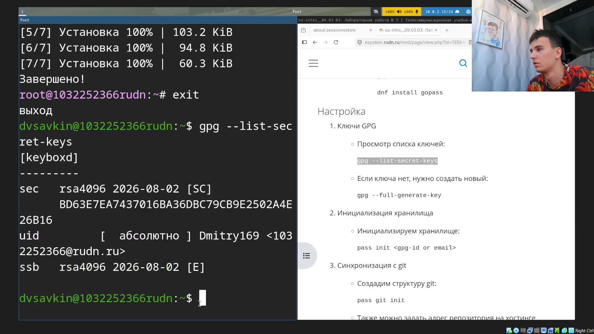
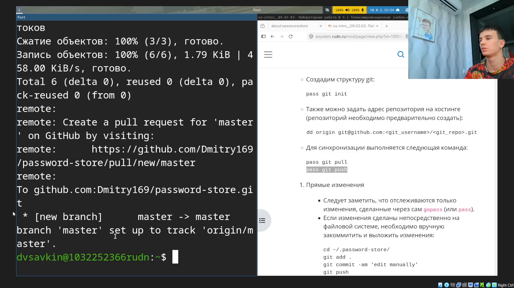
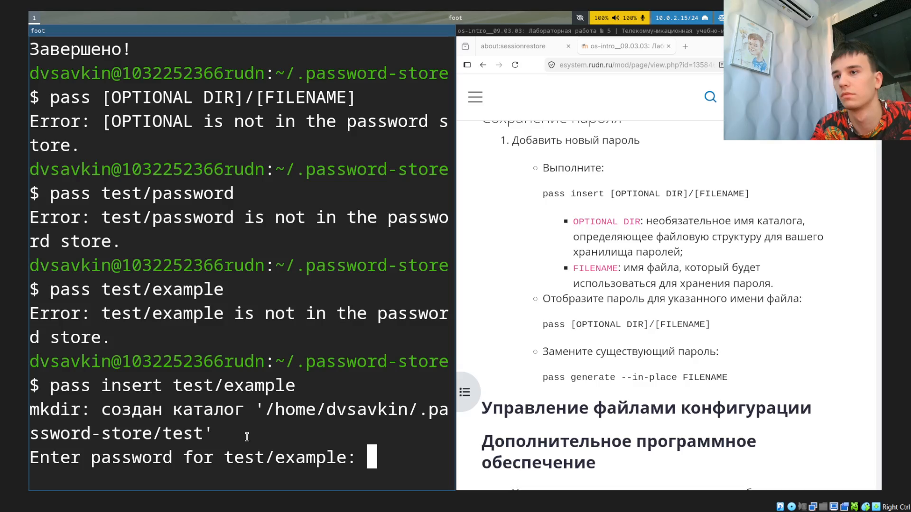
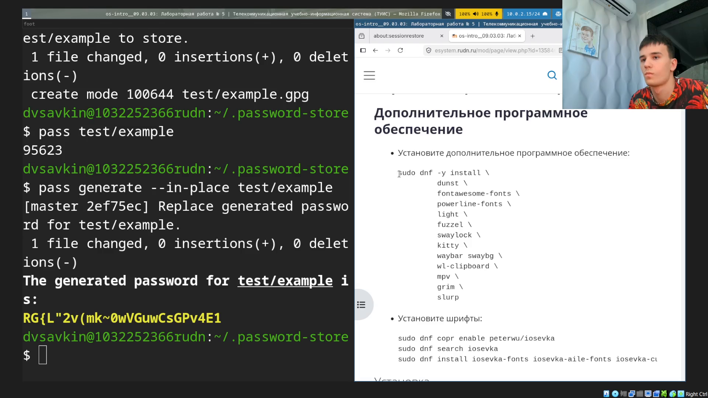
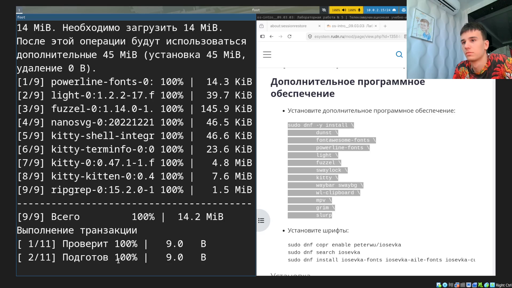
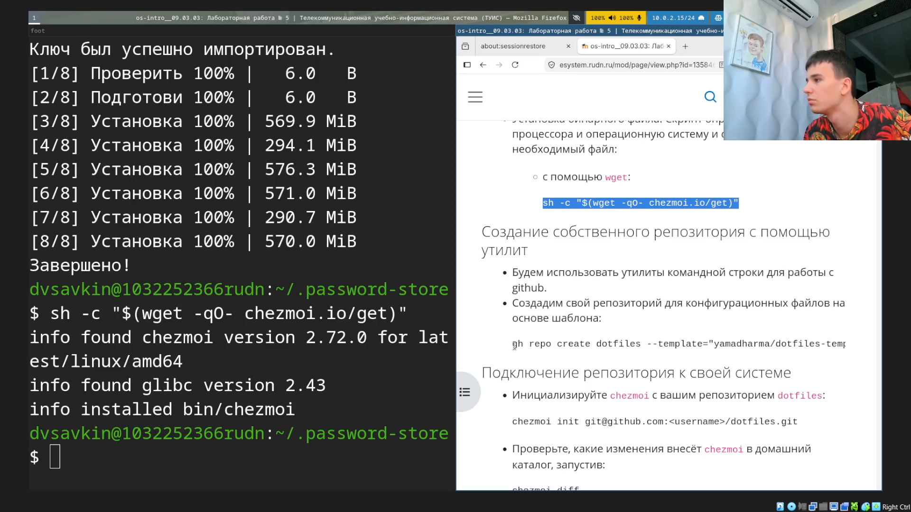
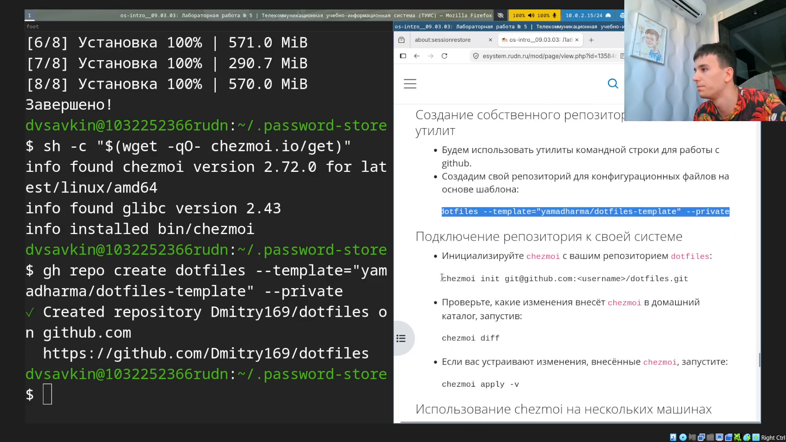

---
## Author
author:
  name: Савкин Дмитрий Вадимович
  affiliation: 
    - name: Российский университет дружбы народов
      country: Российская Федерация
      city: Москва

## Title
title: "Отчёт по лабораторной работе № 5"
subtitle: "Настройка рабочей среды"
license: "CC BY"
---

# Цель работы

получение навыков настройки рабочей среды: менеджера паролей 'pass' и менеджера конфигурационных файлов 'chezmoi'.

# Задание

- Настроить менеджер паролей 'pass' и синхронизировать хранилище паролей с удалённым репозиторием.
- Настроить менеджер dotfiles 'chezmoi' на основе шаблона рабочего окружения и применить конфигурацию.

# Выполнение лабораторной работы

Устанавливаем менеджер паролей 'pass' и дополнение для одноразовых паролей от имени суперпользователя, после чего проверяем наличие GPG-ключа: 'sudo -i', 'dnf install pass pass-otp', 'exit', 'gpg --list-secret-keys'.

{width=70%}

Инициализируем хранилище паролей, указывая адрес электронной почты, привязанный к GPG-ключу, и инициализируем внутри него git-репозиторий: 'pass init 1032252366@rudn.ru', 'pass git init'.

{width=70%}

Добавляем удалённый репозиторий на GitHub и отправляем в него хранилище: 'pass git remote add origin git@github.com:Dmitry169/password-store.git', 'pass git push -u origin master'.

{width=70%}

Хранилище успешно синхронизировано с GitHub - создана ветка 'master', отслеживающая 'origin/master'.

{width=70%}

Добавляем в хранилище тестовую запись пароля: 'pass insert test/example'.

{width=70%}

Просматриваем сохранённый пароль и заменяем его на автоматически сгенерированный: 'pass test/example', 'pass generate --in-place test/example'.

{width=70%}

Устанавливаем пакеты, необходимые для рабочего окружения (уведомления, шрифты, экран блокировки, терминал, панель, обои и вспомогательные утилиты): 'sudo dnf -y install dunst fontawesome-fonts powerline-fonts light fuzzel swaylock kitty waybar swaybg wl-clipboard mpv grim slurp'.

{width=70%}

Подключаем COPR-репозиторий со шрифтами Iosevka, устанавливаем сами шрифты и менеджер конфигурационных файлов 'chezmoi': 'sudo dnf copr enable peterwu/iosevka', 'sudo dnf install iosevka-fonts iosevka-aile-fonts iosevka-curly-fonts iosevka-slab-fonts iosevka-etoile-fonts iosevka-term-fonts', 'sh -c "$(wget -qO- chezmoi.io/get)"'.

{width=70%}

Создаём собственный репозиторий dotfiles на GitHub: 'gh repo create dotfiles --template="yamadharma/dotfiles-template" --private'.

{width=70%}

Инициализируем 'chezmoi' с созданным репозиторием, просматриваем изменения, которые он внесёт в домашний каталог, и применяем их: 'chezmoi init git@github.com:Dmitry169/dotfiles.git', 'chezmoi diff', 'chezmoi apply -v'.

{width=70%}

# Выводы

Изучены и настроены два инструмента для организации рабочей среды: менеджер паролей 'pass', хранящий пароли в виде GPG-зашифрованных файлов и синхронизирующий их через git-репозиторий, и менеджер конфигурационных файлов 'chezmoi', применяющий настройки рабочего стола (панель, терминал, экран блокировки, шрифты) из собственного репозитория dotfiles.
