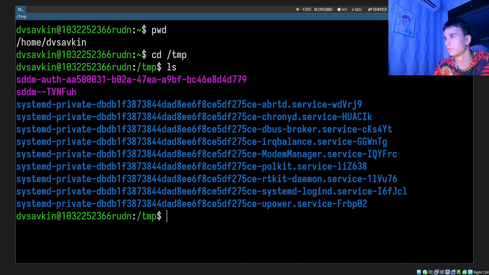
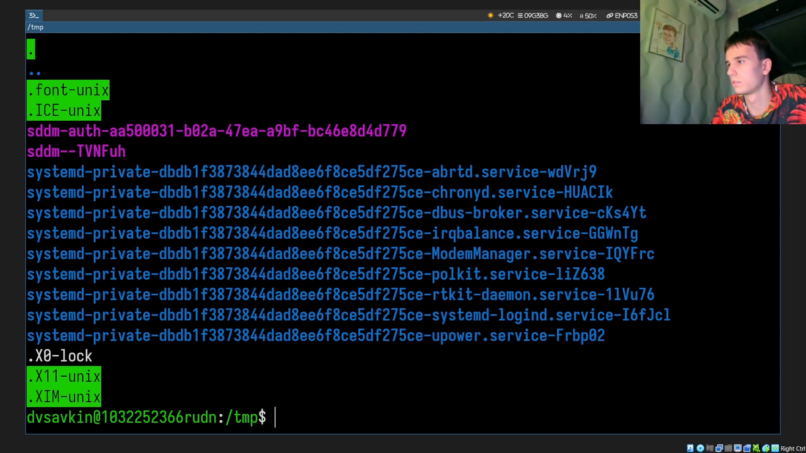
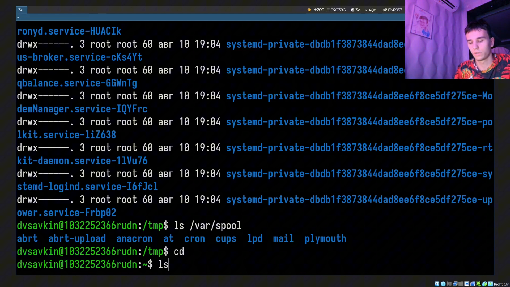
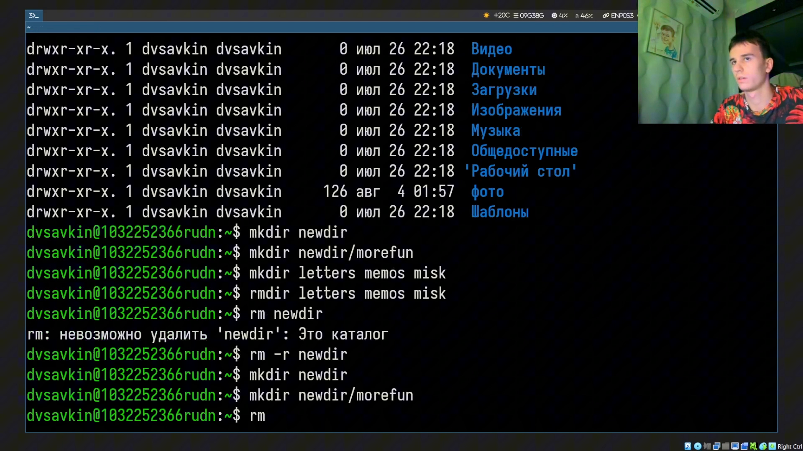
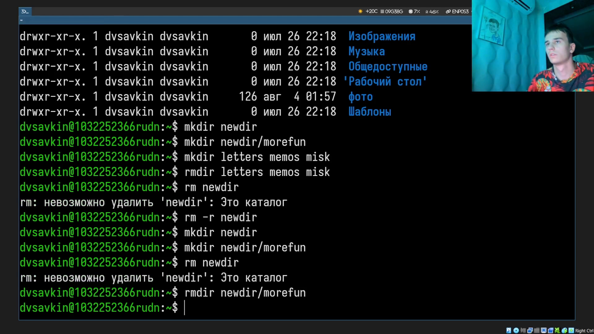
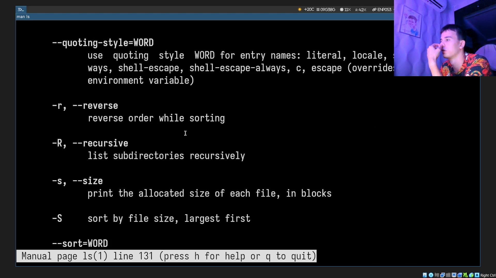
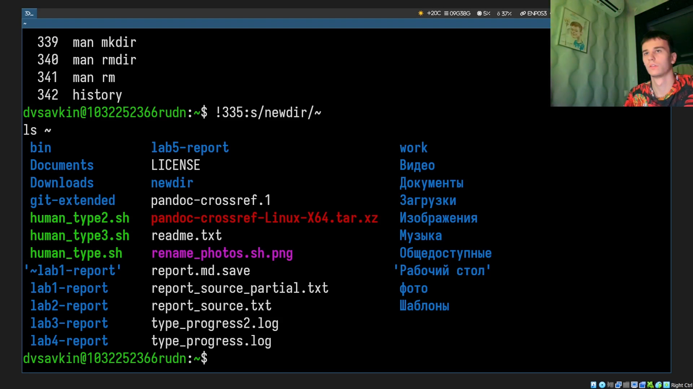

# Информация

## Докладчик

:::::::::::::: {.columns align=center}
::: {.column width="70%"}

- Савкин Дмитрий Вадимович
- РУДН, группа НПИбд-02-25
- Тема: основы интерфейса командной строки

:::
::: {.column width="30%"}

:::
::::::::::::::

# Цель работы

## Цель работы

- Приобретение практических навыков взаимодействия с системой через командную строку

# Задание

## Задание

- Определить домашний каталог, изучить `/tmp` через `ls`
- Создать/удалить каталоги, изучить `man`, `history`

# Выполнение работы
## Домашний каталог

Определяем полное имя домашнего каталога: `pwd`.

{width=55%}

## /tmp

Переходим в `/tmp`, сравниваем `ls` с разными опциями.

{width=55%}

## /var/spool

Проверяем наличие подкаталога `cron` в `/var/spool`.

{width=55%}

## Владелец файлов

Возвращаемся домой, смотрим владельца файлов: `ls -l`.

{width=55%}

## Создание каталогов

Создаём `newdir` и вложенный `morefun`.

{width=55%}

## Групповое создание/удаление

Одной командой создаём и удаляем `letters`, `memos`, `misk`.

{width=55%}

## Ошибка rm

Пробуем `rm` на непустом каталоге — получаем ошибку.

{width=55%}

## rmdir

Удаляем вложенный пустой каталог `morefun`.

{width=55%}

## man ls

Находим опции `-R` (рекурсия) и `-t` (сортировка по времени).

{width=55%}

## man cd/pwd/mkdir/rmdir/rm

Просматриваем справку по основным командам.

{width=55%}

## history

Просматриваем историю, модифицируем команду через подстановку.

{width=55%}

# Выводы

## Выводы

- Получены навыки навигации, работы с каталогами и man
- Освоено использование истории команд для модифицированного повтора
