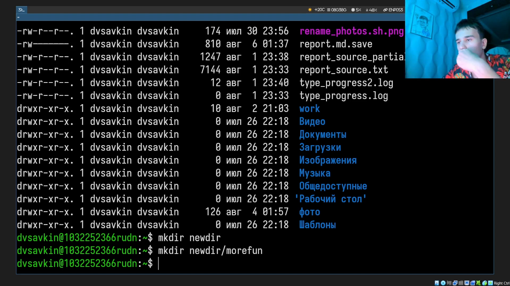
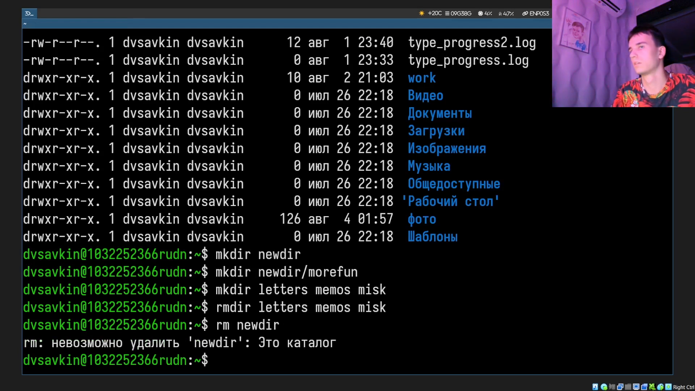
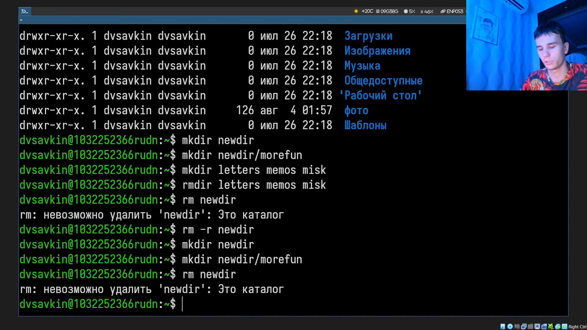
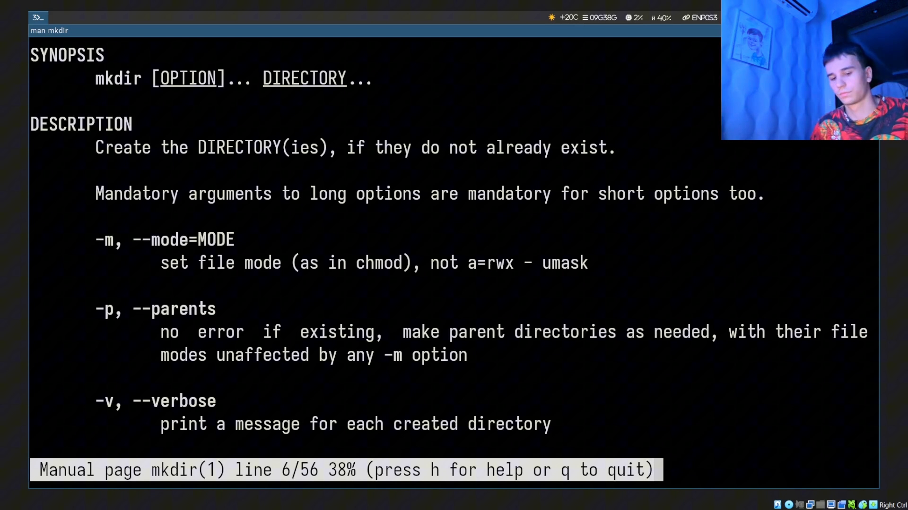

---
## Author
author:
  name: Савкин Дмитрий Вадимович
  affiliation:
    - name: Российский университет дружбы народов
      country: Российская Федерация
      city: Москва

## Title
title: "Отчёт по лабораторной работе № 6"
subtitle: "Основы интерфейса взаимодействия пользователя с системой Unix на уровне командной строки"
license: "CC BY"
---

# Цель работы
приобретение практических навыков взаимодействия пользователя с системой посредством командной строки.

# Задание

- Определить полное имя домашнего каталога.
- Изучить содержимое каталога '/tmp' и домашнего каталога с помощью 'ls' и разных опций.
- Создать и удалить несколько каталогов различными способами.
- С помощью 'man' изучить опции 'ls' для рекурсивного вывода и сортировки по времени изменения.
- Изучить справку по командам 'cd', 'pwd', 'mkdir', 'rmdir', 'rm'.
- Воспользоваться историей команд для модифицированного повтора.

# Выполнение лабораторной работы 

Определяем полное имя домашнего каталога: 'pwd'.

{width=70%}

Переходим в каталог '/tmp' и сравниваем 'ls' с разными опциями: 'cd /tmp', 'ls', 'ls -a', 'ls -l'.

{width=70%}

Проверяем, есть ли в '/var/spool' подкаталог 'cron': 'ls /var/spool'.

{width=70%}

Возвращаемся в домашний каталог и смотрим владельца файлов: 'cd ~', 'ls -l'.

{width=70%}

Создаём каталог 'newdir' и вложенный в него каталог 'morefun': 'mkdir ~/newdir', 'mkdir ~/newdir/morefun'.

{width=70%}

Одной командой создаём три каталога 'letters', 'memos', 'misk' и одной командой удаляем: 'mkdir ~/letters ~/memos ~/misk', 'rmdir ~/letters ~/memos ~/misk'.

{width=70%}

Пробуем удалить непустой каталог 'newdir' командой 'rm' - получаем ошибку, так как без опции '-r' команда не работает с каталогами: 'rm ~/newdir'.

{width=70%} 

Удаляем вложенный пустой каталог 'morefun': 'rmdir ~/newdir/morefun'.

{width=70%}

С помощью 'man ls' находим опцию рекурсивного вывода подкаталогов ('-R') и опцию сортировки по времени последнего изменения ('-t'): 'man ls'.

{width=70%}

С помощью 'man' просматриваем справку по командам 'cd', 'pwd', 'mkdir', 'rmdir', 'rm' и знакомимся с их основными опциями: 'man cd', 'man pwd', 'man mkdir', 'man rmdir', 'man rm'.

{width=70%}

Просматриваем историю выполненных команд и модифицируем одну из них с помощью подстановки: 'history', '!335:s/newdir/~'.

{width=70%}

# Выводы
Получены практические навыки работы с командной строкой Unix-подобной системы: определение текущего и домашнего каталогов, просмотр содержимого каталогов с разными опциями 'ls', создание и удаление каталогов различными способами, получение справки по командам через 'man', а также использование истории команд для повторного и модифицированного выполнения.

# Ответы на контрольные вопросы{.unnumbered}

**1. Что такое командная строка?**

Текстовый интерфейс для ввода команд операционной системы построчно, через командный интерпретатор.

**2. Команда для определения абсолютного пути текущего каталога. Пример.**

'pwd' — например, выводит '/home/dvsavkin'.

**3. Команда и опции для определения только типа и имени файлов в каталоге. Пример.**

'ls -F' - добавляет к имени символ типа: '/' каталог, '*' исполняемый файл, '@' ссылка.

**4. Как отобразить информацию о скрытых файлах? Пример.**

'ls -a' - показывает файлы, чьи имена начинаются с точки, включая '.' и '..'.

**5. Какими командами можно удалить файл и каталог? Одна и та же ли это команда?**

Файл - 'rm файл'. Пустой каталог - 'rmdir каталог' или 'rm -r каталог'. Непустой каталог - только 'rm -r каталог'; 'rm' без '-r' для каталогов не работает.

**6. Как вывести информацию о последних выполненных командах?** 

'history' - выводит пронумерованный список ранее введённых команд.

**7. Как воспользоваться историей команд для их модифицированного выполнения? Пример.**

Обращение по номеру: '!&lt;номер&gt;'; подстановка: '!&lt;номер&gt;:s/что меняем/на что меняем', например '!335:s/newdir/~' взял команду № 335 ('ls newdir') и выполнил её как 'ls ~'.

**8. Примеры запуска нескольких команд в одной строке.**

Команды разделяются точкой с запятой: 'cd; ls'.

**9. Определение и примеры символов экранирования.**

Символ '\\' перед специальным символом (/; .; * и т.д.) отменяет его особое значение, например 'rm файл\\\*'.

**10. Охарактеризуйте вывод 'ls -l'.**

Для каждого файла/каталога выводятся: тип и права доступа, число ссылок, владелец, группа, размер, дата последней модификации, имя.

**11. Что такое относительный путь? Примеры.**

Путь, отсчитываемый от текущего каталога, а не от корня: 'cd ..' - на уровень выше, 'cd ../work' - в каталог 'work' рядом с текущим.

**12. Как получить справку по интересующей команде?**

'man &lt;команда&gt;' - открывает страницу руководства.

**13. Клавиша для автодополнения вводимых команд.**

Tab.
