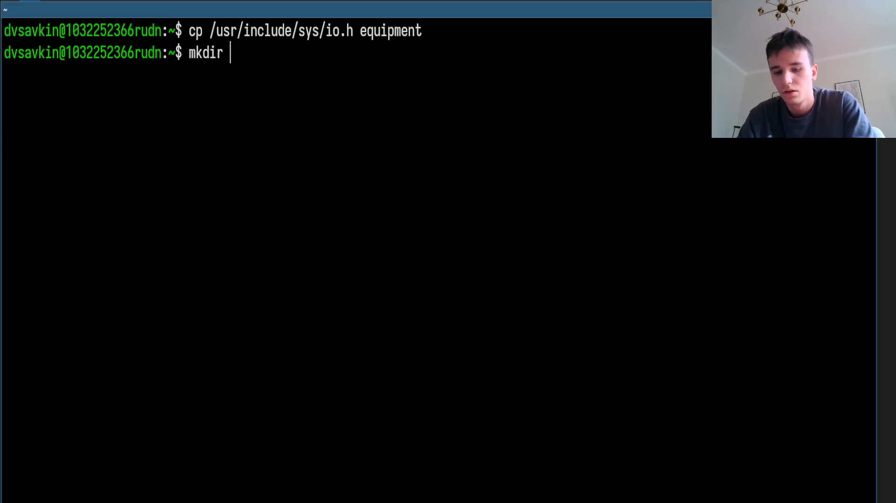
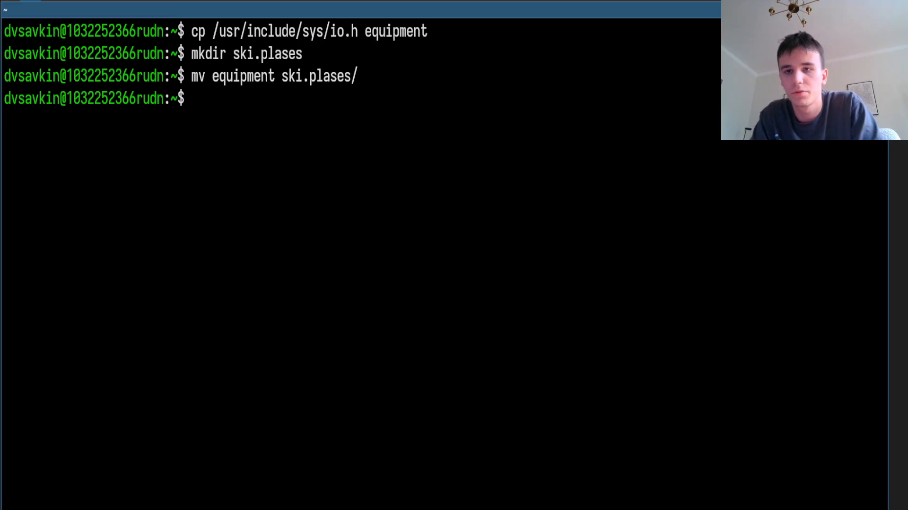
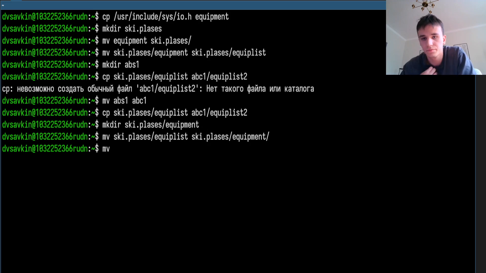
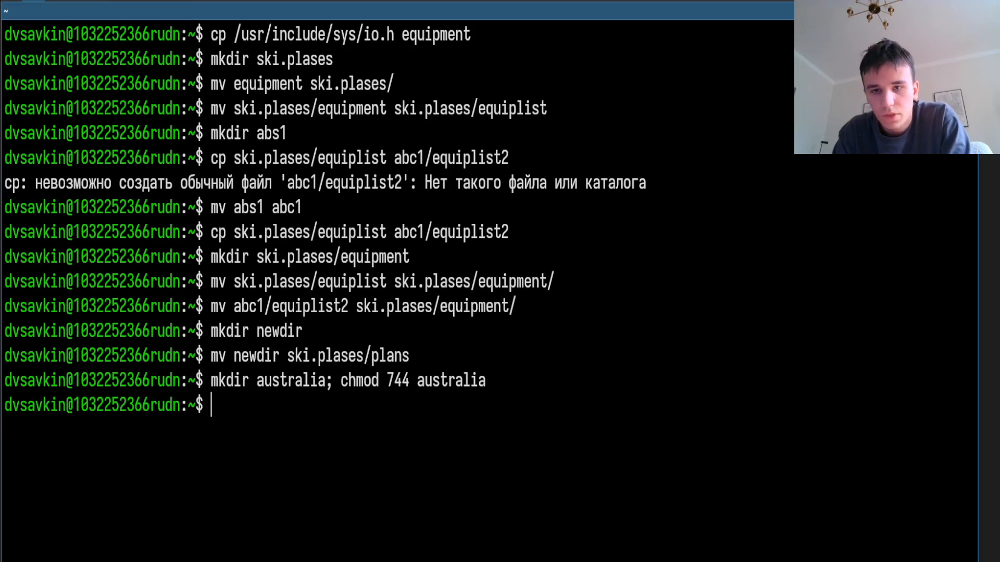
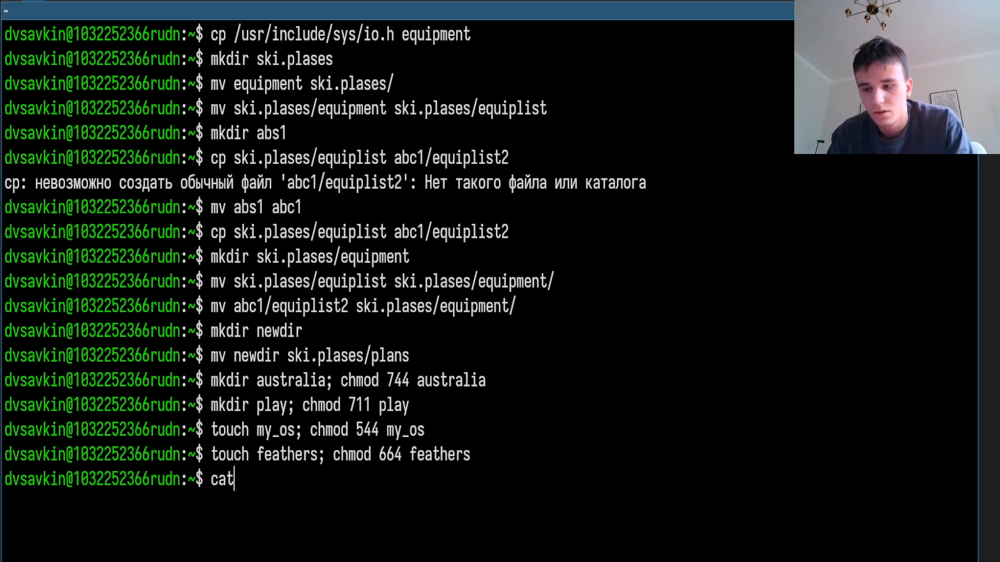
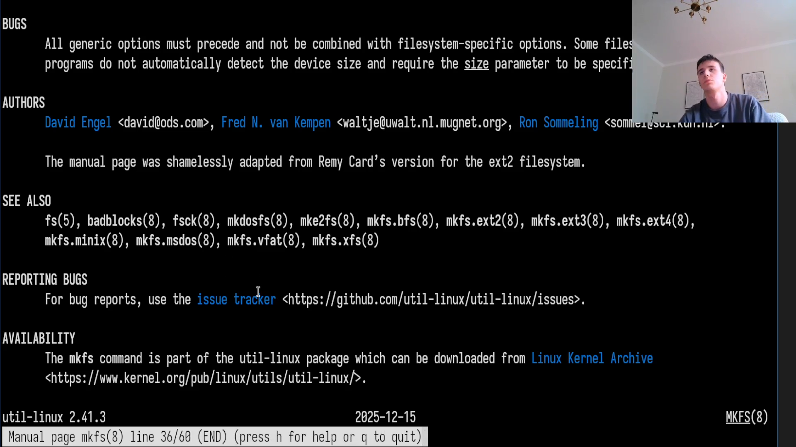

# Информация

## Докладчик

:::::::::::::: {.columns align=center}
::: {.column width="70%"}

- Савкин Дмитрий Вадимович
- РУДН, группа НПИбд-02-25
- Тема: анализ файловой системы Linux

:::
::: {.column width="30%"}

:::
::::::::::::::

# Цель работы

## Цель работы

- Изучить файловую систему Linux, команды работы с файлами и правами доступа

# Задание

## Задание

- Копирование/перемещение файлов, подбор прав доступа chmod
- Изучение mount, fsck, df

# Выполнение работы
## Копирование файла

Копируем `/usr/include/sys/io.h` в `~/equipment`.

{width=55%}

## Новый каталог

Создаём `~/ski.plases`, перемещаем `equipment` туда.

{width=55%}

## Переименование

Переименовываем в `equiplist`.

{width=55%}

## Второй файл

Создаём `~/abc1`, копируем как `equiplist2`.

{width=55%}

## Подкаталог equipment

Создаём подкаталог `equipment` внутри `ski.plases`.

{width=55%}

## Перемещение equiplist*

Перемещаем оба `equiplist*` в новый подкаталог.

{width=55%}

## newdir → plans

Создаём `~/newdir` и перемещаем в `~/ski.plases/plans`.

{width=55%}

## Подбор прав chmod

Подбираем `chmod` для целевых прав четырёх файлов с нуля.

{width=55%}

## /etc/password

Просматриваем файл `/etc/password`.

{width=55%}

## Серия cp/mv/chmod

Проверяем поведение файлов после отнятия прав чтения/выполнения.

{width=55%}

## man mount/fsck/mkfs/kill

Изучаем справку по командам работы с файловой системой и процессами.

{width=40%} {width=40%}

# Выводы

## Выводы

- Изучена структура файловой системы Linux
- Получены навыки работы с правами доступа и командами cp/mv/chmod
