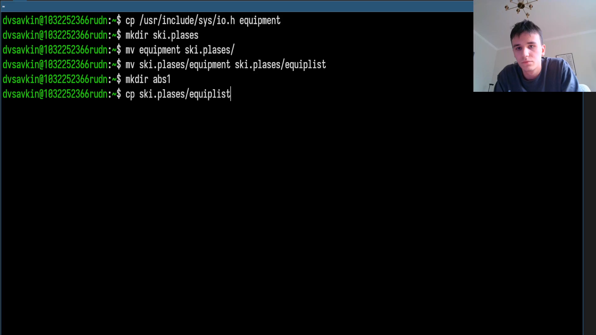
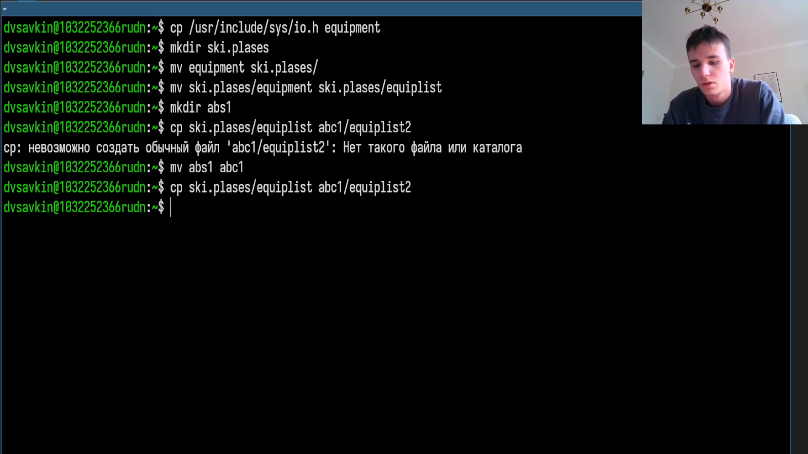
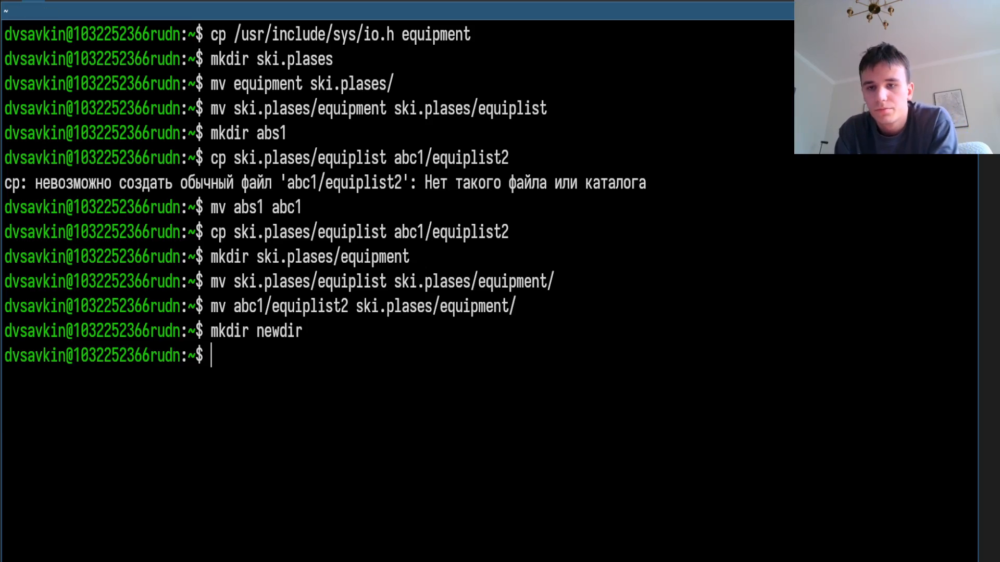
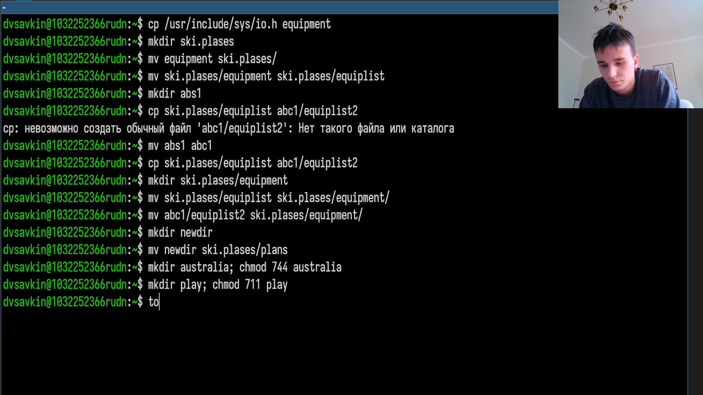
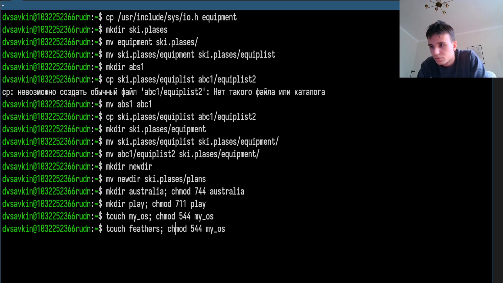
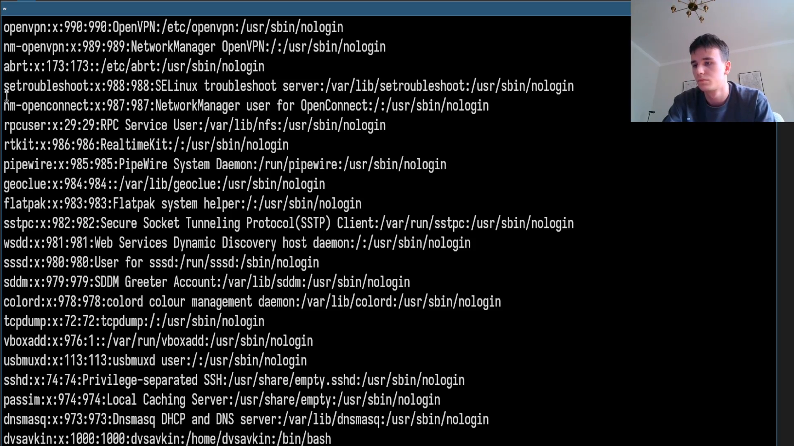

---
## Author
author:
  name: Савкин Дмитрий Вадимович
  affiliation:
    - name: Российский университет дружбы народов
      country: Российская Федерация
      city: Москва

## Title
title: "Отчёт по лабораторной работе № 7"
subtitle: "Анализ файловой системы Linux"
license: "CC BY"
---

# Цель работы
изучение файловой системы Linux, её структуры, а также приобретение практических навыков работы с файлами, каталогами, правами доступа и проверкой файловой системы.

# Задание

- Скопировать файл '/usr/include/sys/io.h' в домашний каталог под именем 'equipment'.
- Создать каталог 'ski.plases' и переместить туда 'equipment', переименовать его в 'equiplist'.
- Создать каталог 'abc1' и скопировать в него 'equiplist' под именем 'equiplist2'.
- Создать подкаталог 'equipment' внутри 'ski.plases' и переместить туда оба файла 'equiplist'.
- Создать каталог 'newdir' и переместить его в 'ski.plases' под именем 'plans'.
- Подобрать права доступа для каталогов/файлов 'australia', 'play', 'my_os', 'feathers'.
- Просмотреть содержимое системного файла со списком пользователей.
- Изучить справку по командам 'mount', 'fsck', 'mkfs', 'kill'.

# Выполнение лабораторной работы

Копируем файл '/usr/include/sys/io.h' в домашний каталог под именем 'equipment': 'cp /usr/include/sys/io.h equipment'.

{width=70%}

Создаём каталог 'ski.plases' и перемещаем в него 'equipment': 'mkdir ski.plases', 'mv equipment ski.plases/'.

{width=70%}

Переименовываем 'equipment' в 'equiplist': 'mv ski.plases/equipment ski.plases/equiplist'.

{width=70%}

Создаём каталог 'abc1' и копируем туда 'equiplist' под именем 'equiplist2': 'mkdir abc1', 'cp ski.plases/equiplist abc1/equiplist2'.

{width=70%}

Создаём подкаталог 'equipment' внутри 'ski.plases' и перемещаем туда оба файла: 'mkdir ski.plases/equipment', 'mv ski.plases/equiplist ski.plases/equipment/', 'mv abc1/equiplist2 ski.plases/equipment/'.

{width=70%}

Создаём каталог 'newdir' и перемещаем его в 'ski.plases' под именем 'plans': 'mkdir newdir', 'mv newdir ski.plases/plans'.

{width=70%}

Создаём каталог 'australia' и устанавливаем права 'drwxr--r--': 'mkdir australia', 'chmod 744 australia'.

{width=70%}

Создаём каталог 'play' и устанавливаем права 'drwx--x--x': 'mkdir play', 'chmod 711 play'.

{width=70%}

Создаём файл 'my_os' и устанавливаем права '-r-xr--r--': 'touch my_os', 'chmod 544 my_os'.

{width=70%}

Создаём файл 'feathers' и устанавливаем права '-rw-rw-r--': 'touch feathers', 'chmod 664 feathers'.

{width=70%}

Просматриваем содержимое системного файла со списком пользователей: 'cat /etc/passwd'.

{width=70%}

Изучаем справку по командам монтирования, проверки файловой системы, создания файловой системы и управления процессами: 'man mount', 'man fsck', 'man mkfs', 'man kill'.

{width=70%}

# Выводы
Получены практические навыки работы с файловой системой Linux: копирование, перемещение и переименование файлов и каталогов, назначение прав доступа через восьмеричную запись 'chmod', просмотр системных файлов, а также знакомство со средствами монтирования и проверки целостности файловой системы через 'man'.

# Ответы на контрольные вопросы{.unnumbered}

**1. Дайте характеристику файловой системе, установленной на вашем диске.**

'ext4' - журналируемая файловая система, используемая по умолчанию в большинстве дистрибутивов Linux; поддерживает большие объёмы данных и восстановление после сбоев благодаря журналу транзакций.

**2. Какова общая структура файловой системы? Какие директории первого уровня вам известны?**

Единое дерево каталогов с корнем '/', к которому монтируются все устройства. Директории первого уровня: '/bin', '/boot', '/dev', '/etc', '/home', '/lib', '/media', '/mnt', '/opt', '/proc', '/root', '/sbin', '/srv', '/sys', '/tmp', '/usr', '/var'.

**3. Какая операция должна быть произведена, чтобы файловая система стала доступна операционной системе?**

Монтирование - команда 'mount'.

**4. Каковы причины нарушения целостности файловой системы и как это исправить?**

Некорректное завершение работы системы, сбои питания, аппаратные ошибки диска. Исправляется командой: 'fsck имя_устройства'.

**5. Как создаётся файловая система?**

С помощью команды 'mkfs', которая размечает раздел под выбранный тип файловой системы.

**6. Какими командами можно просматривать текстовые файлы?**

'cat', 'less', 'head', 'tail'.

**7. Какие возможности предоставляет команда cp?**

Копирование файлов и каталогов; опция '-r' - рекурсивное копирование каталогов, '-i' - запрос подтверждения перед перезаписью.

**8. Какие возможности предоставляет команда mv?**

Перемещение и/или переименование файлов и каталогов; опция '-i' - запрос подтверждения перед перезаписью.

**9. Что такое права доступа и как их можно изменить?**

Права определяют, кто может читать (r), записывать (w) и исполнять (x) файл - отдельно для владельца, группы и остальных пользователей. Изменяются командой 'chmod', символьно ('chmod u+x файл') или в восьмеричной записи ('chmod 744 файл').
