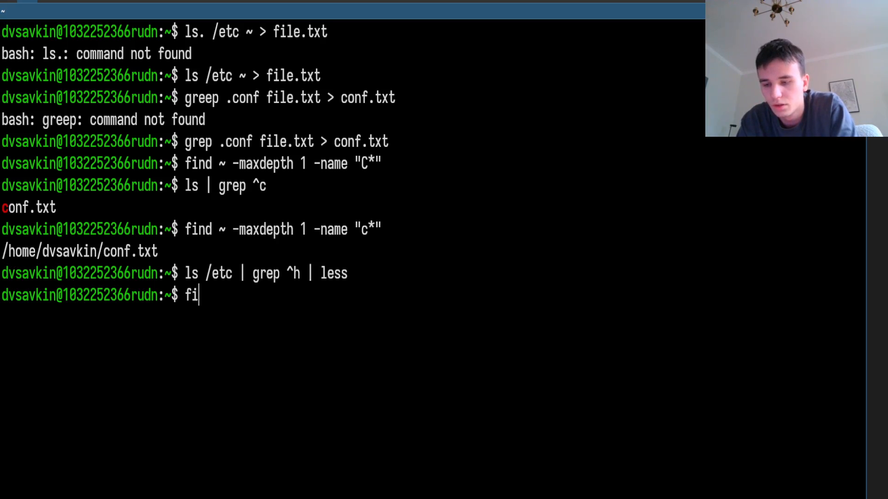
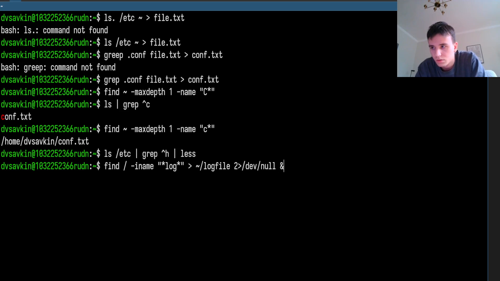
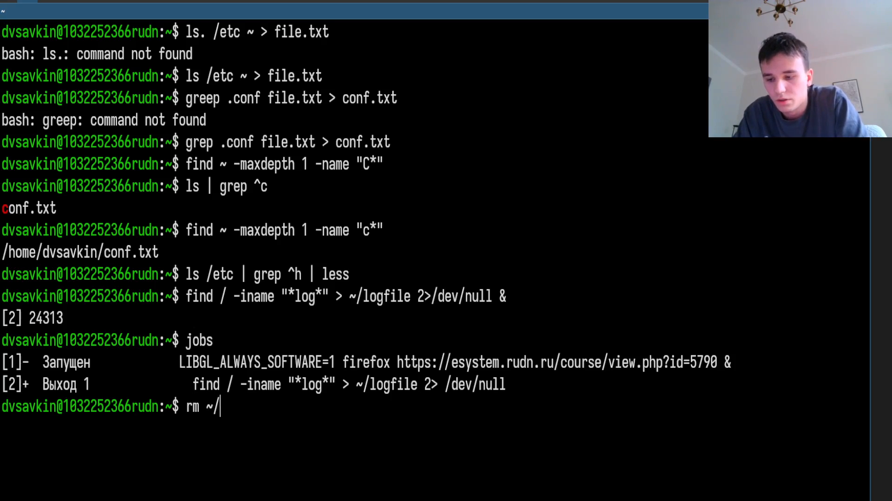
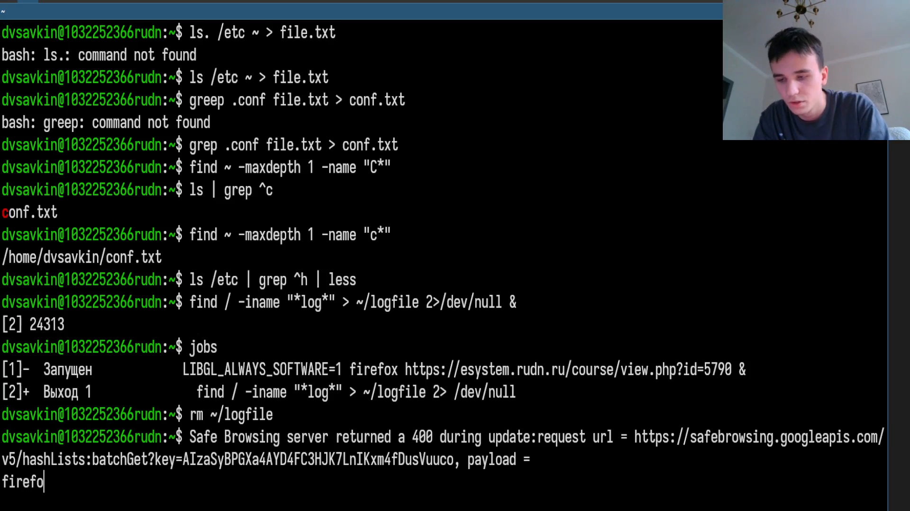
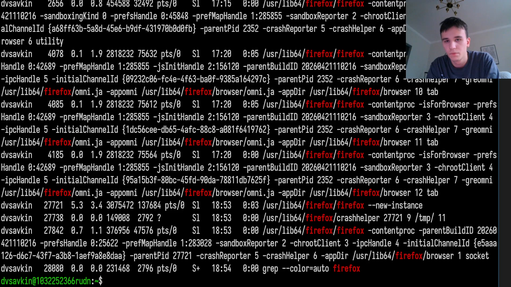
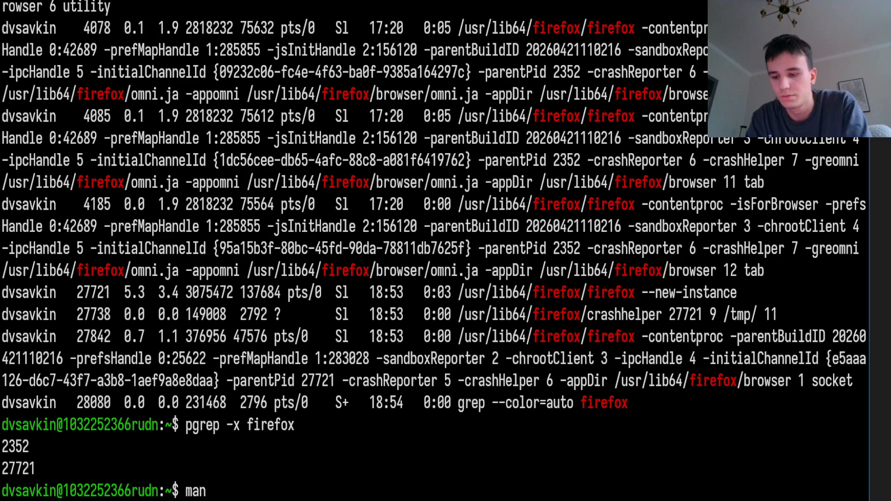
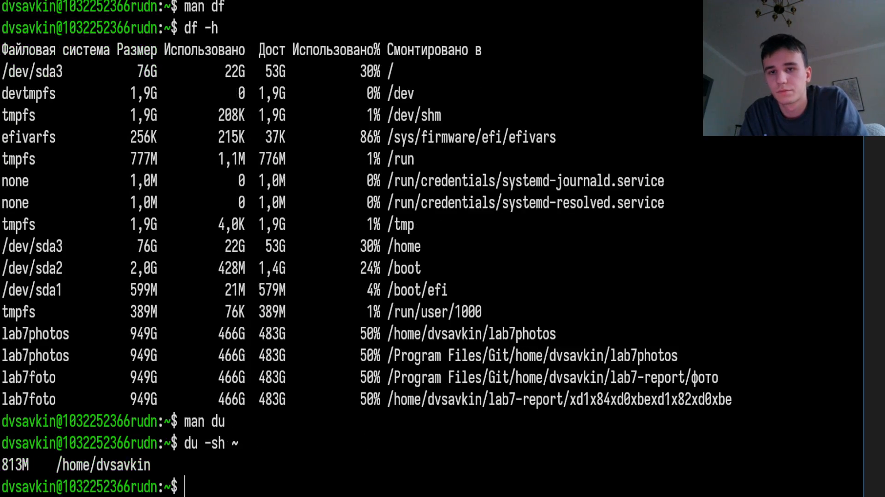
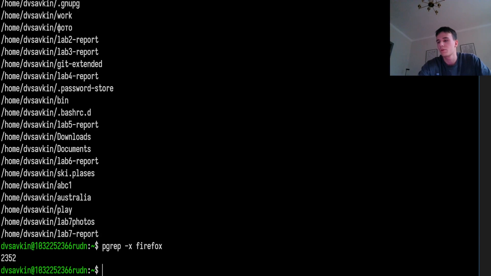

# Информация

## Докладчик

:::::::::::::: {.columns align=center}
::: {.column width="70%"}

- Савкин Дмитрий Вадимович
- РУДН, группа НПИбд-02-25
- Тема: поиск файлов, перенаправление, процессы

:::
::: {.column width="30%"}

:::
::::::::::::::

# Цель работы

## Цель работы

- Освоить поиск файлов, фильтрацию текста и управление процессами

# Задание

## Задание

- Поиск и фильтрация файлов через find/grep
- Фоновые процессы, определение PID, df/du

# Выполнение работы
## file.txt

Составляем список файлов `/etc` и домашнего каталога в `file.txt`.

{width=55%}

## conf.txt

Выбираем `.conf`-файлы в `conf.txt`.

{width=55%}

## Поиск файлов на "c"

Находим файлы, начинающиеся на "c", несколькими способами.

{width=55%}

## Постраничный вывод

Постранично выводим файлы `/etc` на букву "h" через `less`.

{width=55%}

## Фоновый процесс в logfile

Запускаем фоновый процесс, пишущий имена файлов на "log" в `~/logfile`.

{width=55%}

## Удаление logfile

Удаляем `~/logfile`.

{width=55%}

## Фоновый gedit

Запускаем `gedit` в фоне.

{width=55%}

## PID процесса

Определяем PID `gedit` через `ps`+`grep`, вторым способом.

{width=55%}

## Завершение процесса

`man kill`, завершаем `gedit`.

{width=55%}

## df и du

Смотрим свободное место и объём каталога: `df`, `du`.

{width=55%}

## find директорий

Выводим все директории домашнего каталога через `find`.

{width=40%} {width=40%} {width=40%}

# Выводы

## Выводы

- Освоены перенаправление ввода-вывода и поиск файлов
- Получены навыки управления фоновыми процессами и оценки места на диске
