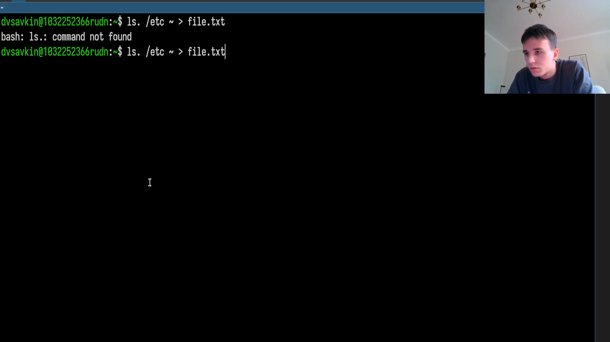
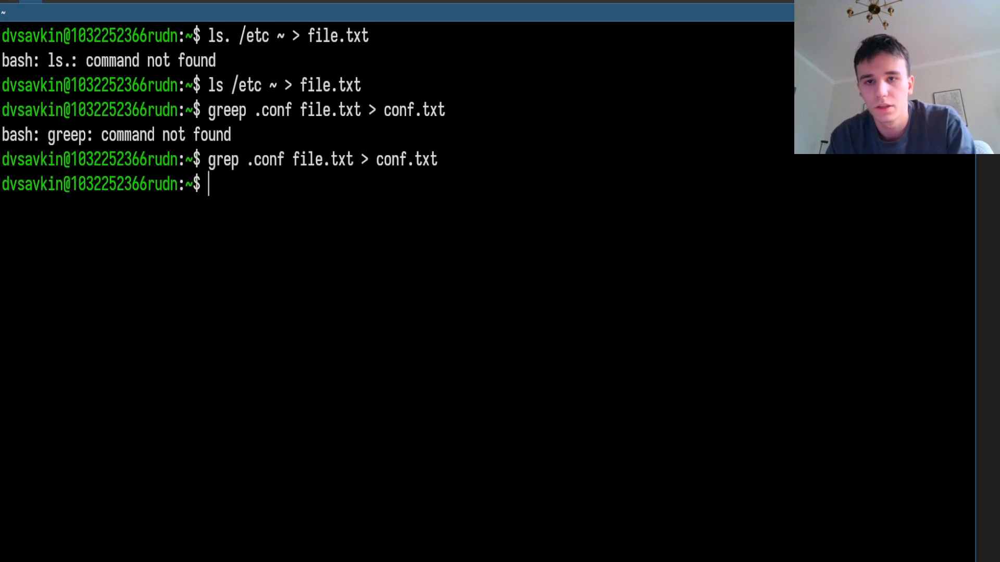
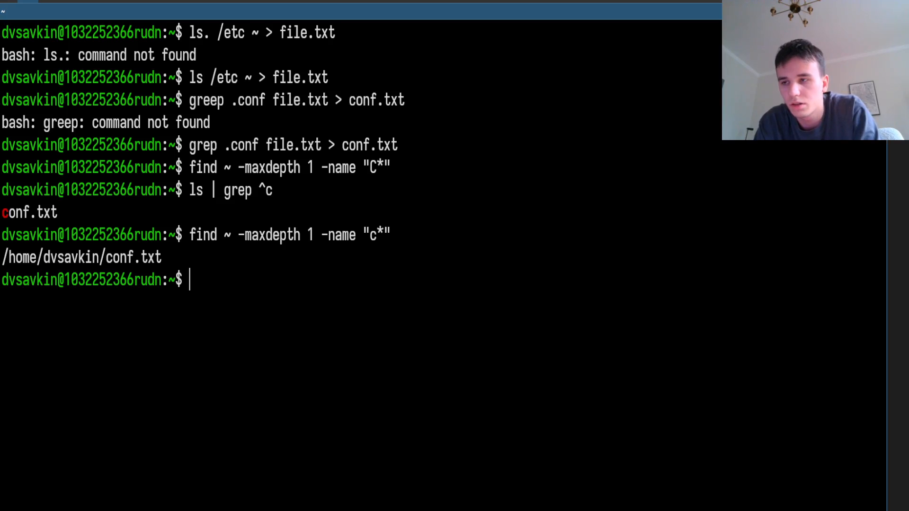
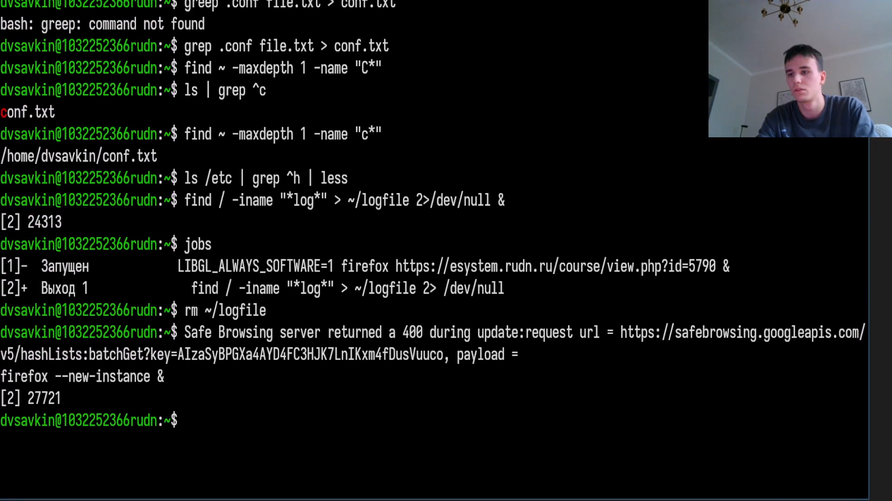
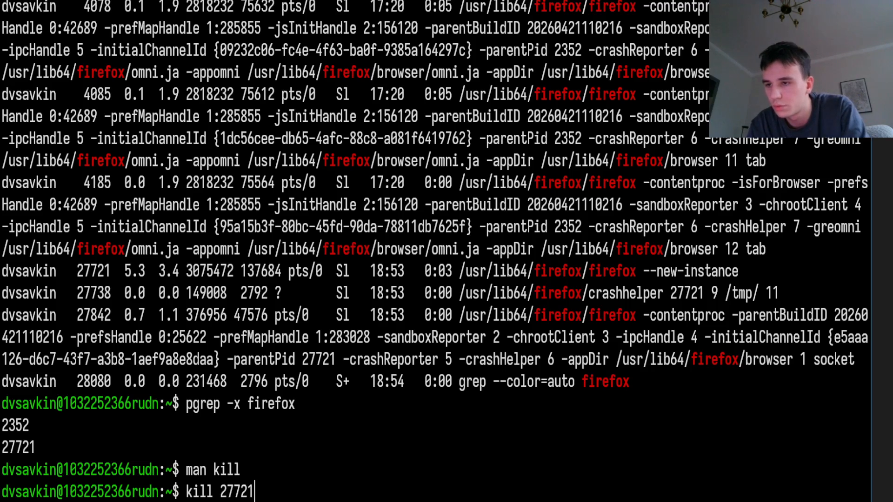

---
## Author
author:
  name: Савкин Дмитрий Вадимович
  affiliation:
    - name: Российский университет дружбы народов
      country: Российская Федерация
      city: Москва

## Title
title: "Отчёт по лабораторной работе № 8"
subtitle: "Поиск файлов, перенаправление ввода-вывода, управление процессами"
license: "CC BY"
---

# Цель работы
изучение инструментов поиска файлов и фильтрации текстовой информации, а также приобретение практических навыков управления процессами и заданиями, проверки использования дискового пространства.

# Задание

- Создать файл со списком содержимого '/etc' и домашнего каталога.
- Отобрать в отдельный файл строки, относящиеся к файлам с расширением '.conf'.
- Найти файлы, имена которых начинаются на 'c', несколькими способами.
- Постранично вывести список файлов каталога '/etc', имена которых начинаются на 'h'.
- Запустить в фоновом режиме процесс, записывающий в файл имена файлов, начинающихся на 'log'.
- Запустить в фоновом режиме процесс, определить его PID двумя способами и завершить командой 'kill'.
- Определить объём свободного места на диске и объём домашнего каталога.
- С помощью 'find' вывести список всех каталогов внутри домашнего каталога.

# Выполнение лабораторной работы

Создаём файл со списком содержимого каталога '/etc' и домашнего каталога: 'ls /etc ~ > file.txt'.

{width=70%}

Отбираем из списка строки с файлами '.conf' в отдельный файл: 'grep .conf file.txt > conf.txt'.

{width=70%}

Ищем файлы, имена которых начинаются на 'c', двумя способами: 'ls | grep ^c' и 'find ~ -maxdepth 1 -name "c*"'.

{width=70%}

Постранично просматриваем файлы каталога '/etc', имена которых начинаются на 'h': 'ls /etc | grep ^h | less'.

{width=70%}

Запускаем в фоновом режиме процесс, записывающий в файл 'logfile' имена файлов, содержащих 'log': 'find / -iname "*log*" > ~/logfile 2>/dev/null &'.

{width=70%}

Проверяем список фоновых заданий: 'jobs'.

{width=70%}

Удаляем файл 'logfile': 'rm ~/logfile'.

{width=70%}

Запускаем в фоновом режиме процесс (firefox), который будем отслеживать: 'firefox --new-instance &'.

{width=70%}

Определяем его PID через 'ps' и 'grep': 'ps aux | grep firefox'.

{width=70%}

Определяем PID тем же способом иначе - через 'pgrep': 'pgrep -x firefox'.

{width=70%}

Изучаем справку по команде 'kill' и завершаем процесс: 'man kill', 'kill 27721'.

{width=70%}

Изучаем справку по 'df' и 'du', определяем свободное место на диске и объём домашнего каталога: 'man df', 'df -h', 'man du', 'du -sh ~'.

{width=70%}

С помощью 'find' выводим список всех каталогов внутри домашнего каталога: 'find ~ -maxdepth 1 -type d'.

{width=70%}

# Выводы
Получены практические навыки поиска файлов и фильтрации текстовой информации средствами 'find' и 'grep', перенаправления потоков ввода-вывода, запуска и управления фоновыми процессами и заданиями (определение PID несколькими способами, завершение через 'kill'), а также определения использования дискового пространства командами 'df' и 'du'.

# Ответы на контрольные вопросы{.unnumbered}

**1. Что такое потоки ввода-вывода?**

Стандартные каналы взаимодействия процесса с окружением: stdin (0) - ввод, stdout (1) - вывод, stderr (2) - вывод ошибок.

**2. В чём разница между '>' и '>>'?**

'>' перезаписывает файл заново (стирая содержимое), '>>' дописывает данные в конец существующего файла.

**3. Что такое конвейер?**

Механизм '|', передающий вывод одной команды на вход другой без промежуточного файла, например 'ls -l | grep текст'.

**4. Чем процесс отличается от программы?**

Программа - файл с исполняемым кодом на диске; процесс - экземпляр запущенной программы в памяти, которому выделены ресурсы и присвоен PID.

**5. Что такое PID и GID?**

PID - уникальный идентификатор процесса. GID - идентификатор группы процессов, используемый при управлении заданиями оболочки.

**6. Что такое задания и какой командой ими управляют?**

Задания - процессы, запущенные из текущей оболочки, в том числе фоновые (через '&'). Список заданий - 'jobs', завершение - 'kill %номер_задания'.

**7. Какие функции выполняют команды top/htop?**

Отображают в реальном времени список запущенных процессов, загрузку CPU и памяти; 'htop' - интерактивная версия 'top' с более удобным интерфейсом.

**8. Команда поиска файлов и примеры её использования.**

'find путь -опции', например 'find ~ -maxdepth 1 -name "c*"' ищет файлы, имя которых начинается на 'c', в домашнем каталоге.

**9. Можно ли искать файлы по содержимому, и как?**

Да, командой 'grep', например 'grep -r "текст" ~' рекурсивно ищет строку "текст" во всех файлах домашнего каталога.

**10. Как определить свободное место на диске?**

'df -h' - выводит свободное и занятое место по каждой файловой системе в удобочитаемом виде.

**11. Как определить объём домашнего каталога?**

'du -sh ~' - выводит суммарный размер домашнего каталога.

**12. Как убить зависший процесс?**

'kill PID' отправляет сигнал завершения (SIGTERM); если процесс не реагирует - 'kill -9 PID' (SIGKILL).
