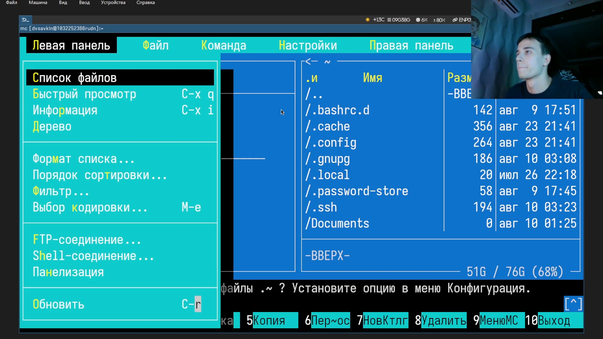
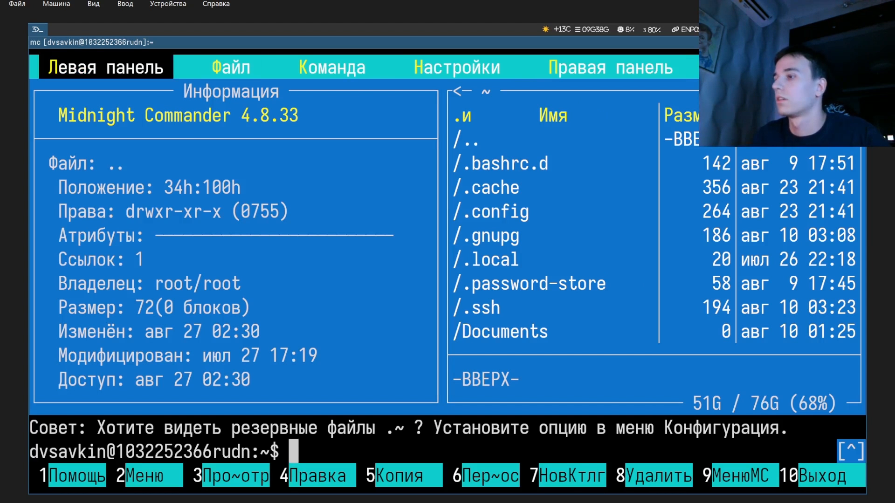
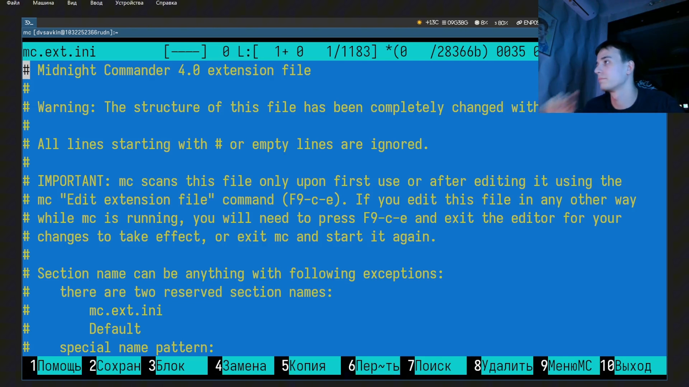
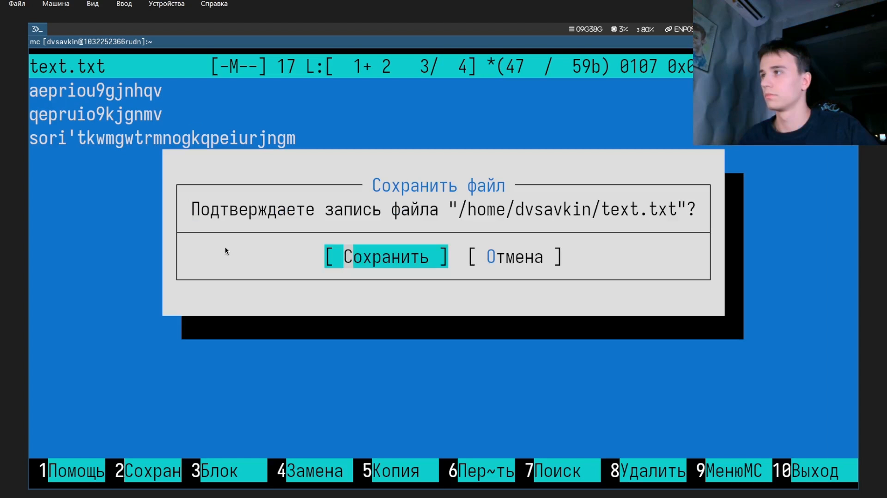
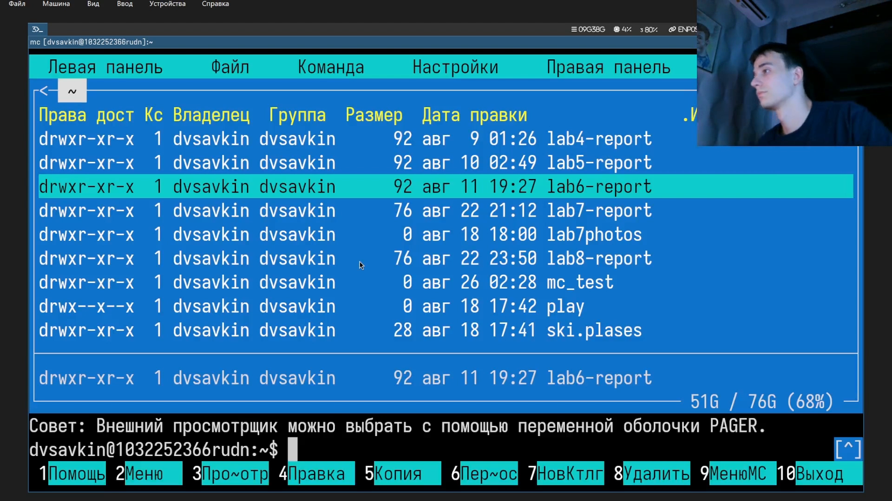

# Информация

## Докладчик

:::::::::::::: {.columns align=center}
::: {.column width="70%"}

- Савкин Дмитрий Вадимович
- РУДН, группа НПИбд-02-25
- Тема: файловый менеджер Midnight Commander

:::
::: {.column width="30%"}

:::
::::::::::::::

# Цель работы

## Цель работы

- Изучение возможностей файлового менеджера Midnight Commander (mc)

# Задание

## Задание

- Изучить меню mc (Файл, Команда, Настройки, панели)
- Опробовать режимы панели, встроенный редактор, права доступа

# Выполнение работы
## Запуск mc

Запускаем `mc`.

{width=55%}

## Меню Файл

Открываем меню «Файл» (F9).

{width=55%}

## Меню Команда

Открываем меню «Команда» (F9).

{width=55%}

## Меню Настройки

Открываем меню «Настройки» (F9).

{width=55%}

## Меню левой панели

Открываем меню левой панели (F9).

{width=55%}

## Режим Информация

Переключаем панель в режим «Информация».

{width=55%}

## Файл расширений

Находим и открываем системный файл расширений `mc.ext.ini`.

{width=55%}

## Создание файла

Создаём файл во встроенном редакторе: `mcedit text.txt`.

{width=55%}

## Сохранение

Сохраняем файл (F2).

{width=55%}

## Просмотр файла

Просматриваем файл встроенным просмотрщиком (F3).

{width=55%}

## Права доступа

Смотрим права доступа к файлу (Ctrl-x c).

{width=55%}

# Выводы

## Выводы

- Получены навыки навигации по панелям и меню mc
- Освоена работа с встроенным редактором, просмотрщиком и правами доступа
