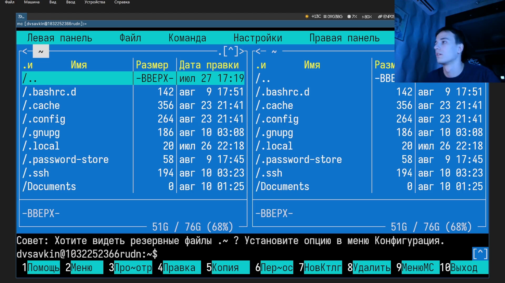
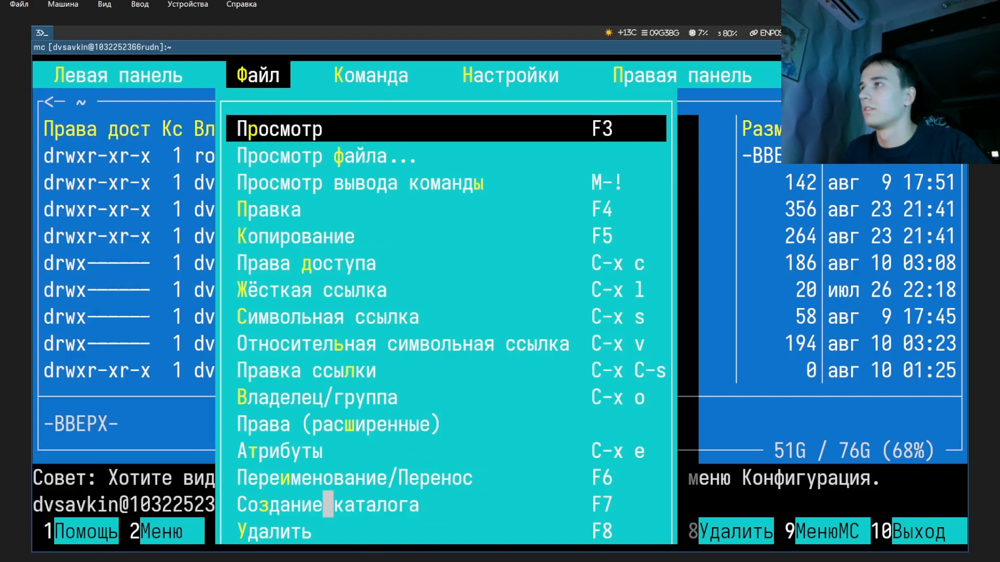
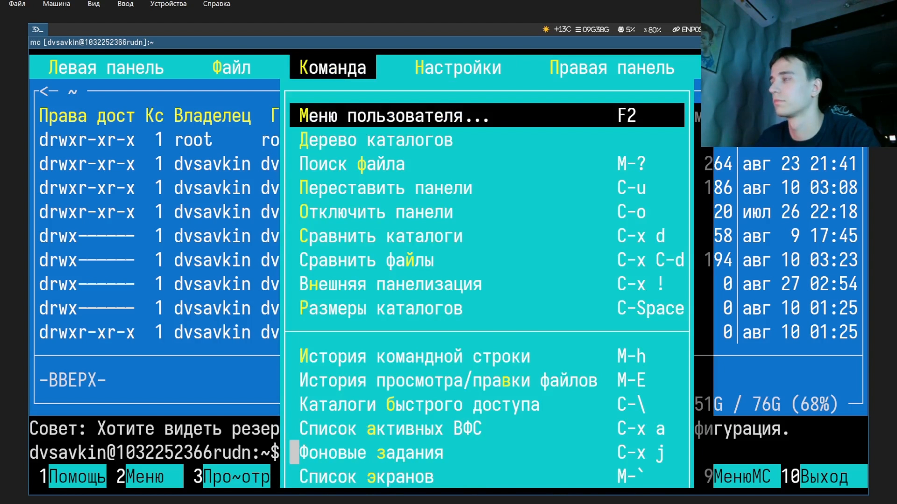
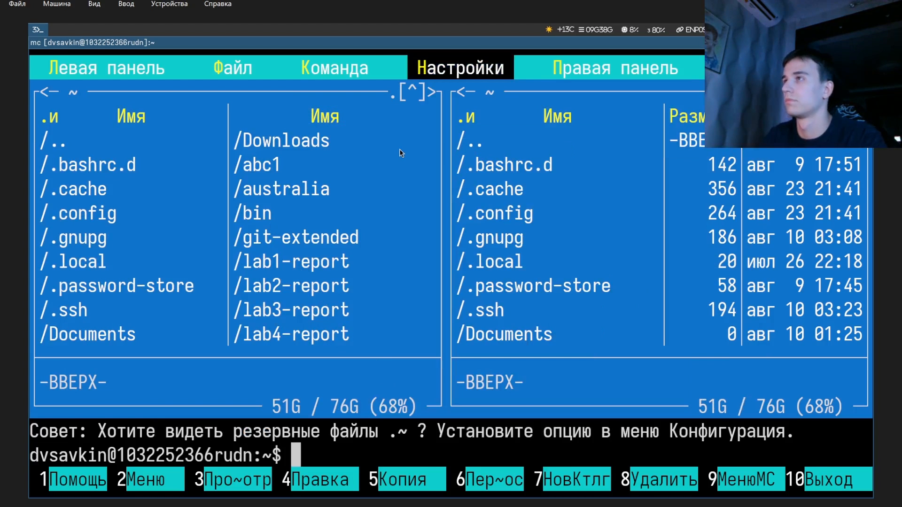
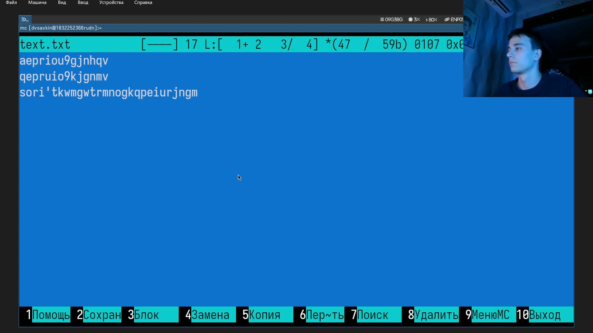
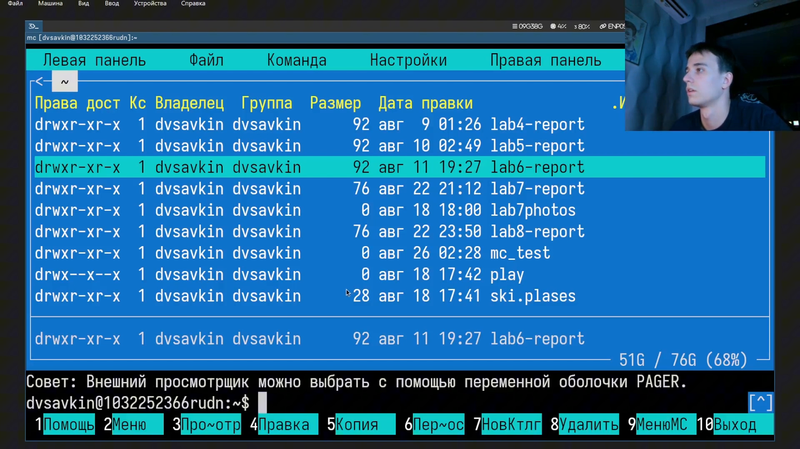

---
## Author
author:
  name: Савкин Дмитрий Вадимович
  affiliation:
    - name: Российский университет дружбы народов
      country: Российская федерация
      city: Москва

## Title
title: "Отчёт по лабораторной работе № 9"
subtitle: "Файловый менеджер Midnight Commander"
license: "CC BY"
---

# Цель работы
изучение возможностей файлового менеджера Midnight Commander (mc).

# Задание

- Изучить меню mc (файл, Команда, Настройки, панели).
- Опробовать режимы панели: Информация, дерево.
- Просмотреть файл встроенным просмотрщиком (f3).
- Создать и отредактировать файл во встроенном редакторе (f4).
- Посмотреть права доступа к файлу.

# Выполнение лабораторной работы

запускаем mc: 'mc'.

{width=70%}

Открываем меню 'файл': 'f9'.

{width=70%}

Открываем меню 'команда': 'f9'.

{width=70%}

Открываем меню 'настройки': 'f9'.

{width=70%}

Открываем меню левой панели: 'f9'

{width=70%}

Переключаем панель в режим 'информация'.

{width=70%}

Находим системный файл расширений и открываем его в редакторе: 'find / -iname "mc.ext*"', 'mcedit /etc/mc/mc.ext.ini'.

{width=70%}

Создаём файл во встроенном редакторе и вводим текст: 'mcedit text.txt'.

{width=70%}

Сохраняем файл: 'f2'.

{width=70%}

Просматриваем сохранённый файл встроенным просмотрщиком: 'f3'.

{width=70%}

Смотрим права доступа к файлу: 'ctrl-x c'.

{width=70%}

# Выводы

Получены навыки работы с mc: навигация по панелям и меню, режим отображения панели Информация, работа с файлом расширений, создание/сохранение файла во встроенном редакторе, просмотр файла и прав доступа к нему.

# Ответы на контрольные вопросы

**1. Какие режимы отображения панели поддерживает  mc?**

Список файлов, информация, дерево.

**2. Какие файловые операции доступны и через shell, и через mc?**

Копирование, перемещение, удаление, создание каталога, просмотр, правки, изменение прав доступа.

**3. Из каких пунктов состоит меню левой/правой панели?**

Список файлов, быстрый просмотр, Информация, Дерево, настройки формата и сортировки.

**4. Из каких пунктов состоит меню 'файл'?**

Просмотр, Правки, Копирование, Права доступа, ссылки, Переименовывание/Перенос, Создание каталога, Удалить.

**5. Из каких пунктов состоит меню 'команда'?**

Меню команда состоит из Меню пользователя, Дерево каталогов, Поиск файла, история команд, каталоги быстрого доступа, фоновое задания.

**6. Из каких пунктов состоит меню 'Настройки'?**

Конфигурация, внешний вид, настройки панелей, Подтверждение, Оформление.

**7. Какие встроенные клавиши mc вы использовали?**

f9, f3, f2, ctrl-x c.

**8. Какие команды встроенного редактора вы использовали?**

f2-сохранение файла

**9. Какие средства создания пользовательских меню предоставляет mc?**

Пункт 'Меню пользователя' (f2)- выполняет действия из редактируемого файла пользовательского меню.

**10. Какими средствами mc позволяет выполнять пользовательские действия над текущем файлом?**

'Меню пользователя' (f2)- применяет заданное в файле меню действие к текущему выделенному файлу.

