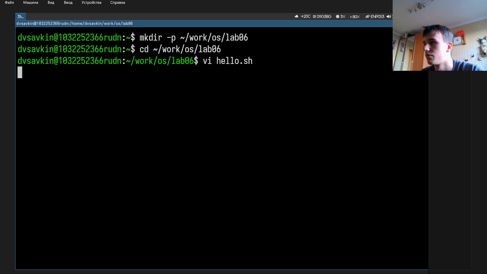
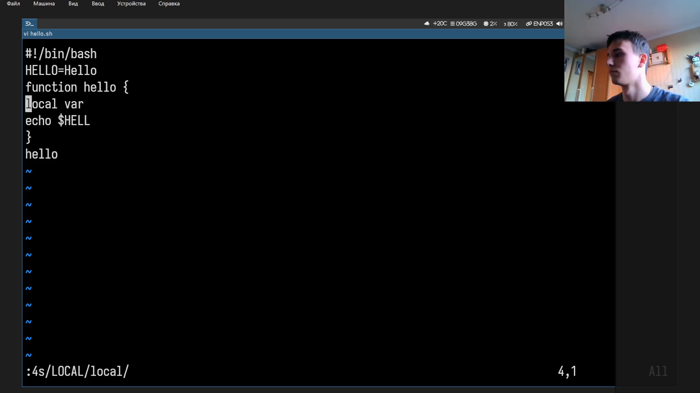
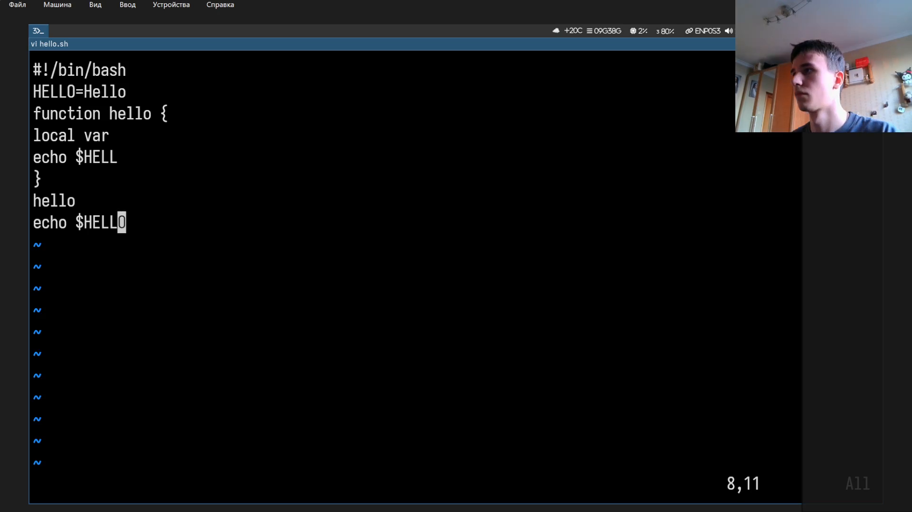
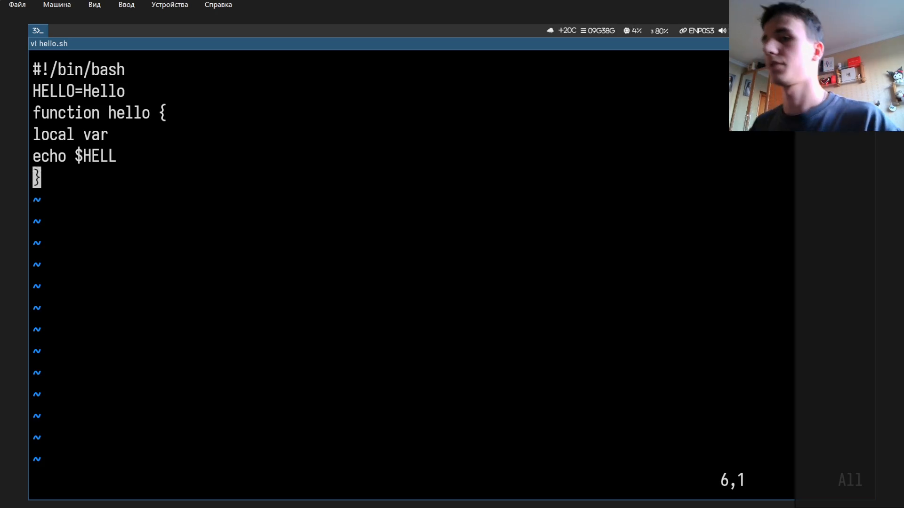

# Информация

## Докладчик

:::::::::::::: {.columns align=center}
::: {.column width="70%"}

- Савкин Дмитрий Вадимович
- РУДН, группа НПИбд-02-25
- Тема: редактор vi

:::
::: {.column width="30%"}

:::
::::::::::::::

# Цель работы

## Цель работы

- Получение практических навыков работы с текстовым редактором vi

# Задание

## Задание

- Создать файл hello.sh в vi с bash-скриптом
- Отредактировать: замена, вставка, удаление строки, отмена, сохранение

# Выполнение работы
## Рабочий каталог

Создаём каталог и переходим в него.

{width=55%}

## Новый файл

Открываем новый файл: `vi hello.sh`.

{width=55%}

## Режим вставки

Переходим в режим вставки, вводим текст скрипта.

{width=55%}

## Сохранение

Сохраняем и выходим: `:wq`.

{width=55%}

## Проверка

Делаем файл исполняемым, проверяем `chmod +x`, `cat`.

{width=55%}

## Повторное открытие

Снова открываем файл: `vi hello.sh`.

{width=55%}

## Замена текста

Заменяем текст в строках 2 и 4 командами последней строки.

{width=55%}

## Вставка строки

Переходим в конец файла, вставляем новую строку.

{width=55%}

## Удаление строки

Удаляем последнюю строку: `dd`.

{width=55%}

## Отмена

Отменяем удаление: `u`.

{width=55%}

## Сохранение и проверка

Сохраняем `:wq`, проверяем `cat -n`, запускаем скрипт.

{width=55%}

# Выводы

## Выводы

- Освоена работа с vi: режимы вставки и последней строки
- Получены навыки поиска, замены, вставки/удаления строк, отмены действий
