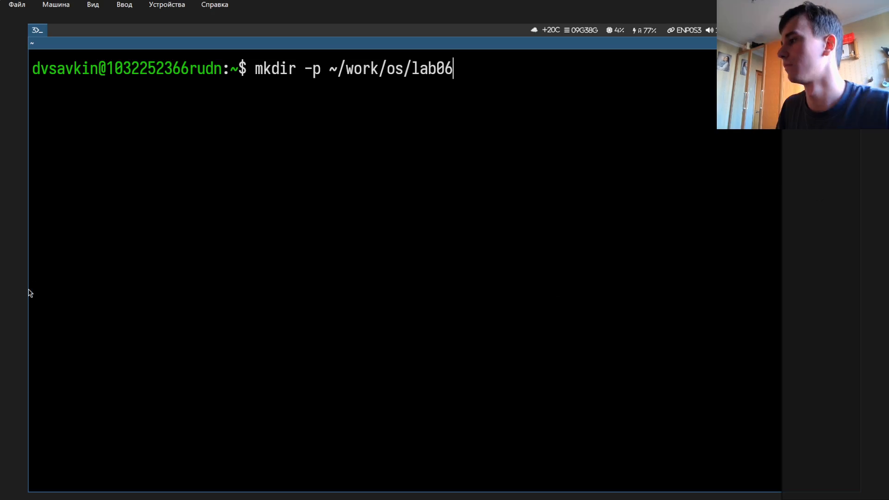
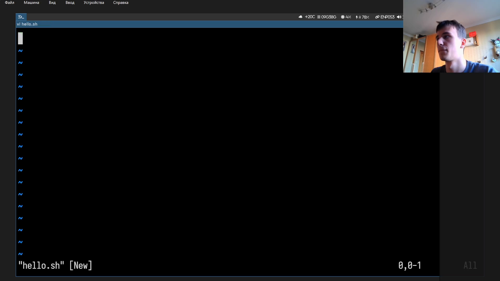
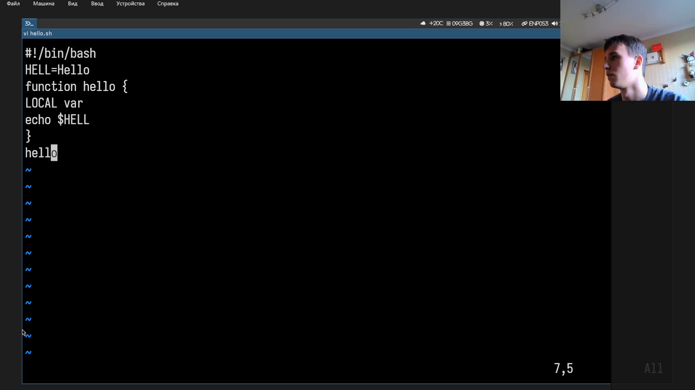
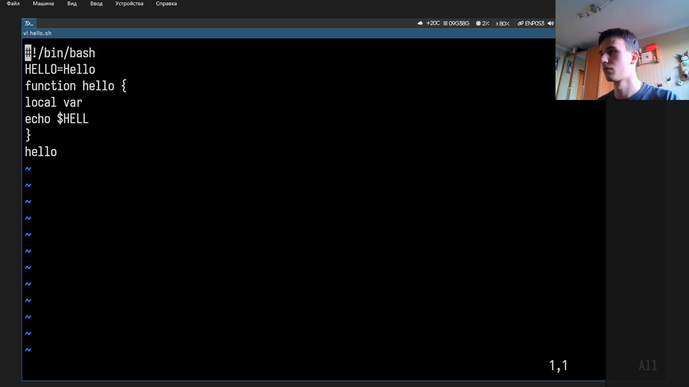
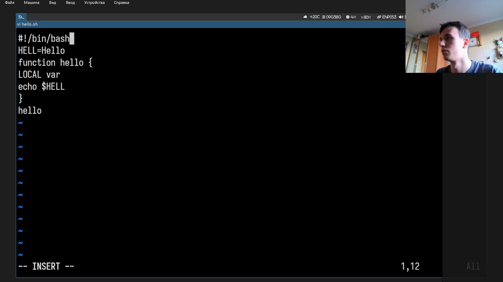
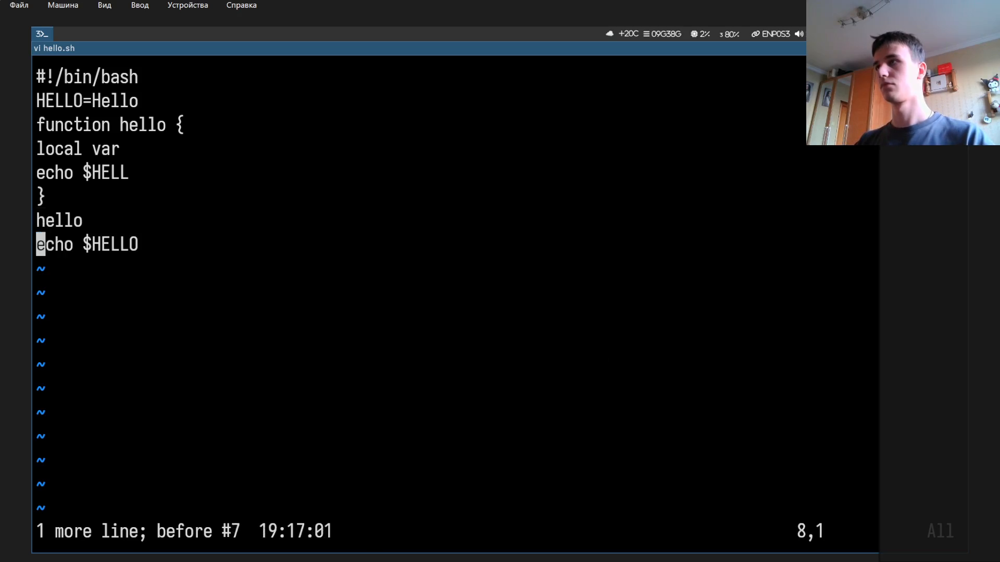
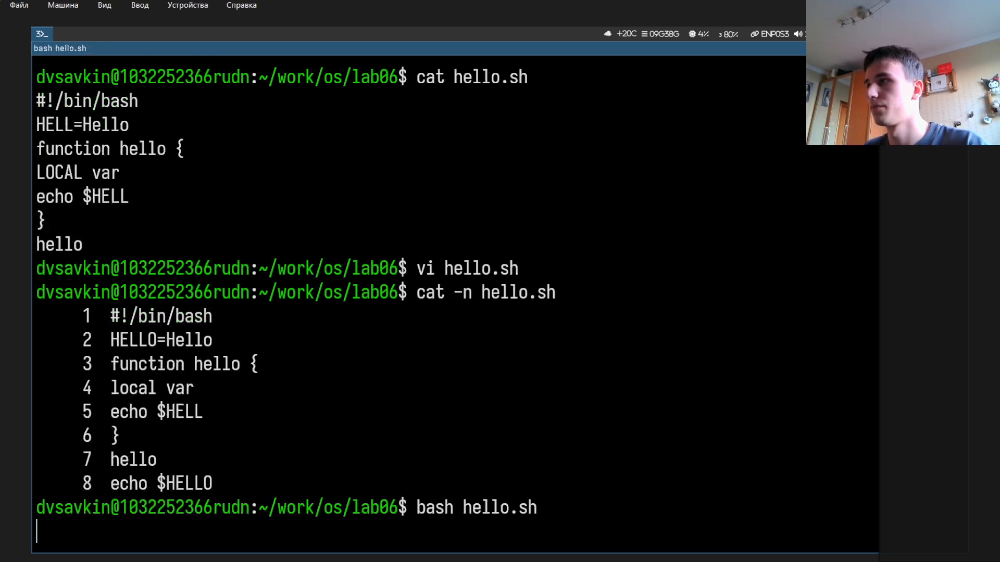

---
## Author
author:
  name: Савкин Дмитрий Вадимович
  affiliation:
    - name: Российский университет дружбы народов
      country: Российская федерация
      city: Москва

## Title
title: "Отчёт по лабораторной работе № 10"
subtitle: "Редактор vi"
license: "CC BY"
---

# Цель работы

Получение практических навыков работы с текстовым редактором vi.

# Задание

- Создать файл hello.sh в vi с bash-скриптом, содержащим функцию hello.
- Сделать файл исполняемым и запустить.
- Отредактировать: заменить текст, вставить и удалить строку, отменить действие, сохранить.

# Выполнение лабораторной работы

Создаём каталог и переходим в него: 'mkdir -p ~/work/os/lab06', 'cd ~/work/os/lab06'.

{width=70%}

Открываем новый файл: 'vi hello.sh'.

{width=70%}

переходим в режим вставки ('i') и вводим текст скрипта, выходим клавишей 'esc'.

{width=70%}

Сохраняем и выходим: ':wq'.

{width=70%}

Делаем файл исполняемым и проверяем: 'chmod +x hello.sh', 'cat hello.sh'.

{width=70%}

Снова открываем файл: 'vi hello.sh'. 

{width=70%}

Заменяем текст в строках 2 и 4 командами последней строки: ':2s/HELL/HELLO/', ':4s/LOCAL/local/'.

{width=70%}

 Переходим в конец файла ('G'), открываем новую строку ('o'), вводим 'echo $HELLO', 'esc'.

{width=70%}

Удаляем последнюю строку: 'G', 'dd'.

{width=70%}

Отменяем удаление: 'u'.

{width=70%}

Сохраняем: ':wq'. Проверяем: 'cat -n hello.sh', 'bash hello.sh'.

{width=70%}

# Выводы

Освоена работа с vi: создание и сохранение файла: режимы вставки и последней строки, поиск и замена текста, вставка/удаление строк, отмена действия.

# Ответы на контрольные вопросы

**1. Какие режимы работы vi вы знаете?**

Командный, режим вставки и режим последней строки.

**2. Как выйти из vi без сохранения изменений?**

Командой: ':q!'.

**3. Какие команды позиционирования курсора вы использовали?**

'h'/'l'/'k'/'j' - посимвольное перемещение, 'G' - конец файла, '0'/'$' - начало/конец строки.

**4. Что для vi является словом?**

Последовательность букв, цифр и знака подчёркивания, либо последовательность прочих не пробельных символов.

**5. Как перейти в начало и в конец файла?**

'gg' - в начало, 'G' - в конец.

**6. Какие группы команд редактирования есть в vi?**

Вставка, удаление, копирование/вставка, замена, отмена.

**7. Как заполнить строку символами '$'?**

Ввести их вручную в режиме вставки либо заменить существующий текст командой замены.

**8. Как отменить некорректные действия?**

клавишей 'u'.

**9. Какие группы команд есть в режиме последней строки?**

Сохранение/выход, работа с диапазоном строк, поиск и замена, настройка опций.

**10. Как определить конец строки, не перемещая курсор?**

Включить ':set list' - конец строки будет показан '$'.

**11. Что показывает команда ':set all'?**

Полный список всех опций редактора с их текущеми значениями.

**12. Как определить, в каком режиме сейчас находится vi?**

Режим вставки помечен строкой '--INSERT--' внизу экрана, режим последней строки виден по курсору после ':'.

**13. Опишите граф взаимосвязи режимов vi?**

Все переходы идут через командный режим: 'i', 'a', 'o' => вставка, ':' => последняя строка, 'esc'/enter - обратно в командный. 
