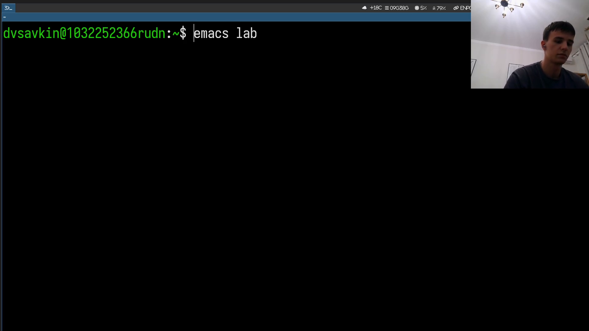
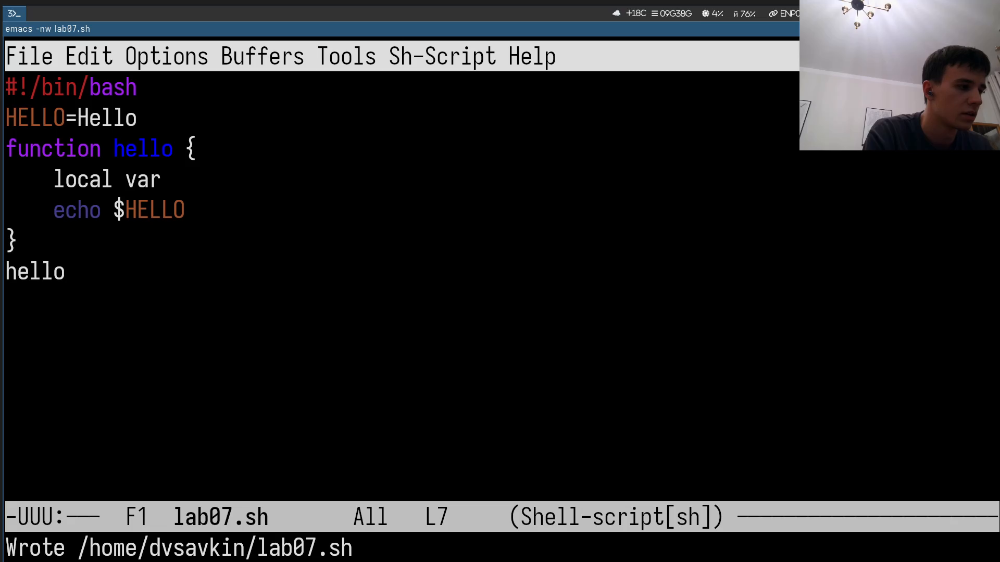
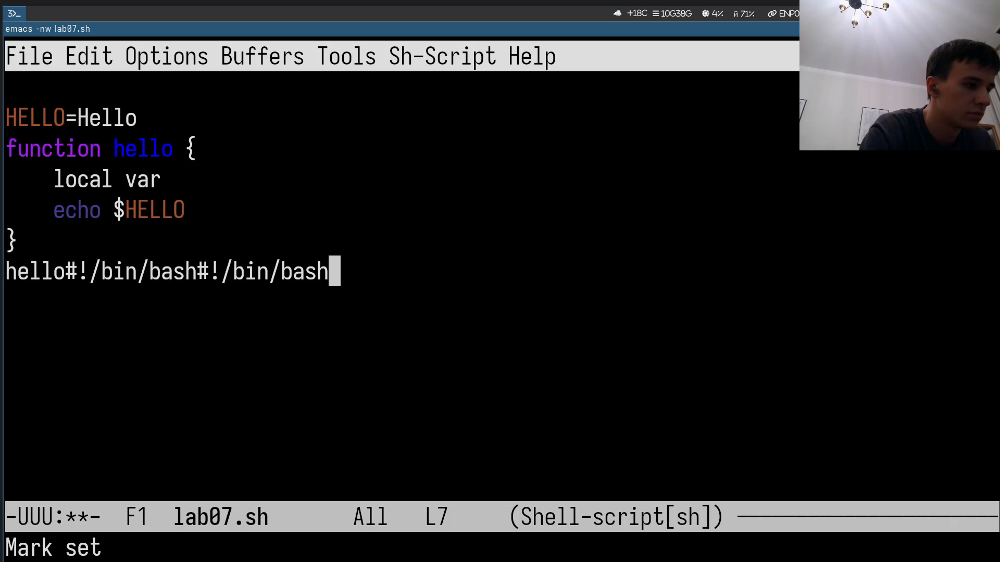
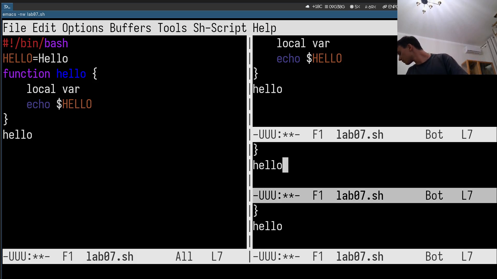
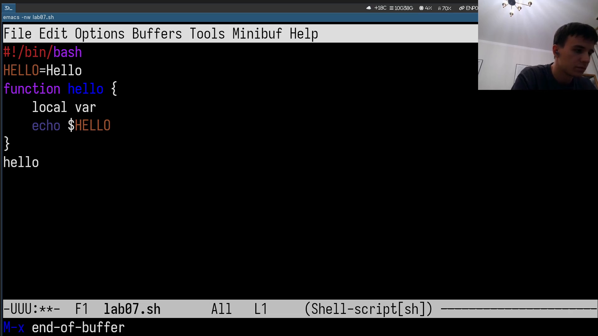
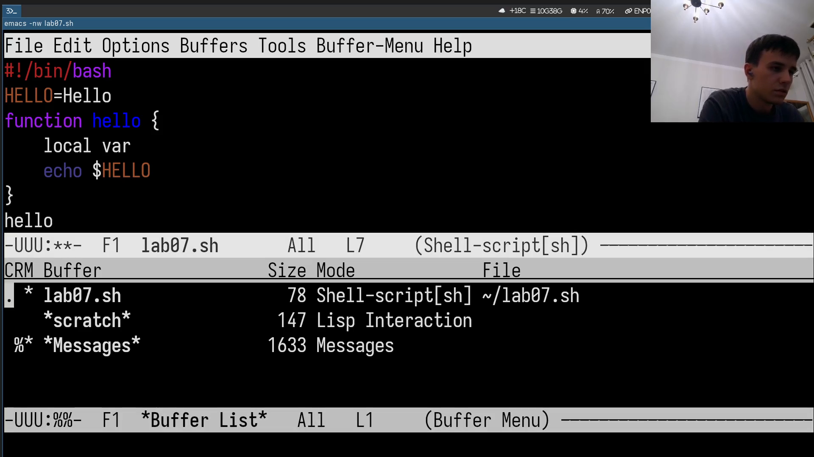
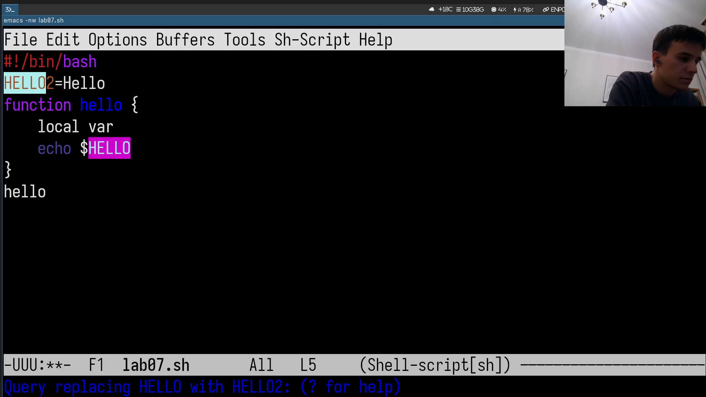
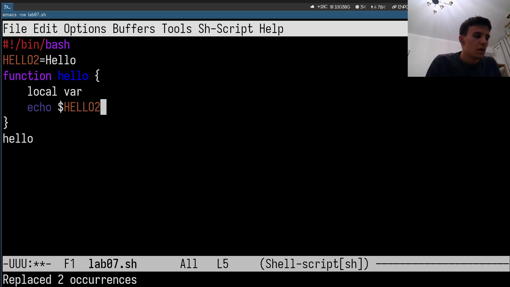
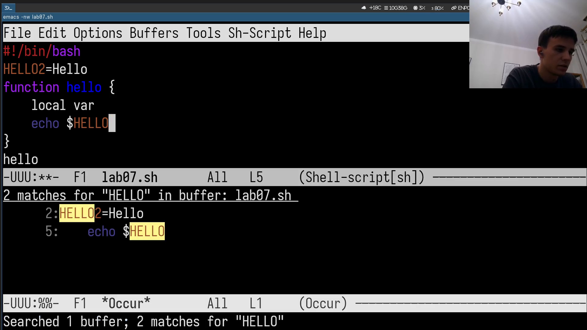

# Информация

## Докладчик

:::::::::::::: {.columns align=center}
::: {.column width="70%"}

- Савкин Дмитрий Вадимович
- РУДН, группа НПИбд-02-25
- Тема: редактор Emacs

:::
::: {.column width="30%"}

:::
::::::::::::::

# Цель работы

## Цель работы

- Получение практических навыков работы с текстовым редактором Emacs

# Задание

## Задание

- Создать файл lab07.sh с тем же скриптом, что в лабораторной работе про vi
- Освоить буферы, окна, поиск и замену

# Выполнение работы
## Запуск Emacs

Запускаем Emacs в терминальном режиме, открываем файл.

{width=55%}

## Ввод и сохранение

Вводим текст скрипта, сохраняем: `Ctrl+X, Ctrl+S`.

{width=55%}

## Копирование строки

Выделяем строку, копируем в конец файла.

{width=55%}

## Вырезание и вставка

Вырезаем фрагмент, вставляем через `Ctrl+Y`.

{width=55%}

## Разбиение на окна

Разбиваем фрейм на 4 окна.

{width=55%}

## Навигация по буферу

Возвращаемся к одному окну, переходим по буферу.

{width=55%}

## Отмена правок

Отменяем тестовые правки: `Ctrl+/`.

{width=55%}

## Список буферов

Открываем список буферов, переключаемся между окнами.

{width=55%}

## Поиск с заменой

Запускаем поиск с заменой `HELLO` на `HELLO2`.

{width=55%}

## Подтверждение замены

Подтверждаем замену всех вхождений.

{width=55%}

## Альтернативный поиск

Проверяем результат через `Alt+S`, `O`.

{width=55%}

# Выводы

## Выводы

- Освоены создание/сохранение файла, вырезание/копирование/вставка
- Изучены буферы, окна, поиск и поиск с заменой в Emacs
