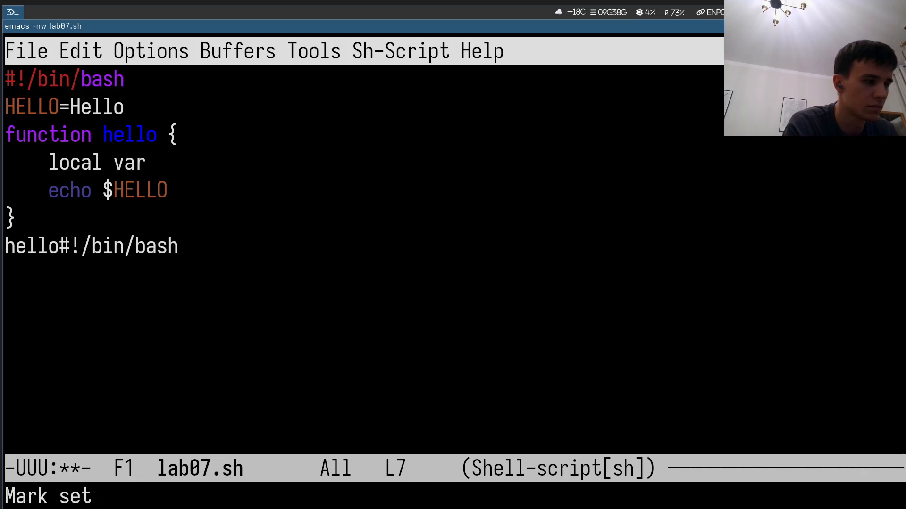
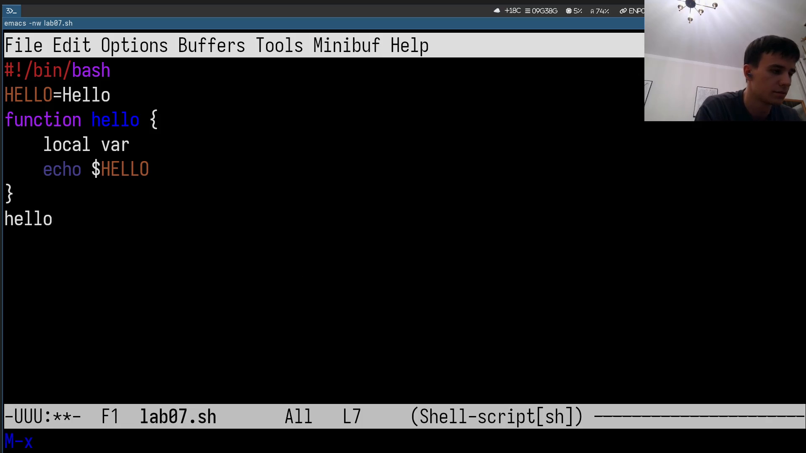

--- 
## Author
author:
  name: Савкин Дмитрий Вадимович
  affiliation:
    - name: Российский университет дружбы народов
      country: Российская федерация
      city: Москва

## Title
title: "Отчёт по лабораторной работе № 11"
subtitle: "Редактирование emacs"
license: "CC BY"
---

# Цель работы

Получение практических навыков работы с текстовым редактором Emacs.

# Задание

- Создать файл lab07.sh в emacs с тем же bash-скриптом, что и в лабораторной работе про vi.
- Освоить вырезание, копирование, вставку и отмену действий.
- Освоить работу с буферами и окнами, разбиение фрейма на несколько окон.
- Освоить поиск и поиск с заменой.

# Выполнение лабораторной работы

Запускаем emacs в терминальном режиме: 'emacs -nw lab07.sh'.

{width=70%}

Вводим текст скрипта и сохраняем: 'Ctrl+x', 'ctrl+s'.

{width=70%}

Выделяем строку ('ctrl+пробел', 'ctrl+e'), копируем в конец файла: 'alt+w', 'ctrl+y'.

{width=70%}

Вырезаем фрагмент вместо копирования: 'ctrl+w', вставляем: 'ctrl+y'.

{width=70%}

Разбираем фрейм на 4 окна: 'ctrl+x, 3', затем в каждой половине 'ctrl+x, 2'.

{width=70%}

Возвращаемся к одному окну ('ctrl+x, 1'), переходим по буферу: 'alt-x end-of-buffer', 'alt+x beginning-of-buffer'.

{width=70%}

Отменяем тестовые правки: 'ctrl+/'.

{width=70%}

Открываем список буферов: 'ctrl+x, ctrl+b', переключаемся между окнами: 'ctrl+x, o'.

{width=70%}

Запускаем поиск с заменой: 'alt+x, query-replace', меняем 'HELLO' на 'HELLO2'.

{width=70%}

Подтверждаем замену клавишей '!': результат - 'Replaced 2 occurrences'.

{width=70%}

Проверяем результат поиском: 'alt+s', 'o', 'HELLO' - список совпадений в отдельном окне.

{width=70%}

# Выводы

Освоена работа с Emacs: создание и сохранение файла, вырезание/копирование/вставка, отмена действий, буферы и окна, разбиение фрейма, поиск и поиск с заменой.

# Ответы на контрольные вопросы

**1. Дайте общую характеристику редактора emacs.**

Расширяемый текстовый редактор со своим языком, работает в терминале и в графике, буферы, окна, фреймы, десятки режимов.

**2. Что усложняет освоение emacs новичком?**

Много сочетаний клавиш.

**3. Дайте определение понятиям "буфер", "окно" своими словами.**

Буфер - область памяти с содержимом файла. Окно - видимая часть фрейма с одним буфером.

**4. Могут ли более 10 буферов отображаться в одном окне?**

Нет, только один буфер.

**5. Какие буферы создаются автоматически при запуске emacs?**

'*scratch*' и '*Messages*'.

**6. Как ввести 'C-c |' и 'C-c C-|'?**

'C-c |' - ctrl+C, затем '|' без ctrl. 'C-c C-|' - ctrl+c, затем '|' с зажатием ctrl.

**7. Как разделить окно на 2 части?**

'ctrl+x, 2' - по горизонтали, 'ctrl+x, 3' - по вертикали.

**8. Где хранятся настройки emacs?**

В '~/.emacs' или '~/.emacs.d/init.el'.

**9. Какую функцию выполняет клавиша '<==' и можно ли её переназначить?**

Двигает курсор влево, переназначить можно через 'global-set-key'.

**10. Какой редактор удобнее - vi или emacs, и почему?**

Для быстрого редактирования проще vi; emacs удобнее для долгой работы за счёт буферов, окон и расширяемости, но сложнее осваивается.
