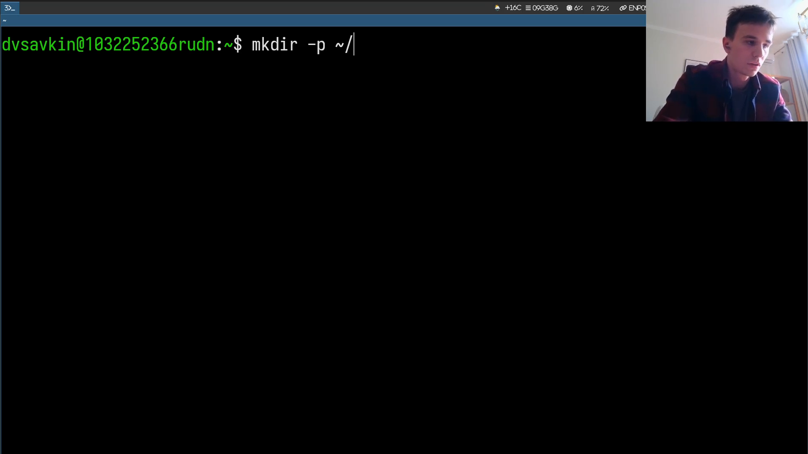
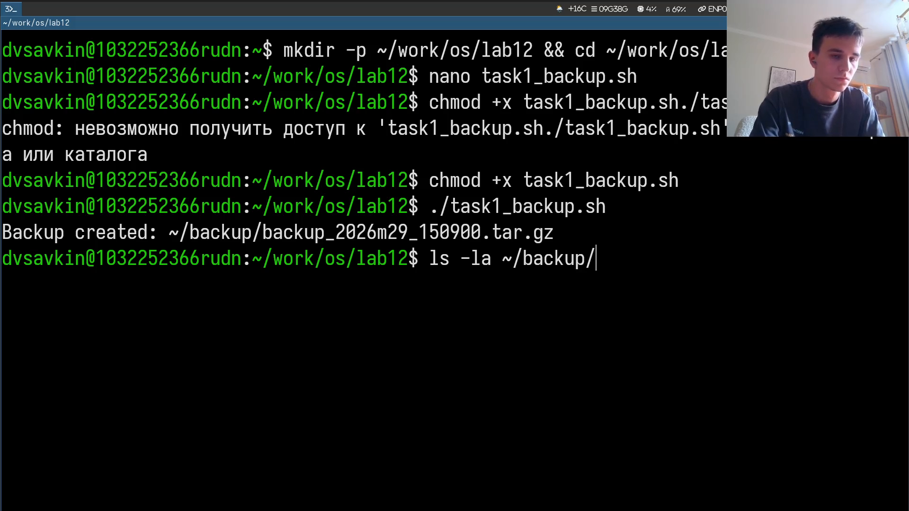
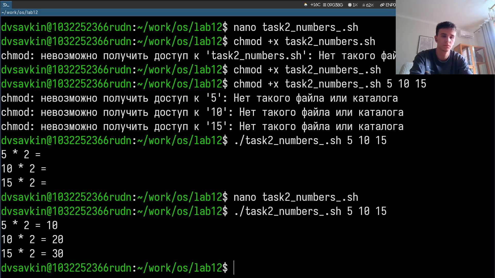
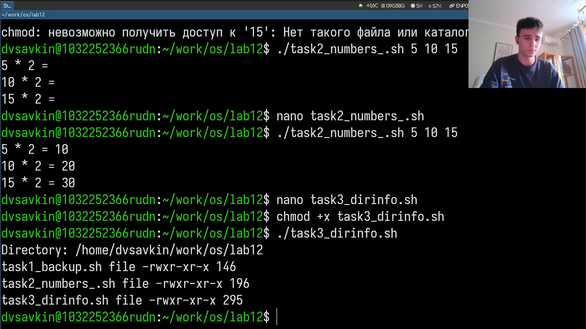

# Информация

## Докладчик

:::::::::::::: {.columns align=center}
::: {.column width="70%"}

- Савкин Дмитрий Вадимович
- РУДН, группа НПИбд-02-25
- Тема: программирование в shell — основы

:::
::: {.column width="30%"}

:::
::::::::::::::

# Цель работы

## Цель работы

- Освоить основы программирования в shell (bash)

# Задание

## Задание

- Скрипт резервного копирования самого себя
- Обработка аргументов, аналог ls, подсчёт файлов по формату

# Выполнение работы
## Рабочий каталог

Создаём рабочий каталог для заданий лабы.

{width=55%}

## Backup-скрипт

Пишем скрипт, архивирующий свой исходный код через `tar`.

{width=55%}

## Обработка аргументов

Пишем скрипт, обрабатывающий до 10 аргументов и пересчитывающий их значения.

{width=55%}

## Аналог ls

Пишем скрипт, выводящий инфо о каталоге и правах доступа файлов.

{width=55%}

## Подсчёт файлов

Пишем скрипт, считающий файлы заданного формата в каталоге.

{width=55%}

# Выводы

## Выводы

- Получены навыки написания bash-скриптов с переменными и циклами
- Освоена обработка аргументов командной строки и работа с getopts
