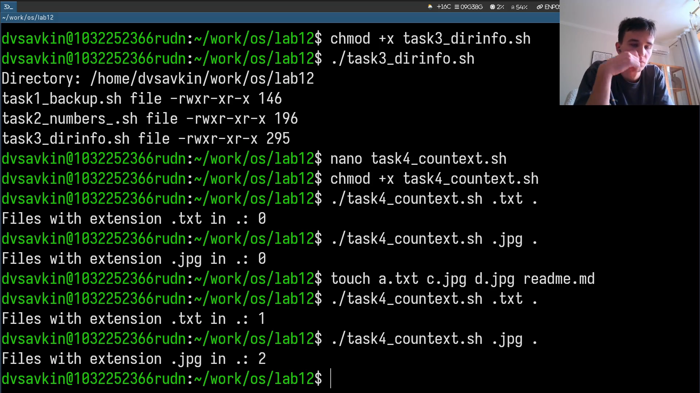

---
## Author
author:
  name: Савкин Дмитрий Вадимович
  affiliation: 
    - name: Российский университет дружбы народов
      country: Российская федерация
      city: Москва

## Title
title: "Отчёт по лабораторной работе № 12"
subtitle: "Программирование в shell: основы"
license: "CC BY"
---

# Цель работы

Получение базовых навыков программирования в shell (bash), написание командных файлов.

# Задание

- Скрипт, делающий бэкап своего исходного кода в архив.
- Командный файл, обрабатывающий до 10 числовых аргументов.
- Командный файл - аналог ls, выводящий каталог и права доступа.
- Командный файл, считающий файлы заданного расширения в каталоге.

# Выполнение лабораторной работы

Создаём рабочий каталог: 'mkdir -p ~/work/os/lab12', 'cd ~/work/os/lab12'.

{width=70%}

Пишем task1_backup.sh - архивация своего кода в '~/backup' через 'tar'. Делаем исполняемым и запускаем: 'chmod +x task1_backup.sh', './task1_backup.sh'.

{width=70%}

Пишем task2_numbers.sh - обработка до 10 числовых аргументов через цикл 'for' и арифметику '(( ))'. Запускаем: './task2_numbers.sh 5 10 15'

{width=70%}

Пишем task3_dirinfo.sh - аналог ls, выводит имя/тип/права/размер каждого файла через 'stat -c'. Запускаем без аргументов - показывает текущий каталог.

{width=70%}

Пишем task4_countext.sh - принимает расширение и путь, считает файлы через 'find' и 'wc -l'. Создаём тестовые файлы и проверяем: 'touch a.txt c.jpg d.jpg', './task4_countext.sh .txt .', './task4_countext.sh .jpg .'.

{width=70%}

# Выводы

Освоены основы shell-программирования: переменные, позиционные параметры, циклы, условия, арифметика, работа с 'find/stat', создание и запуск исполняемых командных файлов.

# Ответы на контрольные вопросы

**1. Понятие командной оболочки, примеры и различия.**

оболочка - программа-посредник между пользователем и ОС. Примеры: sh, csh, ksh, bash - различия синтаксиса и возможностей.

**2. Что такое POSIX?**

стандарт совместимости UNIX-подобных систем.

**3. Как определяются переменные и массивы в bash?**

Переменная: 'имя=значение'. Массив: 'set -A arr знач1 знач2' или 'arr=(знач1 знач2)', доступ '${arr[i]}'.

**4. Назначение let и read.**

let - выполняет арифметику, read - считывает ввод в переменные.

**5. Арифметические операции в bash.**

+ - * / % ++ --, через let или (( )).

**6. Что означает (( ))?**

скобочная форма арифметического выражения, аналог let.

**7. Стандартные имена переменных.**

PATH, PS1, PS2, HOME, IFS, MAIL, TERM, LOGNAME.

**8. Что такое метасимволы?**

* - любая строка, ? - один символ, [a-z] - диапазон символов.

**9. Как их экранировать?**

\ перед символом, одинарные кавычки экранируют всё, двойные - всё кроме ($, `, \, ").

**10. Как создать/запустить командные файлы?**

Создать файл, 'chmod +x файл', запустить: './файл' или 'bash файл'.

**11. Как определяются функции в bash?**

function имя { . . . }, удаление unset -f имя.

**12. Как определить каталог файл или обычный файл?**

test -d файл - каталог, test -f файл - обычный файл.

**13. Назначение set, typeset, unset.**

set - параметры/опции оболочки. typeset - тип/атрибуты переменной или функции. unset - удаление переменной.

**14. Как передаются параметры в командные файлы?**

Через позиционные параметры $1 - $9.

**15. Специальные переменные bash.**

$0 имя скрипта $1 - $9 аргументы, $# их число, $? код завершения, $$ PID процесса, $! PID фонового процесса.
