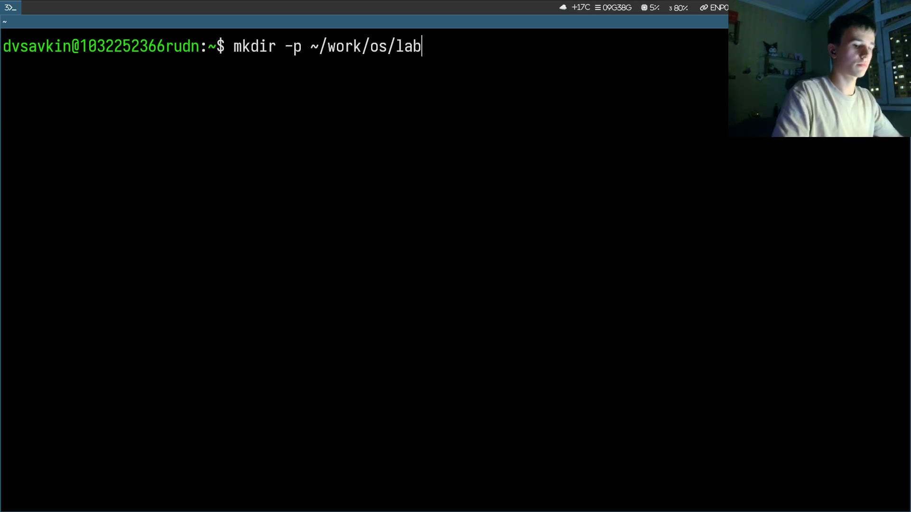
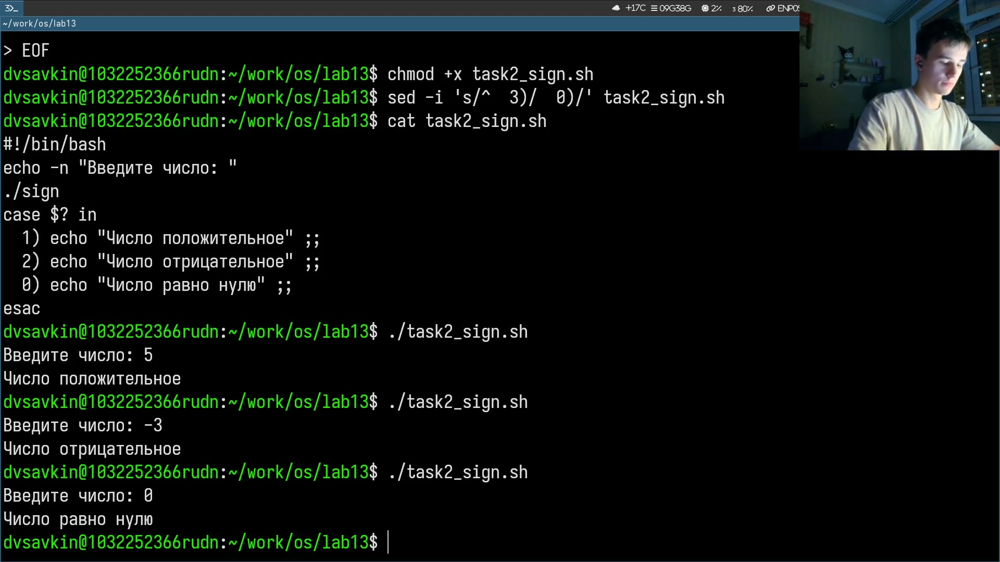
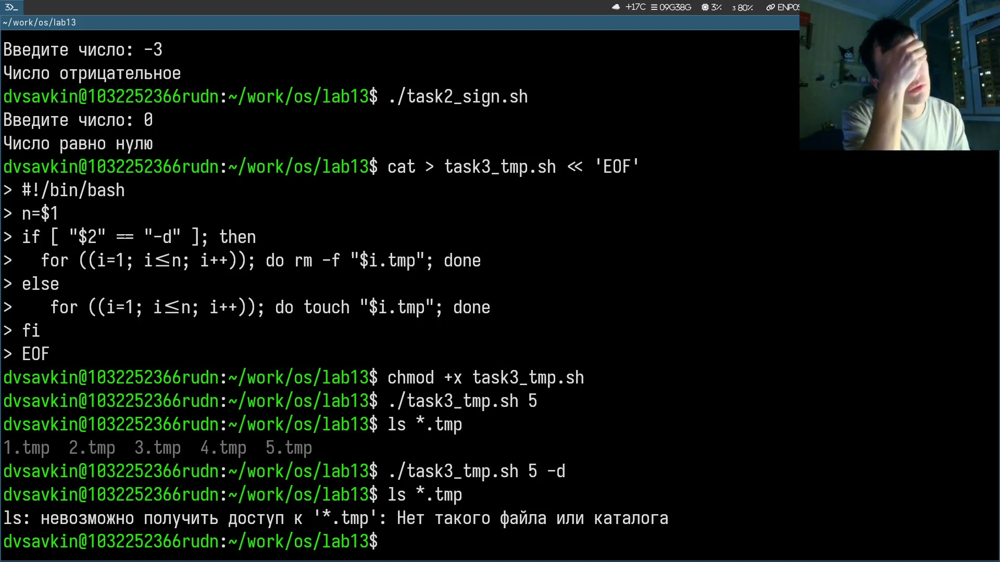
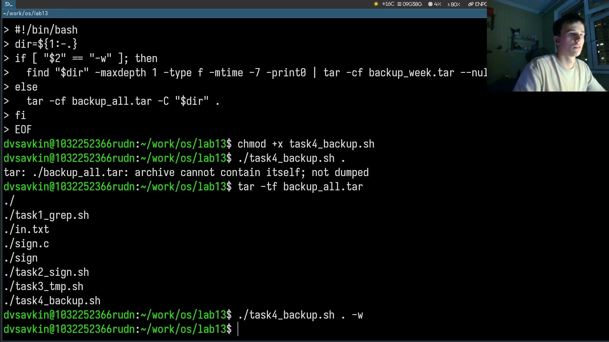

# Информация

## Докладчик

:::::::::::::: {.columns align=center}
::: {.column width="70%"}

- Савкин Дмитрий Вадимович
- РУДН, группа НПИбд-02-25
- Тема: ветвления и циклы в shell

:::
::: {.column width="30%"}

:::
::::::::::::::

# Цель работы

## Цель работы

- Получение навыков написания командных файлов с ветвлениями и циклами

# Задание

## Задание

- getopts+grep поиск по шаблону
- Программа на Си с кодами возврата, создание/удаление N файлов, tar

# Выполнение работы
## Рабочий каталог

Создаём рабочий каталог лабы.

{width=55%}

## task1_grep.sh

Разбор ключей через getopts, поиск по шаблону через grep.

{width=55%}

## sign.c и task2_sign.sh

Программа на Си определяет знак числа, скрипт анализирует `$?`.

{width=55%}

## task3_tmp.sh

Создание и удаление N временных файлов через цикл for.

{width=55%}

## task4_backup.sh

Архивация каталога через tar, вариант — только файлы за неделю.

{width=55%}

# Выводы

## Выводы

- Освоены getopts, анализ кодов завершения через `$?`
- Получены навыки массовых операций с файлами и архивирования через tar
