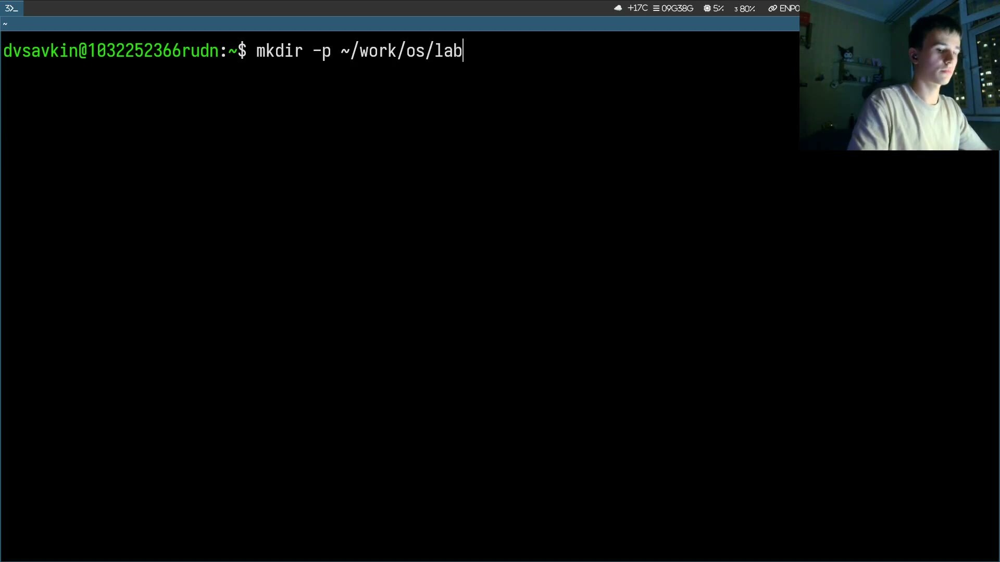
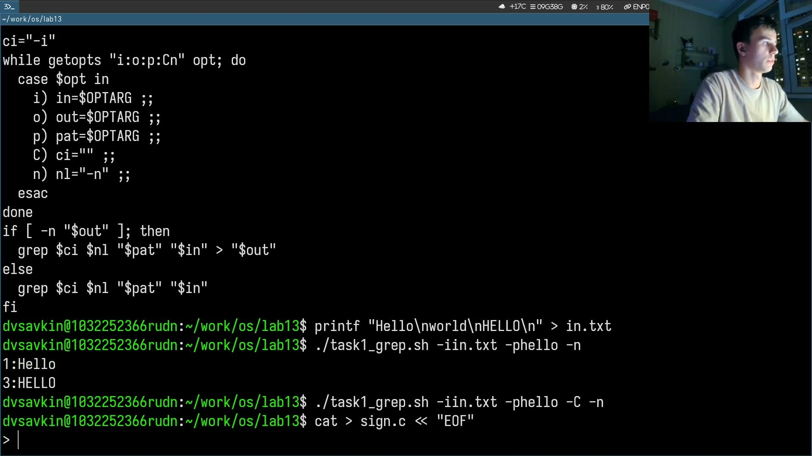
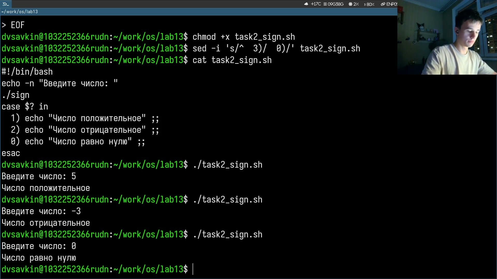
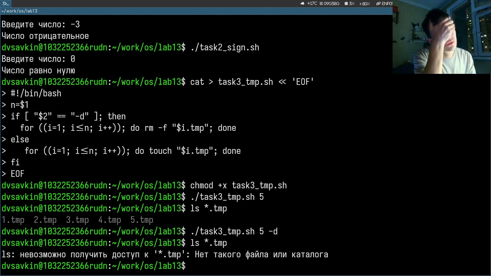
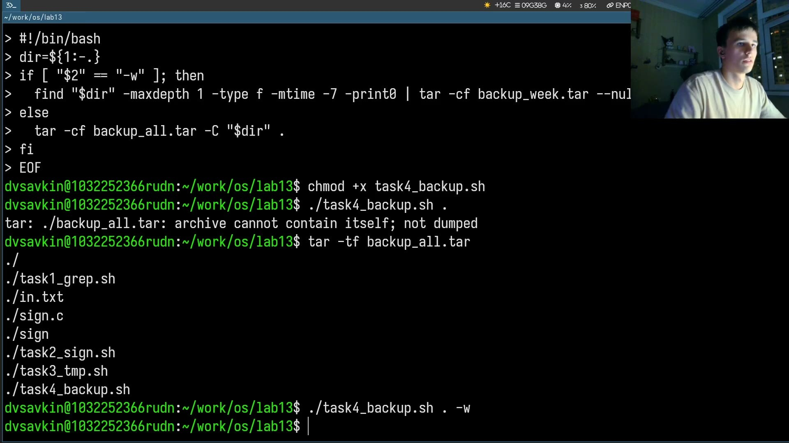

---
## Author
author:
  name: Савкин Дмитрий Вадимович
  affiliation:
    - name: Российский университет дружбы народов
      country: Российская федерация
      city: Москва

## Title
title: "Отчёт по лабораторной работе № 13"
subtitle: "Программирование в shell: ветвления и циклы"
license: "CC BY"
---

# Цель работы

Навыки shell-программирования: ветвления и циклы.

# Задание

- 'getopts'+'grep', ключи '-i,-o,-p,-C,-n'.
- Си-программа: знак числа, 'exit(n)', анализ '$?'.
- Создание/удаление N файлов.
- Архивация 'tar' за неделю.

# Выполнение лабораторной работы

Создаём рабочий каталог: 'mkdir -p ~/work/os/lab13 && cd ~/work/os/lab13'.

{width=70%}

Пишем task1_grep.sh - разбор ключей 'getopts', поиск шаблона через grep с учётом регистра -C и номерами строк -n. Тестируем на файле in.txt.

{width=70%}

Пишем sign.c - знак числа через exit(), и task2_sign.sh, который вызывает sign и по $? выводит сообщение. Проверяем на числах 5, -3, 0.

{width=70%}

Пишем task3_tmp.sh - создаёт N файлов через for/touch, тем же ключом -d их удаляет. Проверяем на 5 файлах.

{width=70%}

Пишем task4_backup.sh - архивирует каталог через tar, ключ -w архивирует только файлы за неделю через find -mtime -7.

{width=70%}

# Выводы

Освоены ветвления/циклы: getopts, $?, for, tar+find.

# Ответы на контрольные вопросы

**1. Назначение getopts.**

Разбирает флаги командной строки, значение флага записывается в '$OPTARG'.

**2. Связь метасимволов с генерацией имён файлов.**

'*', '?', '[...]' - оболочка подставляет вместо них подходящие имена файлов.

**3. Операторы управления действиями.**

if, case, for, while, until.

**4. Операторы прерывания цикла.**

break, continue

**5. Зачем нужны false и true.**

Команды с заведомым кодом возврата, используются для организации бесконечных циклов.

**6. Что значит if test -f man$s/$i.$s.**

Проверка, что существует обычный файл с именем, собранным из значений переменных.

**7. Разница while и until.**

while - выполняется пока условие истинно, until - выполняется пока ложно.
