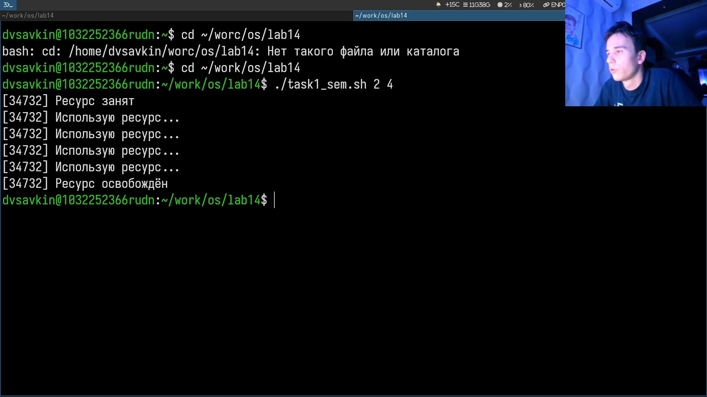
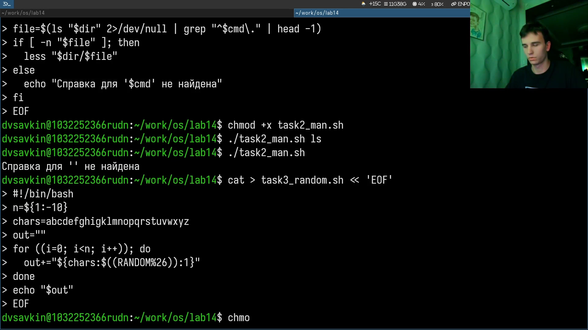
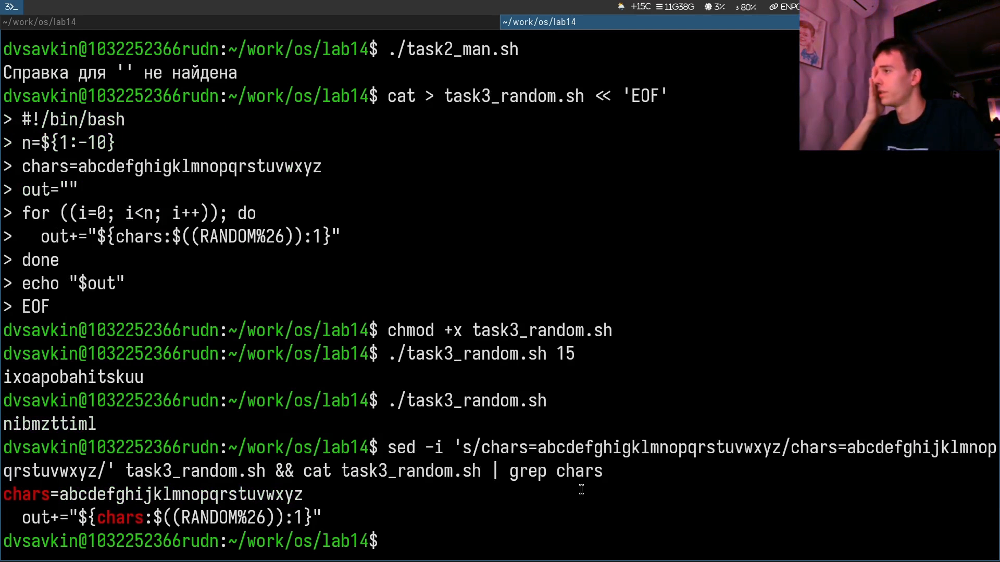

# Информация

## Докладчик

:::::::::::::: {.columns align=center}
::: {.column width="70%"}

- Савкин Дмитрий Вадимович
- РУДН, группа НПИбд-02-25
- Тема: расширенное программирование в shell

:::
::: {.column width="30%"}

:::
::::::::::::::

# Цель работы

## Цель работы

- Написание сложных командных файлов с логическими конструкциями и циклами

# Задание

## Задание

- Упрощённый семафор для синхронизации процессов
- Аналог man, генератор случайных латинских букв

# Выполнение работы
## Скрипт семафора

Пишем `task1_sem.sh` через heredoc: ожидание и занятие ресурса.

{width=55%}

## Полный текст семафора

Цикл ожидания с сообщениями и счётчиком, `touch`/`rm` файла-блокировки.

{width=55%}

## Тест семафора

`chmod +x`, `./task1_sem.sh 2 4` — ресурс занят и удержан 4 секунды.

{width=55%}

## Аналог man

Пишем `task2_man.sh`: поиск справки через `ls`+`grep`, вывод через `less`.

{width=55%}

## Тест аналога man

`./task2_man.sh ls` открывает справку, без аргумента — сообщение об ошибке.

{width=55%}

## Генератор случайных букв

Пишем `task3_random.sh`: `${chars:RANDOM%26:1}`.

{width=55%}

## Тест и исправление опечатки

Запускаем генератор, находим и исправляем опечатку в алфавите через `sed`.

{width=55%}

# Выводы

## Выводы

- Реализован семафор на основе файла-блокировки для синхронизации процессов
- Написана обёртка над man и генератор случайных букв через $RANDOM
