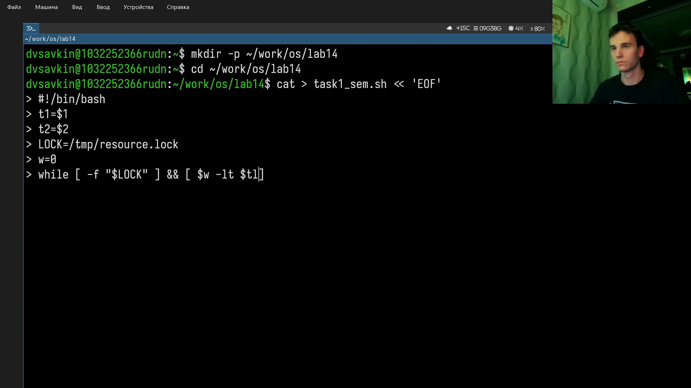
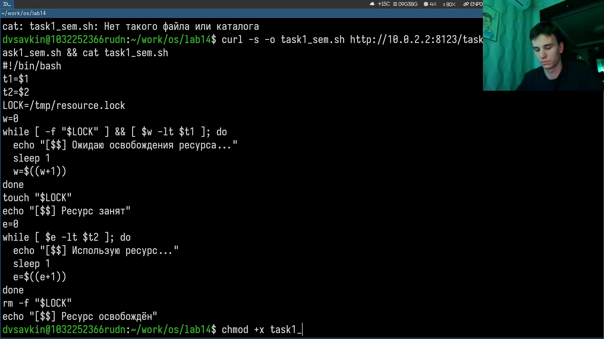
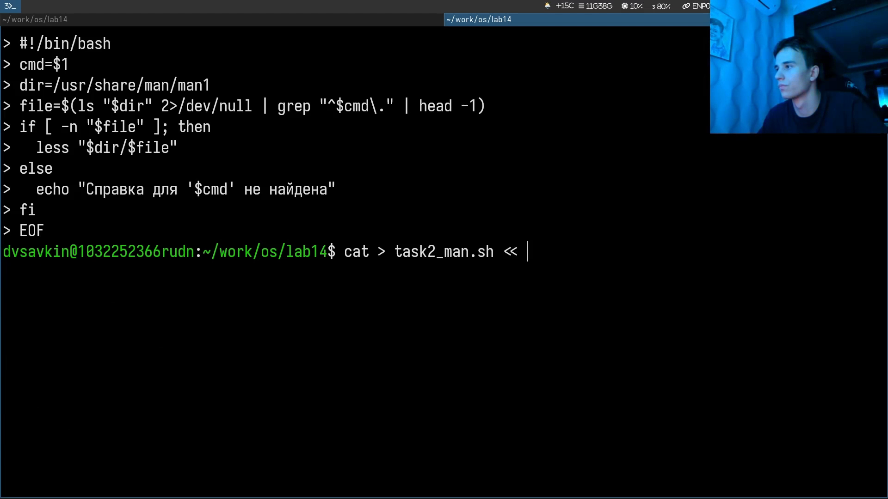
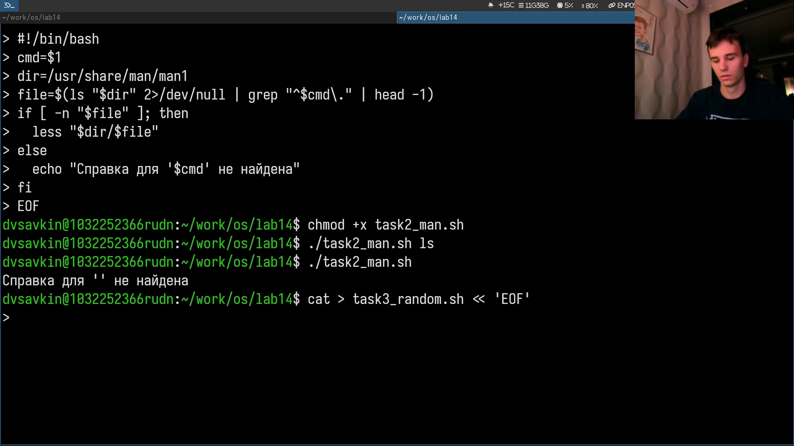

---
## Author
author:
  name: Савкин Дмитрий Вадимович
  affiliation:
    - name: Российский университет дружбы народов
      country: Российская Федерация
      city: Москва

## Title
title: "Отчёт по лабораторной работе № 14"
subtitle: "Расширенное программирование в shell"
license: "CC BY"
---

# Цель работы

Написание сложных командных файлов с логическими конструкциями и циклами.

# Задание

- Написать упрощённый семафор для синхронизации процессов.
- Реализовать аналог `man` командным файлом.
- Сгенерировать случайную последовательность латинских букв через `$RANDOM`.

# Выполнение лабораторной работы

Создаём рабочий каталог и пишем скрипт семафора через heredoc: `mkdir -p ~/work/os/lab14`, `cat > task1_sem.sh << 'EOF'`. Скрипт принимает время ожидания `t1` и время занятия ресурса `t2`, использует файл-блокировку `/tmp/resource.lock`.

{width=70%}

Полный текст `task1_sem.sh`: цикл ожидания освобождения ресурса (с сообщениями и счётчиком `w`), затем `touch "$LOCK"` и занятие ресурса на `t2` секунд, в конце `rm -f "$LOCK"`.

{width=70%}

Даём права на выполнение и тестируем: `chmod +x task1_sem.sh`, `./task1_sem.sh 2 4` — скрипт занимает ресурс и удерживает его 4 секунды с выводом PID (`$$`).

{width=70%}

Пишем аналог `man`: `cat > task2_man.sh << 'EOF'`. Скрипт ищет файл справки по имени команды в `/usr/share/man/man1` через `ls | grep`, открывает через `less`, при отсутствии — выводит сообщение.

{width=70%}

Тестируем: `chmod +x task2_man.sh`, `./task2_man.sh ls` открывает страницу справки, `./task2_man.sh` без аргумента выводит `Справка для '' не найдена`.

{width=70%}

Пишем генератор случайных букв: `cat > task3_random.sh << 'EOF'`. Число букв берётся первым аргументом (по умолчанию 10), каждая буква — случайный символ из алфавита через `${chars:$((RANDOM%26)):1}`.

{width=70%}

Запускаем: `./task3_random.sh 15` и `./task3_random.sh`. Замечаем опечатку в алфавите (пропущена буква `j`) и исправляем на месте через `sed -i 's/.../.../ ' task3_random.sh`, проверяем результат через `grep chars`.

{width=70%}

# Выводы

Освоены командные файлы с циклами и условиями: упрощённый семафор на основе файла-блокировки для синхронизации процессов, обёртка над `man`, генератор случайных латинских букв через `$RANDOM`.

# Ответы на контрольные вопросы{.unnumbered}

**1. Найдите синтаксическую ошибку в `while [$1 != "exit"]`.**
Нет пробелов вокруг `[` и `]`: нужно `[ "$1" != "exit" ]`.

**2. Как выполняется конкатенация строк в bash?**
Просто пишутся подряд: `c="$a$b"`.

**3. Что делает утилита `seq` и чем её можно заменить?**
Выводит числа по порядку (`seq 1 10`); замена — `{1..10}` или `for ((i=1;i<=10;i++))`.

**4. Чему равно `$((10/3))`?**
`3` — деление целочисленное.

**5. Чем zsh отличается от bash?**
Более гибкие автодополнение и глобы, поддержка плагинов (oh-my-zsh), другой синтаксис массивов.

**6. Корректен ли синтаксис `for ((a=1; a <= LIMIT; a++))`?**
Да, корректный C-подобный цикл.

**7. Сравните bash с языками программирования (плюсы/минусы).**
Плюс — быстрая автоматизация системных задач без компиляции; минус — низкая производительность и плохая читаемость сложной логики.
